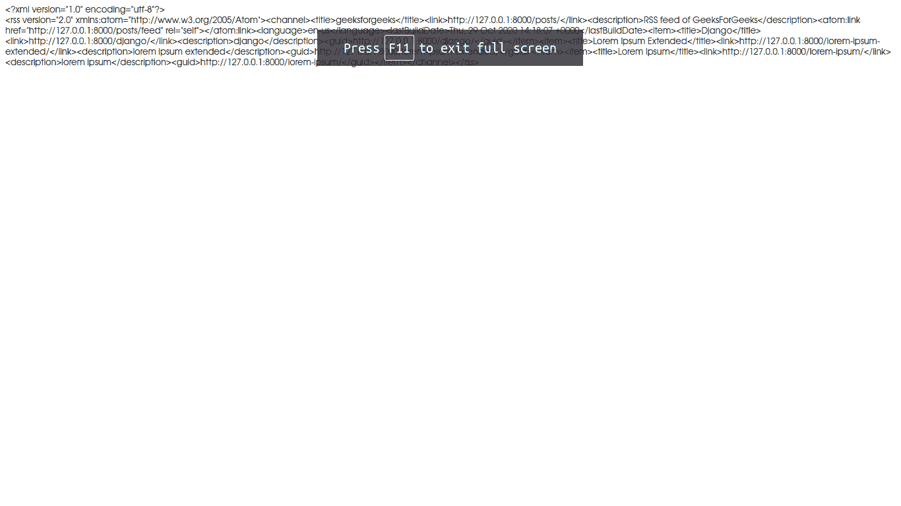
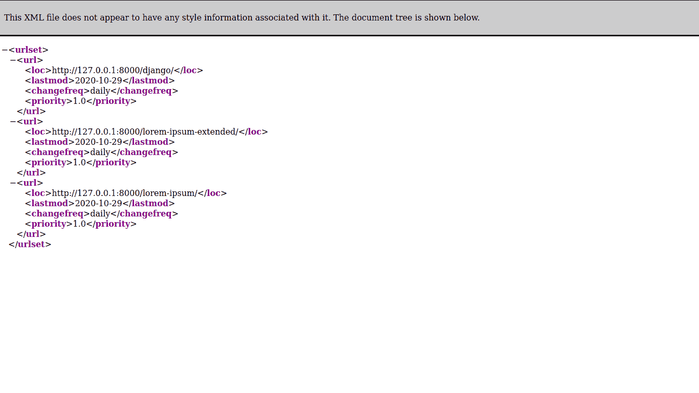

# 如何给 Django 项目添加 RSS Feed 和 Sitemap？

> 原文:[https://www . geesforgeks . org/how-add-RSS-feed-and-sitemap-to-django-project/](https://www.geeksforgeeks.org/how-to-add-rss-feed-and-sitemap-to-django-project/)

本文是姜戈博客内容管理系统项目的延续。在此查看–[与 Django](https://www.geeksforgeeks.org/building-blog-cms-content-management-system-with-django/) 一起构建博客内容管理系统

## RSS(真正简单的联合)源

RSS(真正简单的联合)是一种网络订阅源，允许用户和应用程序以标准化的、计算机可读的格式访问网站更新。例如，这些订阅源可以让用户在一个新闻聚合器中跟踪许多不同的网站。Django 附带了一个库来为我们的博客创建 atom feed。

### 为 RSS 源创建视图–

转到博客应用程序目录，创建一个文件 feeds.py 并粘贴下面的代码。

## 蟒蛇 3

```py
from django.contrib.syndication.views import Feed
from django.template.defaultfilters import truncatewords
from .models import posts
from django.urls import reverse
from django.utils.feedgenerator import Atom1Feed

class blogFeed(Feed):
    title = "geeksforgeeks"
    link = "/posts/"
    description = "RSS feed of GeeksForGeeks"

    def items(self):
        return posts.objects.filter(status = 1)

    def item_title(self, item):
        return item.title

    def item_description(self, item):
        return item.metades

    def item_link(self, item):
       return reverse('post_detail', args =[item.slug])

class atomFeed(Feed):
    feed_type = Atom1Feed
```

### 为 RSS 源创建路由–

要路由 RSS 源，请转到您用于生成源的应用程序的 urls.py 文件，并添加路由

## 蟒蛇 3

```py
# importing django routing libraries
from . import views
from django.urls import path, include
from .views import * from .feeds import blogFeed

urlpatterns = [
.....
    # RSS route 
    path("posts / feed", blogFeed(), name ="feed"),
.....
]
```

### **样品进料**



样品进料

## 网站地图–

网站地图协议允许网站管理员向搜索引擎通知网站上可用于爬行的网址。站点地图是一个列出站点网址的 XML 文件。它允许网站管理员包含每个网址的附加信息:上次更新的时间、更改的频率。这使得搜索引擎可以更有效地抓取网站，并找到可能与网站其他内容隔离的网址。

### 将站点地图添加到 INSTALLED _ APPS–

Django 还附带了一个站点地图创建器，可以进入博客应用程序目录，将站点地图添加到设置文件中已安装的应用程序中

## 蟒蛇 3

```py
INSTALLED_APPS = [
    'django.contrib.admin',
    'django.contrib.auth',
    'django.contrib.contenttypes',
    'django.contrib.sessions',
    'django.contrib.messages',
    'django.contrib.staticfiles',
    'blog',
    # adding in installed apps
    'django.contrib.sitemaps',

]
```

### 创建站点地图–

创建一个 sitemaps.py 文件并粘贴下面的代码。

## 蟒蛇 3

```py
from django.contrib.sitemaps import Sitemap
from .models import posts

# siemap class
class blogSitemap(Sitemap):
# change frequency and priority
    changefreq = "daily"
    priority = 1.0

    def items(self):
        return posts.objects.filter(status = 1)

    def lastmod(self, obj):
        return obj.updated_on
```

### 向模型添加绝对网址–

生成的站点地图应该有我们帖子的 URL，所以我们需要在我们的模型中添加一个简单的函数，这样我们的站点地图库就可以生成帖子 URL

## 蟒蛇 3

```py
# add it in your model for which you want to generate sitemap
def get_absolute_url(self):
        from django.urls import reverse
        return reverse("post_detail", kwargs ={"slug": str(self.slug)})
```

### 站点地图的路由–

现在要生成站点地图 url，请转到的 urls.py 文件并添加路线

## 蟒蛇 3

```py
# adding sitemap libraries
from django.contrib.sitemaps.views import sitemap
from blog.sitemaps import blogSitemap

blogsitemap = {
"blog": blogSitemap, }

urlpatterns = [
.....
    # urls handling site maps
    path("sitemap.xml", sitemap, {"sitemaps": blogsitemap}, name ="sitemap"),
.....
]
```

现在你可以在指定的网址上看到 RSS 源和站点地图

### 示例站点地图



示例站点地图