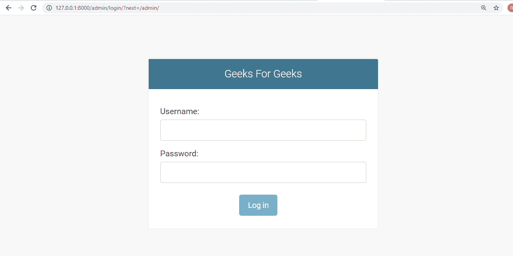
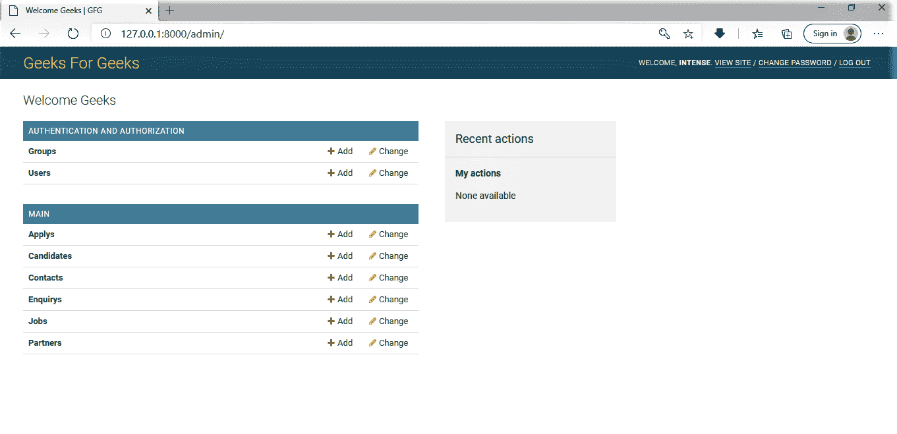

# 如何在 Django 项目中添加站点标题、站点标题、索引标题？

> 原文:[https://www . geesforgeks . org/how-add-site-header-site-title-index-title-in-a-django-project/](https://www.geeksforgeeks.org/how-to-add-site-header-site-title-index-title-in-a-django-project/)

**自动管理界面**Django 最强大的部分之一。元数据从您的模型中读取，以提供一个快速的、以模型为中心的界面，受信任的用户可以在其中管理您站点上的内容。管理员的推荐使用仅限于组织的内部管理工具。它不是用来构建整个前端的。

**概述:**

*   将`'django.contrib.admin'`及其依赖项-`django.contrib.auth`、`django.contrib.contenttypes`、`django.contrib.messages`和`django.contrib.sessions`添加到您的 INSTALLED_APPS 设置中。
*   在选项的**“context _ processors”**选项中，使用`django.template.context_processors.request`、`django.contrib.auth.context_processors.auth`和`ngo.contrib.messages.context_processors.messages`在模板设置中配置一个 DjangoTemplates 后端。
*   如果您使用了切割中间件设置，则必须包括`django.contrib.auth.middleware.AuthenticationMiddleware`和`django.contrib.messages.middleware.MessageMiddleware`。

**在`urls.py`–**中进行以下更改

```
from django.contrib import admin
from django.urls import path, include

# Adds site header, site title, index title to the admin side.
admin.site.site_header = 'Geeks For Geeks'
admin.site.site_title = 'GFG'
admin.site.index_title = 'Welcome Geeks'

urlpatterns = [
    path('', include('main.urls')),
    path('admin/', admin.site.urls),
]
```

**输出–**


**DJANGO ADMIN 海关化:**

Python 代码允许添加站点标题、站点标题和索引标题。

[](https://media.geeksforgeeks.org/wp-content/uploads/20200819185413/Screenshot62.png)