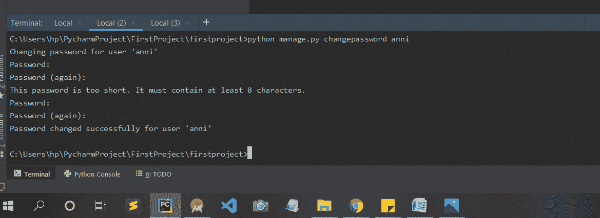

# 如何更改 Django 中超级用户的密码？

> 原文:[https://www . geesforgeks . org/如何更改 django 超级用户密码/](https://www.geeksforgeeks.org/how-to-change-password-of-superuser-in-django/)

Django 为用户提供了管理面板来查看数据库和其他活动。如果你不知道如何创建超级用户，那么你可以参考[如何在姜戈创建超级用户？](https://www.geeksforgeeks.org/how-to-create-superuser-in-django/)

**如何更改 Django 中超级用户的密码？**

要更改超级用户的密码，首先访问与 manage.py 相同的目录，然后运行以下命令:

```py
python manage.py changepassword user_name
```

更改用户“用户名”的密码

在密码字段前面输入密码，然后按回车键。请输入一个强密码，以确保安全。

```py
Password: ******
```

然后再次输入相同的密码进行确认。

```py
Password (again): ******
```

此密码太短。它必须包含至少 8 个字符。

在密码字段前面再次输入密码，然后按回车键。输入一个强密码和至少 8 个字符，以确保安全。

```py
Password: ********
```

```py
Password (again): ********
```

用户“user_name”的密码已成功更改。

