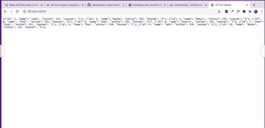

# 如何在 Django 将模型数据转换成 JSON？

> 原文:[https://www . geesforgeks . org/如何将模型-数据转换为 django-JSON/](https://www.geeksforgeeks.org/how-to-convert-models-data-into-json-in-django/)

Django 是一个基于 Python 的高级网络框架，允许快速开发和干净、实用的设计。它也被称为电池内置框架，因为 Django 为一切提供内置功能，包括 Django 管理界面、默认数据库 SQLlite3 等。

**在 Django 如何将模型数据转换成 Json 数据？**

首先创建新项目

```py
django-admin startproject tryJson
```

```py
cd tryJson
```

然后在项目中创建新的应用程序

```py
python manage.py startapp main
```

在 INSTALLED_APPS 中的 **tryJson/settings.py** 中添加您的主应用程序


在主应用程序中编辑**模型**

## 蟒蛇 3

```py
from django.db import models

class Student(models.Model):
    course_choices = (
        ('1','Java'),
        ('2','Python'),
        ('3','Javascript')
        )
    name = models.CharField(max_length=50)
    rollno = models.IntegerField()
    course = models.CharField(max_length=15,
        choices = course_choices)
```

然后，为了创建模型，我们必须在 cmd 或终端中编写以下命令

```py
python manage.py makemigrations
```

```py
python manage.py migrate
```

因此，我们创建了我们的模范学生，其中包括一些字段，如姓名、编号、课程。

在模型中插入一些数据。


在主应用程序中创建一个新文件

・T 0️ urls.py ・T 1️

## 蟒蛇 3

```py
from django.urls import path
from .  import *

urlpatterns = [
    path("",views.jsondata,name = "jsondata"),
]
```

编写逻辑将模型数据转换为 Json 数据

**view . py**

## 蟒蛇 3

```py
from django.http import JsonResponse
from .models import Students

def jsondata(request):
      data list(Students.objects.values())
    return JsonResponse(data,safe = False)
```

*   使用 values()方法获取所有数据，并使用 list()函数转换为列表，然后存储在变量中。
*   返回一个 JsonResponse 并传递数据，然后放入 safe = False

然后打开 cmd 或终端运行此应用程序

```py
python manage.py runserver
```

**输出:-**

