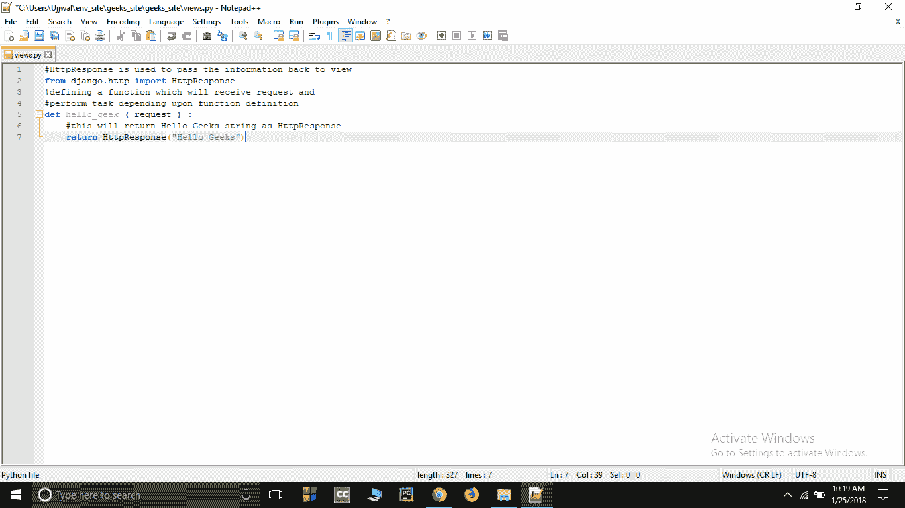
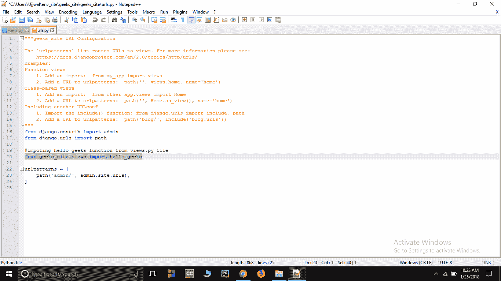
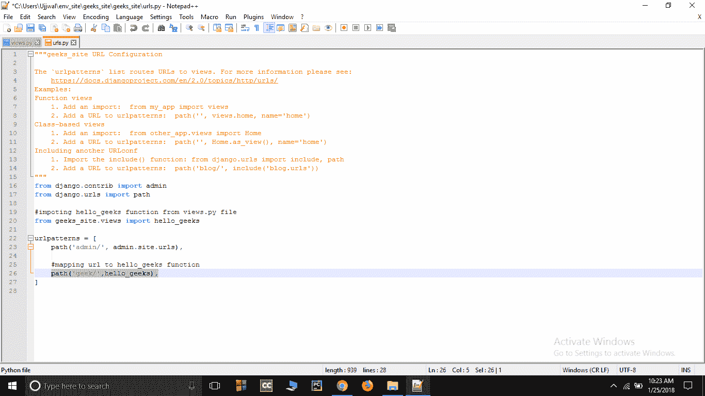
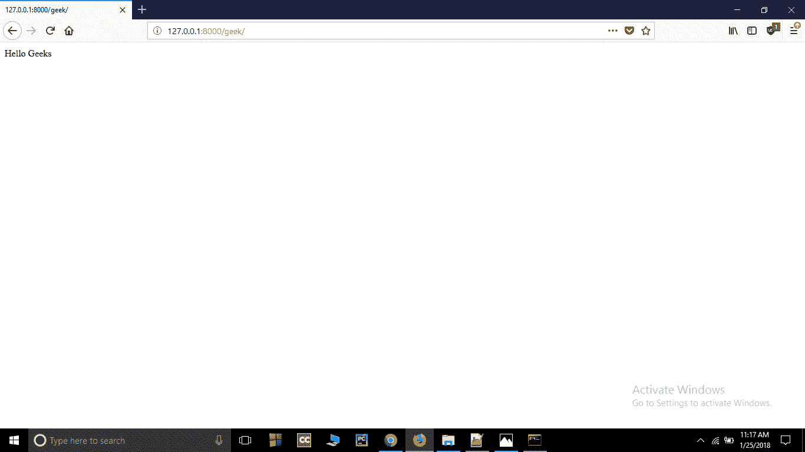

# 如何利用姜戈的 MVT 创建基础项目？

> 原文:[https://www . geesforgeks . org/如何使用 django 中的 mvt 创建基本项目/](https://www.geeksforgeeks.org/how-to-create-a-basic-project-using-mvt-in-django/)

**先决条件–**[姜戈项目 MVT 结构](https://www.geeksforgeeks.org/django-project-mvt-structure/)

假设你已经看完了前一篇文章。本文着重于创建一个使用 MVT 架构渲染模板的基本项目。我们将使用 MVT(模型、视图、模板)将数据渲染到本地服务器。

**创建基本项目:**

*   要在您的电脑上启动姜戈项目，请打开终端并输入以下命令

```py
django-admin startproject projectName
```

*   将创建一个名为*项目名称*的新文件夹。使用终端输入命令输入项目

```py
cd projectName
```

*   在存储 settings.py、urls.py 等文件的项目文件夹内新建一个文件**view . py**，并在其中保存以下代码-

## 蟒蛇 3

```py
# HttpResponse is used to
# pass the information
# back to view
from django.http import HttpResponse

# Defining a function which
# will receive request and
# perform task depending
# upon function definition
def hello_geek (request) :

    # This will return Hello Geeks
    # string as HttpResponse
    return HttpResponse("Hello Geeks")
```



*   打开项目文件夹(项目名称)中的**URL . py**，并添加您的条目-
    *   从 views.py 文件导入 **hello_geek** 函数。

```py
from projectName.views import hello_geeks
```



*   在 url 模式内的 url 字段中添加一个条目-

```py
path('geek/', hello_geek), 

```



*   现在要运行服务器，请按照以下步骤操作-
    *   打开命令提示符，通过以下命令将目录更改为 env _ site

```py
$ cd env_site
```

*   转到 env_site 中的脚本目录并激活虚拟环境-

```py
$ cd Script
```

```py
$ activate
```

*   返回 env_site 目录，转到项目目录-

```py
$ cd ..
```

```py
$ cd geeks_site
```

*   **启动服务器-** 在 cmd 中键入以下命令启动服务器-

```py
$ python manage.py runserver
```

*   **检查–**打开浏览器，输入该网址-

```py
http://127.0.0.1:8000/geek/
```

