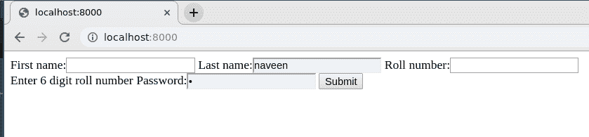

# 如何使用 Django Forms 创建表单？

> 原文:[https://www . geeksforgeeks . org/如何使用-django-forms 创建表单/](https://www.geeksforgeeks.org/how-to-create-a-form-using-django-forms/)

Django 表单是一组高级的 HTML 表单，可以使用 python 创建，并以 python 方式支持 HTML 表单的所有功能。这篇文章围绕如何使用各种表单域和属性创建一个基本表单展开。在 Django 中创建表单与创建模型完全相似，需要指定表单中存在哪些字段以及字段的类型。例如，为了输入，注册表单可能需要名字(字符域)、卷号(整数域)等等。

### 使用 Django 表单创建表单

使用示例说明**姜戈表格**。考虑一个名为 geeksforgeeks 的项目，它有一个名为 geeks 的应用程序。

> 请参考以下文章，查看如何在 Django 中创建项目和应用程序。
> 
> *   [如何利用姜戈的 MVT 创建基础项目？](https://www.geeksforgeeks.org/how-to-create-a-basic-project-using-mvt-in-django/)
> *   [如何在姜戈创建 App？](https://www.geeksforgeeks.org/how-to-create-an-app-in-django/)

在你的极客应用程序中，创建一个名为 forms.py 的新文件，你可以在其中创建所有的表单。要创建姜戈表单，您需要使用[姜戈表单类](https://docs.djangoproject.com/en/2.2/topics/forms/#the-django-form-class)。我们来演示一下。

在您的表单中。请输入以下内容，

## 蟒蛇 3

```py
from django import forms

# creating a form
class InputForm(forms.Form):

    first_name = forms.CharField(max_length = 200)
    last_name = forms.CharField(max_length = 200)
    roll_number = forms.IntegerField(
                     help_text = "Enter 6 digit roll number"
                     )
    password = forms.CharField(widget = forms.PasswordInput())
```

让我们解释一下到底发生了什么，左边是字段的名称，右边是输入字段的各种功能。字段的语法表示为

**语法:**

```py
Field_name = forms.FieldType(attributes)
```

现在要将此表单呈现到视图中，请转到 views.py 并创建一个 home_view，如下所示。

## 蟒蛇 3

```py
from django.shortcuts import render
from .forms import InputForm

# Create your views here.
def home_view(request):
    context ={}
    context['form']= InputForm()
    return render(request, "home.html", context)
```

在视图中，只需要在 forms.py 中创建上面创建的表单类的一个实例

## 超文本标记语言

```py
<form action = "" method = "post">
    
    {{form }}
    <input type="submit" value=Submit">
</form>
```

都设置好了检查表单是否正常让我们访问 [http://localhost:8000/](http://localhost:8000/)



表单工作正常，但视觉效果令人失望，Django 提供了一些预定义的方法来方便地显示表单。在模板中，下面将修改输入，

*   [{{ form.as_table }}](https://www.geeksforgeeks.org/form-as_table-render-django-forms-as-table/) 会将它们渲染为包裹在< tr >标签中的表格单元格
*   [{{ form.as_p }}](https://www.geeksforgeeks.org/form-as_p-render-django-forms-as-paragraph/) 将使它们包裹在< p >标签中
*   [{{ form.as_ul }}](https://www.geeksforgeeks.org/form-as_ul-render-django-forms-as-list/) 将使它们包裹在< li >标签中

用户也可以修改这些设置，并使用{{ form.field_name }}根据自己的需要显示字段，但如果某些字段为空，则这可能会改变正常的验证过程，因此需要格外小心。更多–[姜戈表格](https://www.geeksforgeeks.org/django-forms/)