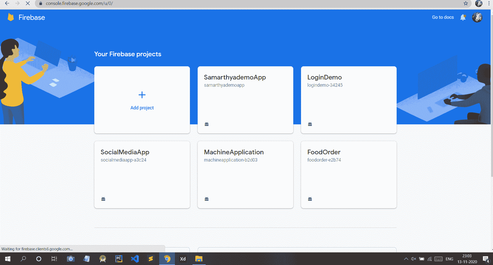
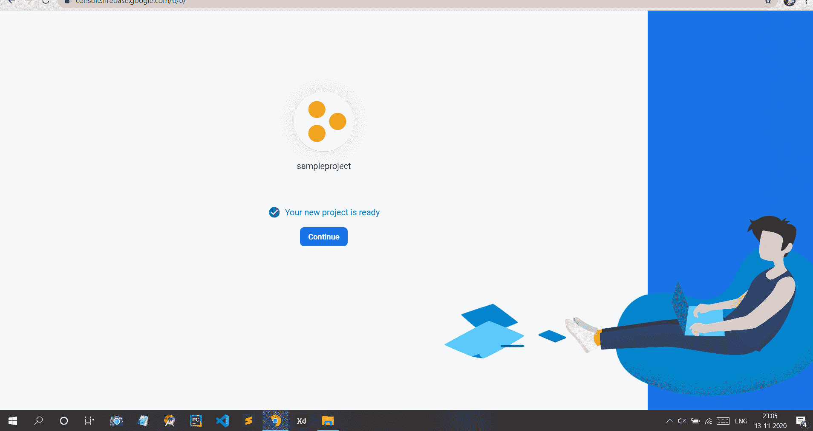
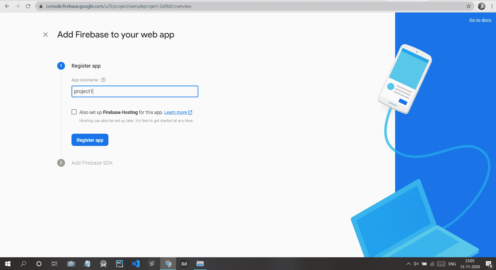
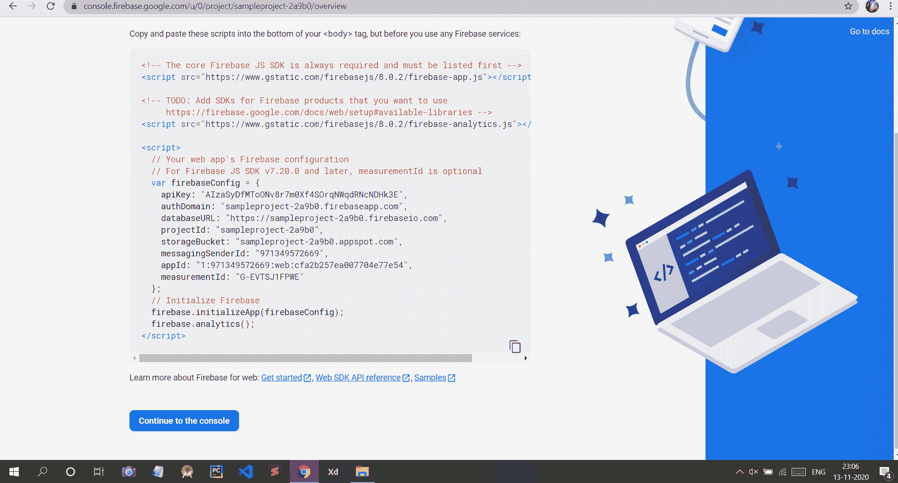
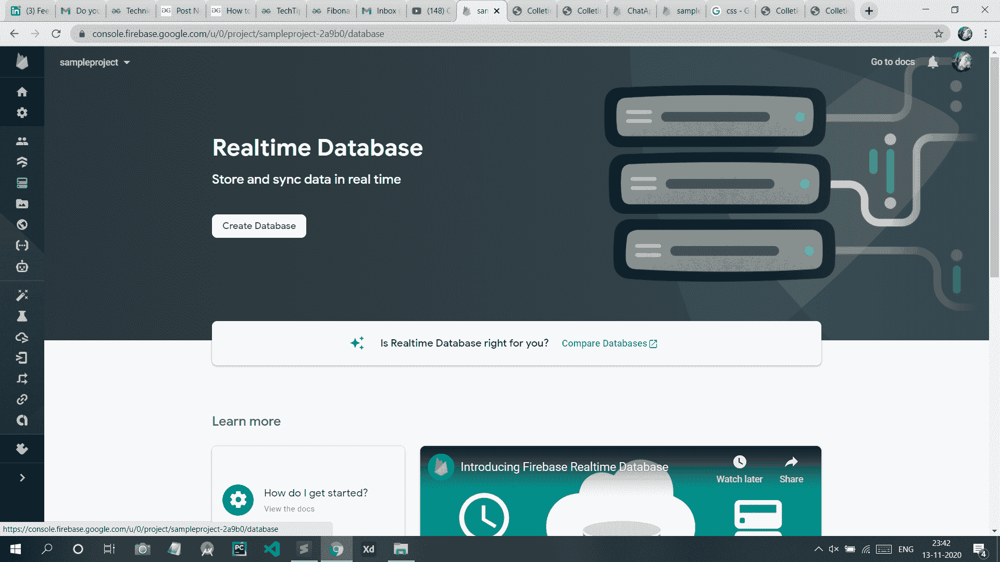
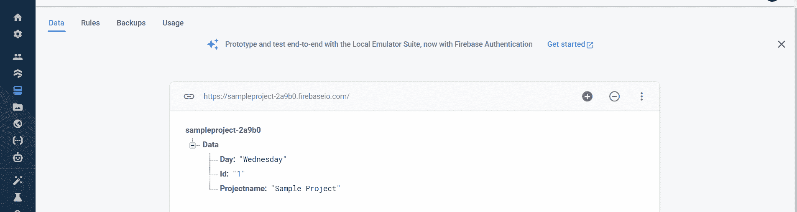
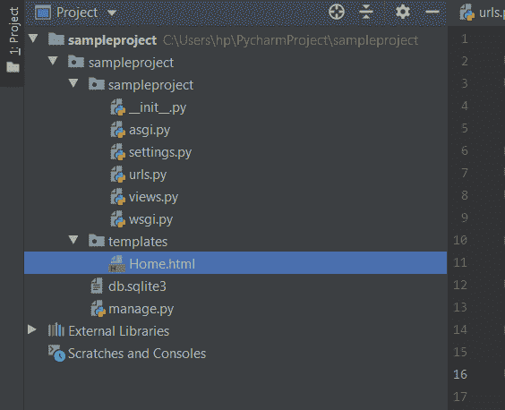
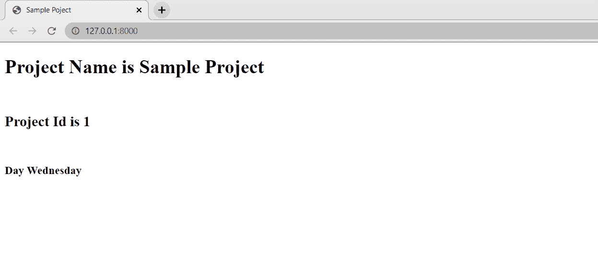

# 如何使用 Firebase 数据库在 Django 创建新项目？

> 原文:[https://www . geesforgeks . org/如何创建一个新的 django-in-project-use-firebase-database/](https://www.geeksforgeeks.org/how-to-create-a-new-project-in-django-using-firebase-database/)

[**【Django】**](https://www.geeksforgeeks.org/django-tutorial/)是一个基于 Python 的 web 框架，可以让你快速创建高效的 web 应用。如果你是刚来姜戈的，那么你可以参考[姜戈介绍和安装](https://www.geeksforgeeks.org/django-introduction-and-installation/?ref=lbp)。在这里，我们将学习如何使用 Firebase 作为数据库创建一个 Django 项目。

### **如何在 Firebase 中创建新项目？**

**第一步:**首先我们要去**在 Firebase 上创建一个项目**来连接我们的静态网页。访问 Firebase 页面配置您的项目–[https://console.firebase.google.com/u/0/?pli=1](https://console.firebase.google.com/u/0/?pli=1)

点击**添加项目**按钮。



**第二步:**给你的项目命名，点击**继续**按钮。


**第三步:**现在点击**继续**按钮。


**第 4 步:**现在选择 Firebase 默认账户，点击**创建项目**。


**第五步:**现在你的项目创建完毕。你可以走了。点击**继续。**



**第 6 步:**现在点击第三个图标，即**网页按钮(< / > )** 。


**第七步:**给你的网络项目取个昵称，点击**注册 App**



**第八步:**现在你会看到你的 App 的配置是这样的。将此代码复制到某个地方。你以后会需要它的。



**第九步:**点击**实时数据库**按钮，如图所示。


**第 10 步:**现在点击**创建数据库。**



**第 11 步:**现在点击**测试模式**，然后点击**启用**。


现在，我们将添加一些数据，并尝试使用我们的网站检索这些数据



### 将 Firebase 数据库集成到 Django 项目中–

现在，我希望你已经在姜戈创建了一个项目。如果没有，那么参考[如何使用姜戈的 MVT 创建一个基础项目？](https://www.geeksforgeeks.org/how-to-create-a-basic-project-using-mvt-in-django/?ref=lbp)由于我们使用 firebase 作为数据库，我们需要安装 pyrebase。为此，在终端中键入以下命令

```
$pip install pyrebase4
```

直接在项目中创建一个 views.py 文件。结构应该是这样的。



**Urls.py 文件**

## 蟒蛇 3

```
from django.contrib import admin
from django.urls import path
from . import views

urlpatterns = [
    path('admin/', admin.site.urls),
    path('', views.home),
]
```

**视图. py**

## 蟒蛇 3

```
from django.shortcuts import render
import pyrebase

config={
    apiKey: "Use Your Api Key Here",
    authDomain: "Use Your authDomain Here",
    databaseURL: "Use Your databaseURL Here",
    projectId: "Use Your projectId Here",
    storageBucket: "Use Your storageBucket Here",
    messagingSenderId: "Use Your messagingSenderId Here",
    appId: "Use Your appId Here"
}
firebase=pyrebase.initialize_app(config)
authe = firebase.auth()
database=firebase.database()

def home(request):
    day = database.child('Data').child('Day').get().val()
    id = database.child('Data').child('Id').get().val()
    projectname = database.child('Data').child('Projectname').get().val()
    return render(request,"Home.html",{"day":day,"id":id,"projectname":projectname })
```

**Home.html**

## 超文本标记语言

```
<!DOCTYPE html>
<html lang="en">
<head>
    <meta charset="UTF-8">
    <title>Sample Project</title>
</head>
<body>
<H1>
Project Name is {{ projectname }}
    </H1>
<br/>
<h2>
Project Id is {{ id }}
    </h2>
<br>
<h3>
Day {{ day }}
    </h3>
<br>
</body>
</html>
```

现在转到您的项目目录，并使用给定的命令运行我们的项目:

```
python manage.py runserver
```

**项目输出如下–**

