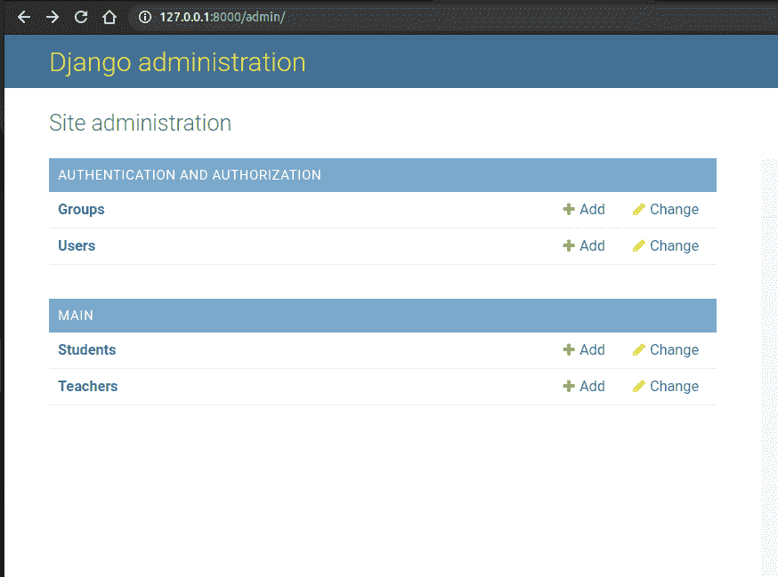

# 如何在 Django 中创建抽象模型类？

> 原文:[https://www . geesforgeks . org/how-create-abstract-model-class-in-django/](https://www.geeksforgeeks.org/how-to-create-abstract-model-class-in-django/)

Django 是一个高级 Python Web 框架，它鼓励快速开发和干净、实用的设计。它由经验丰富的开发人员构建，解决了许多网络开发的麻烦，因此您可以专注于编写应用程序，而无需重新发明轮子。这是免费的开源软件。

#### 什么是模型继承？

Django 中的模型继承的工作方式几乎与 python 中普通类继承的工作方式相同。在本文中，我们将围绕如何在 Django 模型中创建抽象基类展开。

**抽象基类:-**

当您想要将一些公共信息放入许多其他模型中时，抽象基类非常有用。您编写您的基类，并在元类中放入抽象=真。假设你有两个模范学生和老师。

**车型. py**

## 蟒蛇 3

```py
from django.db import models

class Student(models.Model):  # STUDENT
    name = models.CharField(max_length=100)
    rollno = models.IntergerField()

class Teacher(models.Model):  # TEACHER
    name = models.CharField(max_length=100)
    ID = models.IntergerField()
```

所以你有没有注意到一个字段名在两个模型中都很常见。

因此，我们没有在两个模型中添加公共字段，而是创建了另一个模型，并将这些公共字段放入该模型中。

**车型. py**

## 蟒蛇 3

```py
from django.db import models

class common(models.Model):  # COMM0N
    name = models.CharField(max_length=100)

    class Meta:
        abstract = True
```

所以在这里，我创建了一个公共模型，并将公共字段放在该模型中。

在元类中放入抽象=真。将抽象设置为 True 后，现在它变成了抽象类而不是模型，所以现在不能生成数据库表。

## 蟒蛇 3

```py
class Student(common):  # STUDENT
    rollno = models.IntegerField()

class Teacher(common):  # TEACHER
    ID = models.IntegerField()
```

人的本质

```py
python3 manage.py makemigrations
```

```py
python3 manage.py migrate
```

现在，您可以继承学生和教师中的通用名称字段。就像普通的 python 继承一样。

**输出:**

