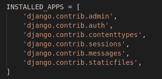
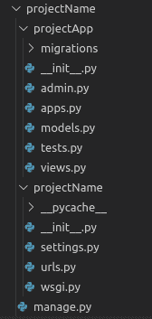

# 如何在姜戈创建 App？

> 原文:[https://www . geesforgeks . org/how-to-create-app-in-django/](https://www.geeksforgeeks.org/how-to-create-an-app-in-django/)

**先决条件–**[如何使用姜戈的 MVT 创建基础项目？](https://www.geeksforgeeks.org/how-to-create-a-basic-project-using-mvt-in-django/)

Django 以其独特且全面管理的应用程序结构而闻名。对于每一项功能，应用程序都可以像一个完全独立的模块一样创建。本文将带您了解如何创建一个基本的应用程序，并使用该应用程序添加功能。
例如，如果你正在创建一个博客，应该为评论、帖子、登录/注销等创建单独的模块。在姜戈，这些模块被称为应用程序。每个任务都有不同的应用程序。

### 使用 Django 应用程序的好处–

*   Django 应用程序是可重用的，即一个 Django 应用程序可以用于多个项目。
*   我们有松散耦合的，即几乎独立的组件
*   多个开发人员可以处理不同的组件
*   调试和代码组织很容易。Django 有一个优秀的调试器工具。
*   它有内置的功能，如管理页面等，这减少了从 stratch 构建相同的努力

**预装应用–**
Django 为用户提供了一些预装应用。要查看预安装的应用程序，请导航到项目名称–>项目名称–>设置。在您的设置文件中，您将找到 INSTALLED_APPS。为了开发人员的舒适，Django 提供了 INSTALLED_APPS 中列出的应用程序。



#### 另外，请访问:

[Django ORM–插入、更新&删除数据](https://www.geeksforgeeks.org/django-orm-inserting-updating-deleting-data/)

### 在姜戈创建应用程序:

让我们开始构建一个应用程序。

### **<u>法-1</u>**

*   要在您的 Django 项目中创建一个基本应用程序，您需要转到包含 manage.py 的目录，并从那里输入命令:

```
python manage.py startapp projectApp
```

### **<u>法-2</u>**

*   要在您的 Django 项目中创建一个基本应用程序，您需要转到包含 manage.py 的目录，并从那里输入命令:

```
django-admin startapp projectApp
```

现在你可以看到你的目录结构如下:



*   要考虑项目中的应用程序，您需要在 INSTALLED_APPS 列表中指定您的项目名称，如下所示。

## 蟒蛇 3

```
# Application definition

INSTALLED_APPS = [
    'django.contrib.admin',
    'django.contrib.auth',
    'django.contrib.contenttypes',
    'django.contrib.sessions',
    'django.contrib.messages',
    'django.contrib.staticfiles',
    'projectApp'
]
```

*   因此，我们最终创建了一个应用程序，但是要使用网址呈现应用程序，我们需要将应用程序包含在我们的主项目中，以便可以呈现重定向到该应用程序的网址。让我们探索它。
    转到项目名称- >项目名称->URL . py，并在标题中添加以下代码

```
from django.urls import include
```

*   现在，在网址模式列表中，您需要指定包含您的应用网址的应用名称。这是它的代码

## 蟒蛇 3

```
from django.contrib import admin
from django.urls import path, include

urlpatterns = [
    path('admin/', admin.site.urls),
    # Enter the app name in following
    # syntax for this to work
    path('', include("projectApp.urls")),
]
```

*   现在你可以使用默认的 MVT 模型来创建网址、模型、视图等。它们会自动包含在你的主项目中。

Django Apps 的主要特点是独立性，每一个 app 都作为一个独立的单元来支持主项目。