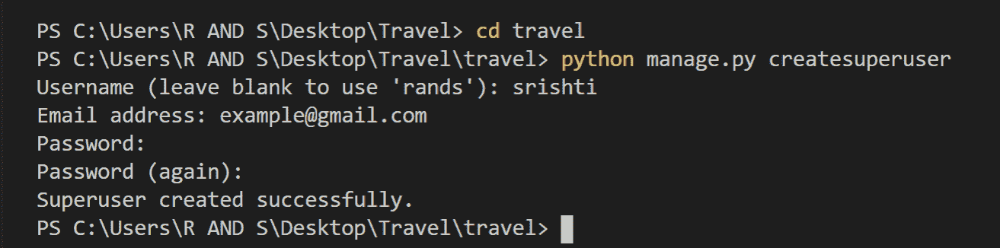
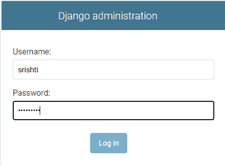

# 如何在姜戈创建超级用户？

> 原文:[https://www . geesforgeks . org/如何创建-django 超级用户/](https://www.geeksforgeeks.org/how-to-create-superuser-in-django/)

Django 为其用户提供了我们的管理面板。因此，我们不需要担心创建单独的管理页面或提供身份验证功能，因为 Django 为我们提供了该功能。在使用此功能之前，您必须已经迁移了项目，否则将不会创建超级用户数据库。

**如何在姜戈创建超级用户？**

要创建超级用户，首先到达与 **manage.py** 相同的目录，并运行以下命令:

```
python manage.py createsuperuser
```

然后输入您选择的用户名，并按回车键。

```
Username: srishti
```

然后输入电子邮件地址并按回车键。(可以留空)

```
Email address: example@gmail.com
```

接下来，在密码字段前面输入密码，然后按回车键。请输入一个强密码，以确保安全。

```
Password: ******  
```

然后再次输入相同的密码进行确认。

```
Password(again): ******
```

如果以上字段输入正确，超级用户创建成功。

[](https://media.geeksforgeeks.org/wp-content/uploads/20200804173614/2020080410-300x74.png)

完成上述步骤后显示的图像

现在我们可以通过运行命令 **python manage.py runserver** 登录到我们的 Django Admin 页面。然后，打开一个网络浏览器，转到您本地域的“/admin/”，例如**http://127 . 0 . 0 . 1:8000/admin/**，然后输入相同的用户名和密码。

[](https://media.geeksforgeeks.org/wp-content/uploads/20200804230348/2020080411-300x221.png)

决哥管理页