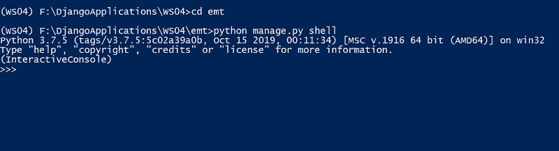
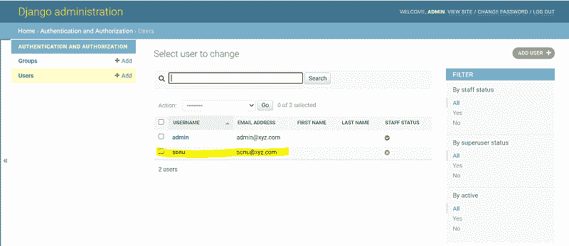

# 如何从 Django shell

创建用户

> 原文:[https://www . geesforgeks . org/how-create-user-from-django-shell/](https://www.geeksforgeeks.org/how-to-create-user-from-django-shell/)

让我们看看如何使用 Django 的交互 shell 为 Django 创建一个用户？请确保您激活了虚拟环境，并且您位于包含 manage.py 文件的文件夹中。

**注:**参考文章[如何在姜戈使用 MVT 创建基础项目？](https://www.geeksforgeeks.org/how-to-create-a-basic-project-using-mvt-in-django/)了解如何在 Django 创建项目。

让我们使用下面的命令启动 Django 的交互式 shell

> python manage.py shell

您将获得如下所示的类似输出



现在在 shell 中输入以下代码，为 Django 创建一个用户。

## 蟒蛇 3

```py
from django.contrib.auth.models import User

user = User.objects.create_user('sonu','sonu@xyz.com','sn@pswrd')
user.save()
```

让我们使用超级用户凭据来检查我们的新用户。可以遵循[如何在姜戈创建超级用户？](https://www.geeksforgeeks.org/how-to-create-superuser-in-django/)创建超级用户。让我们启动服务器并使用管理网址登录(确保网址模式中提到了路径(' admin/'，admin.site.urls)，)。

> http://127.0.0.1:8000/admin

分享下面的截图



您可以在“用户”部分下查看新添加的用户详细信息。