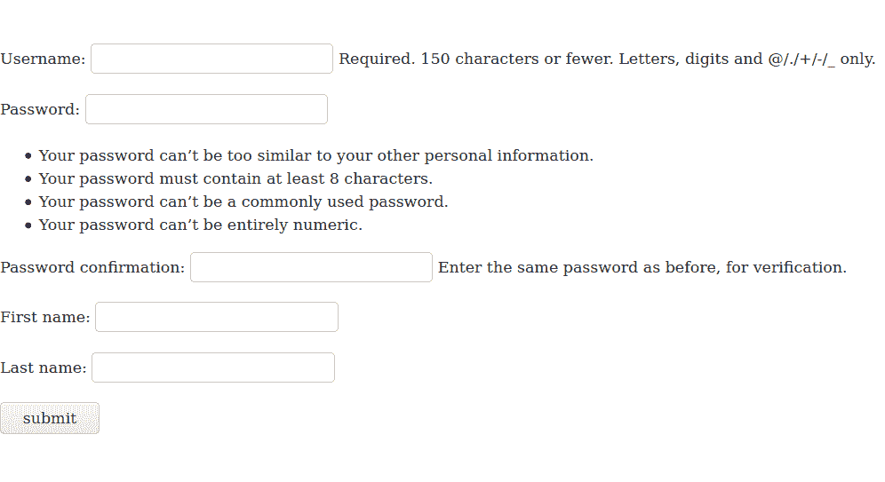
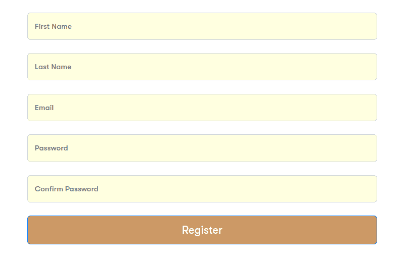

# 如何使用 Django Widget twings 定制 Django 表单？

> 原文:[https://www . geeksforgeeks . org/how-customize-django-forms-using-django-widget-tweets/](https://www.geeksforgeeks.org/how-to-customize-django-forms-using-django-widget-tweaks/)

Django 表单是用几行代码创建可用表单的一个很好的特性。但是 Django 不容易让我们编辑好的设计表单。在这里，我们将看到自定义 Django 表单的方法之一，因此它们将根据我们的愿望在我们的 HTML 页面上显示。基本上，我们将检查方法，以将我们自己的自定义 css、类或 id 包含到表单中的各个字段中。

假设我们有一个简单的 Django 表单，它有四个字段:

*   西方人名的第一个字
*   姓
*   用户名(默认可用)
*   密码(默认可用)
*   确认密码(默认可用)

我们不打算讨论如何创建这个表单，而是看如何定制 Django 表单的前端。要在 Django 创建表单，您可以签出–[如何使用 Django Forms 创建表单？](https://www.geeksforgeeks.org/how-to-create-a-form-using-django-forms/)

最初的 Django 表单(默认情况下是这样的)


默认的 Django 表单

它的简单代码如下

## 超文本标记语言

```
{{form}}
 <input type="submit" value="submit">
```

当然，Django 默认为我们提供了很多默认的方法，比如使用 **form.as_p** ，如下所示



使用 as_p 的 Django 表单

这将有一个简单的代码像

## 超文本标记语言

```
{{form.as_p}}
<input type="submit" value="submit">
```

但是我们需要给表单添加自定义类和 CSS。

### 如何使用 Django Widget twings 定制 Django 表单？

那么，让我们看看如何让它看起来像这样好



Django 表单输入表单自定义

因此，我们将使用 Django 小部件调整来实现它。让我们使用 pip 安装 django 小部件调整

```
pip install django-widget-tweaks

```

现在转到设置中的已安装应用程序，然后在已安装应用程序中添加小部件调整

```
INSTALLED_APPS = [
   'django.contrib.auth',

#...........(some more apps already here maybe)......

'widget_tweaks',

#...........(some more apps already here maybe)......
]

```

现在我们已经安装了 Django 小部件，让我们把它导入到我们正在工作的 HTML 文件中
写这个

{ % load widget _ twings % }

在您的 HTML 页面的顶部，我们只需更改每个字段:

## 超文本标记语言

```


<div class="form-group">
  // first_name is the name by which first name is created in django forms
  
</div>

<div class="form-group">
   // last_name is the name by which last name is created in django forms
  
</div>

<div class="form-group">
   // username is the default name of username in django forms
  
</div>

<div class="form-group">
   // password1 is the default name of password in django forms
  
</div>

<div class="form-group">
   // password2 is the default name of confirm password in django forms
  
</div>

<div>
  <button type="submit" value="Submit" > Register </button>
</div>
```

每个字段的名称都在代码中用“//”进行了解释。在 CSS 文件中，我们将拥有所有的代码，用于按类或 id 定制每个字段。

让我们看看姜戈的调整是如何帮助我们的。在每个字段中，我们都有自己的类，因此我们可以根据自己的选择添加任何 CSS。因此，我们只需要用 css 设计 HTML，并在 Django 中使用它，只需在最后用 render_field 和 form.field_name 替换输入标记，并用我们的选择进行设计。