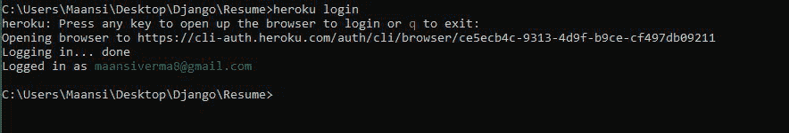
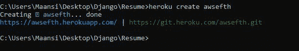
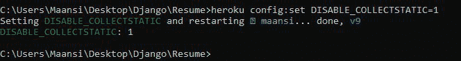
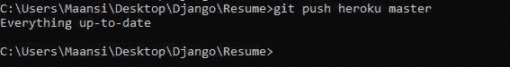
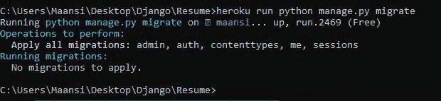
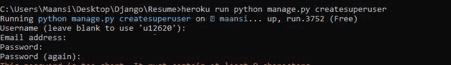
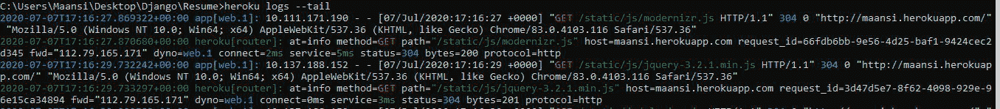

# 如何在 Heroku 上部署 Django 应用？

> 原文:[https://www . geesforgeks . org/how-deploy-django-application-on-heroku/](https://www.geeksforgeeks.org/how-to-deploy-django-application-on-heroku/)

Django 是一个用于构建网络应用程序的 MVT 网络框架。它健壮、简单，并帮助 web 开发人员编写干净、高效和强大的代码。在本文中，我们将学习如何通过简单的步骤在 Heroku 上部署 Django 项目。为此，应准备好一个姜戈项目，访问以下链接准备一个:[https://www.geeksforgeeks.org/django-tutorial/](https://www.geeksforgeeks.org/django-tutorial/)

### **先决条件**:

*   Django
*   Postgres 已安装

**Requirements.txt 文件:**在与您的 manage.py 相同的目录中创建 Requirements.txt 文件。在激活虚拟环境的情况下，在控制台中运行以下命令:

```
 (myvenv) $ pip install dj-database-url gunicorn whitenoise

```

```
 (myvenv) $ pip freeze > requirements.txt

```

请检查您的 requirements.txt。它将使用项目中当前安装的软件包进行更新。

**Procfile:** 在与 manage.py 相同的目录下创建一个名为 Procfile 的文件，你会看到 Heroku 标志作为 Procfile 的图标。添加以下一行:

```
web: gunicorn <project_name>.wsgi --log-file -

```

这里的项目名称将是您的 settings.py 所在的文件夹的名称。Procfile 明确声明应该执行什么命令来启动您的应用程序。

**Runtime.txt 文件:**在与你的 manage.py 相同的目录中创建 Runtime.txt 文件。添加你想要用于你的 web 应用程序的 python 版本:

```
python-3.7.1 

```

**设置. py:** 按照以下说明修改您的设置. py:

1.将调试设置为假。

```
DEBUG = False

```

2.修改允许的主机。

```
ALLOWED_HOSTS = ['127.0.0.1', '.herokuapp.com']

```

3.要禁用 Django 的静态文件处理并允许白化接管，请将“nostatic”添加到“INSTALLED_APPS”列表的顶部。

```
INSTALLED_APPS = [
    'whitenoise.runserver_nostatic',
    'django.contrib.staticfiles',
    # ...
]

```

4.将白色添加到中间件列表中。白化中间件应该直接放在 Django SecurityMiddleware 之后(如果您正在使用它)，并且放在所有其他中间件之前:

```
MIDDLEWARE = [
 'django.middleware.security.SecurityMiddleware',
 'whitenoise.middleware.WhiteNoiseMiddleware',
 # ...
]

```

5.更新您的数据库设置。

```
import dj_database_url

DATABASES = {
    'default': {
        'ENGINE': 'django.db.backends.postgresql_psycopg2',
        'NAME': '<database_name>',
        'USER': '<user_name>',
        'PASSWORD': '<password>',
        'HOST': 'localhost',
        'PORT': '',
    }
}

db_from_env = dj_database_url.config(conn_max_age=500)
DATABASES['default'].update(db_from_env)

```

6.直接从文件的原始位置(通常在 STATICFILES_DIRS 或 app 静态子目录中)提供文件，而不需要通过 collectstatic 命令将其收集到 STATIC_ROOT 中；将“白化 _ 使用 _ 查找器”设置为“真”。

```
WHITENOISE_USE_FINDERS = True

```

7.白化瓦兹附带了一个存储后端，自动负责压缩您的文件，并为每个版本创建唯一的名称，以便它们可以安全地永远缓存。要使用它，只需将它添加到您的设置中。py:

```
STATICFILES_STORAGE = 'whitenoise.storage.CompressedManifestStaticFilesStorage'

```

**设置的最终修改内容。py:**

```
import dj_database_url

...

DEBUG = False

ALLOWED_HOSTS = ['127.0.0.1', '.herokuapp.com']

INSTALLED_APPS = [
    'whitenoise.runserver_nostatic',

    #...

]

MIDDLEWARE = [
    'django.middleware.security.SecurityMiddleware',
    'whitenoise.middleware.WhiteNoiseMiddleware',

    #...
]

...

DATABASES = {
    'default': {
        'ENGINE': 'django.db.backends.postgresql_psycopg2',
        'NAME': '<database_name>',
        'USER': '<username>',
        'PASSWORD': '<password>',
        'HOST': 'localhost',
        'PORT': '',
    }
}

WHITENOISE_USE_FINDERS = True

...

db_from_env = dj_database_url.config(conn_max_age=500)
DATABASES['default'].update(db_from_env)

STATICFILES_STORAGE = 'whitenoise.storage.CompressedManifestStaticFilesStorage'

```

**Heroku 账号**

1.安装你的英雄库工具带，你可以在这里找到:[https://toolbelt.heroku.com/](https://toolbelt.heroku.com/)

2.通过在 cmd 或 gitbash 中运行以下命令来验证您的 Heroku 帐户

```
$heroku login

```



这里，要部署的项目(简历)的目录是活动的

> 有时 cmd 或 git bash 可能会在某些命令下冻结。用 CTRL+C 就出来了。

3.在部署之前提交对 git 的任何更改。

```
$ git status
$ git add -A .
$ git commit -m "additional files and changes for Heroku"

```

4.选择您的应用程序名称，该名称将显示在域名–**【您的应用程序名称】. herokupapp . com**上，并使用以下命令创建应用程序:

```
$ heroku create <your_app's_name>

```



5.**调试:**如果收集静态在构建过程中失败，则会提供一个有助于诊断问题的回溯。如果需要运行 collectstatic 的环境的其他信息，请使用 DEBUG_COLLECTSTATIC 配置。

```
$ heroku config:set DEBUG_COLLECTSTATIC=1

```


6.**禁用 Collectstatic:** 有时，您可能不希望 Heroku 代表您运行 Collectstatic。您可以使用 DISABLE _ COLLECTSTATIC 配置禁用 COLECTSTATIC 构建步骤:

```
$heroku config:set DISABLE_COLLECTSTATIC=1

```



7.最后，做一个简单的 git 推送来部署我们的应用程序:

```
$ git push heroku master

```



8.当我们部署到 Heroku 时，我们创建了一个新的数据库，它是空的。我们需要运行迁移并创建超级用户命令。

```
$ heroku run python manage.py migrate

```



```
$ heroku run python manage.py createsuperuser

```



命令提示符将要求您再次选择用户名和密码。这些将是你在你的直播网站的管理页面上的登录细节。

9.要打开您的站点运行:

```
$ heroku open

```

**解决错误**

如果您在网站上看到应用程序错误，请运行:

```
$heroku logs --tail

```



它显示最近的日志，并让会话保持打开状态，以便实时日志流入。通过查看应用程序中的实时日志流，您可以深入了解实时应用程序的行为，并调试当前的问题。完成后，按 Ctrl+C 返回提示。