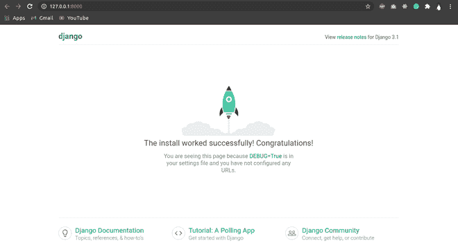
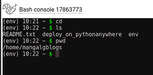
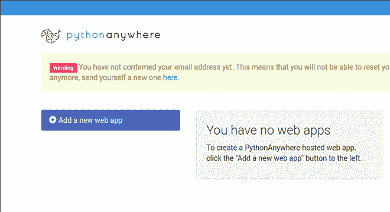
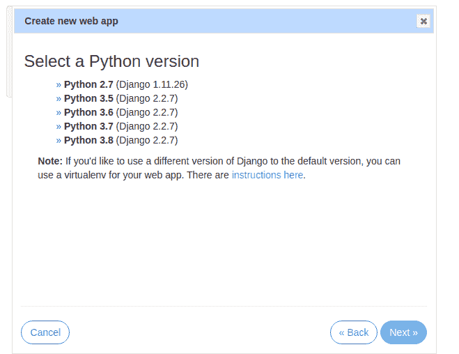
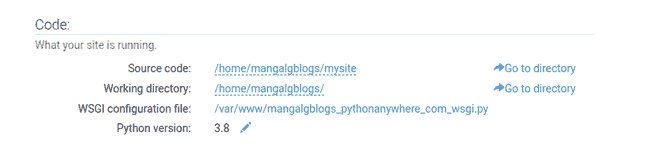
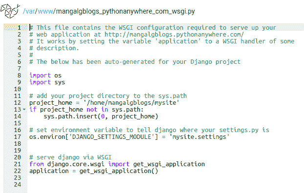
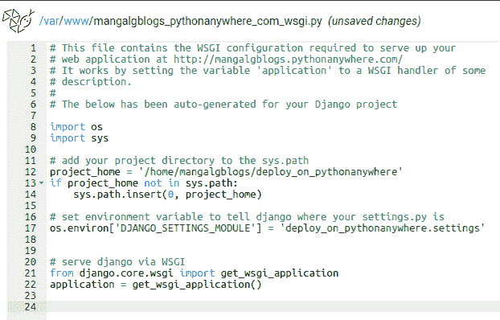
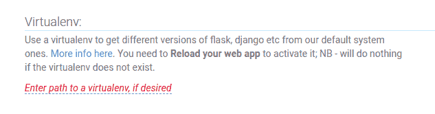
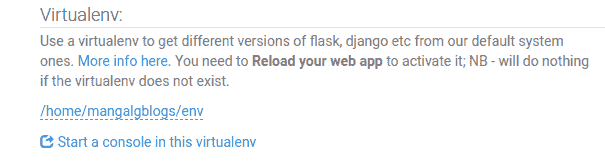
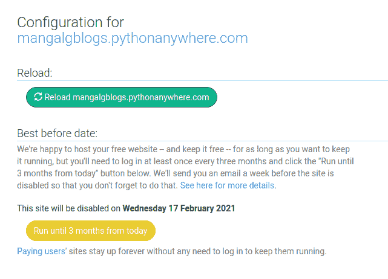

# 如何在 PythonAnywhere 上部署 Django 项目？

> 原文:[https://www . geesforgeks . org/how-deploy-django-project-on-pythonanywhere/](https://www.geeksforgeeks.org/how-to-deploy-django-project-on-pythonanywhere/)

在过去的几年里，Django 已经成为流行的框架之一。通常，在创建您的 django 项目后，您会困惑，如何与周围的人分享它。本文围绕如何在 pythonanywhere 上免费托管 django 应用程序展开。让我们开始吧..！！

### 步骤 1:设置您的 Django 项目(本地更改)

让我们在 Django 创建一个简单的应用程序来展示部署。

*   初始化你的姜戈项目

```py
django-admin startproject deploy_on_pythonanywhere

```

*   在编辑器中的“设置”下打开项目。复制制作:

```py
ALLOWED_HOSTS = ['*']

```

*   使用命令创建 requirements.txt 文件

```py
pip3 freeze > requirements.txt

```

*   我们项目的文件结构如下:

```py
deploy_on_pythonanywhere
├── db.sqlite3
├── deploy_on_pythonanywhere
│   ├── asgi.py
│   ├── __init__.py
│   ├── __pycache__
│   │   ├── __init__.cpython-38.pyc
│   │   ├── settings.cpython-38.pyc
│   │   ├── urls.cpython-38.pyc
│   │   └── wsgi.cpython-38.pyc
│   ├── settings.py
│   ├── urls.py
│   └── wsgi.py
├── manage.py
└── requirements.txt

```

*   让我们启动我们的姜戈服务器

```py
cd deploy_on_pythonanywhere
python3 manage.py runserver

```



你的服务器运行在本地主机上🙂但是等等，等等……这还没有结束，让我们为这个世界而活吧

### 第二步:上传项目到 GitHub

*   点击此链接在 github 上推送项目–[如何在 Github 上上传项目？](https://www.geeksforgeeks.org/how-to-upload-a-project-on-github/)

### 步骤 3:在 pythonanywhere 上部署项目

*   在 pythonanywhere 上创建帐户–[单击此处](https://www.pythonanywhere.com/registration/register/beginner/)
*   注册后，您可以看到如下页面


*   现在点击控制台，然后选择 Bash，如下所示


*   **在 bash 上运行以下命令:**
*   repo github 克隆

```py
git clone https://github.com/Prakhar-Mangal/deploy_on_pythonanywhere.git

```

*   现在创建和设置环境变量

```py
python3 -m venv env #create virtual environment
source env/bin/activate #activate virtual environment
cd deploy_on_pythonanywhere #navigate inside your project 
pip install -r requirements.txt #installing dependencies using requirements.txt

```

*   现在复制您在 bash 上安装的目录的路径
*   在 bash 上键入命令

```py
cd
ls # get list of directories
pwd #copy the path for future use

```

*   这里看起来像:



好啊，我们成功地建立了我们的项目: )但是等等，遵循最后的过程，我们准备好了

*   现在点击网页，然后选择添加一个新的网络应用程序



*   **点击下一步，按照程序**
*   选择 Django 作为框架


*   选择 python3.8(最新)，然后单击“下一步”直到最后一步。



*   现在在网络部分打开 WSGI 配置文件



*   编辑第 12 行和第 17 行的 WSGI 配置文件，删除您从 GitHub 克隆的带有项目名称的单词**我的站点**，在我的例子中是**deploy _ on _ python onywhere**



*   现在看起来像这样，然后点击保存:



*   选择网站下的虚拟链接部分:



*   输入我们使用 bash 创建的 Virtualenv 的路径(路径请参考上面的 pwd 命令)



*   单击网站部分下的重新加载，并访问链接

