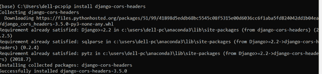
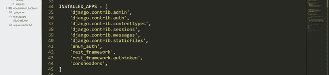
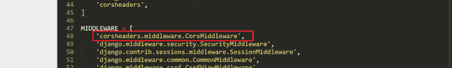

# 如何在姜戈项目中启用 CORS 标头？

> 原文:[https://www . geesforgeks . org/how-to-enable-CORS-headers-in-your-django-project/](https://www.geeksforgeeks.org/how-to-enable-cors-headers-in-your-django-project/)

当站点 A 想要访问另一个站点 B 的内容时，它被称为跨来源请求。由于出于安全原因被禁用，B 在响应中发送一个访问控制-允许-源头。默认情况下，一个域不允许访问另一个域上承载的应用编程接口。如果我们想允许我们的 Django 应用程序中托管的 REST API(比如后端)从另一台服务器上托管的其他应用程序(比如前端)访问，我们必须启用 CORS(跨来源资源共享)。

### 允许 CORS 参与姜戈项目的步骤–

1.使用画中画安装 django-CORS-header:

```py
pip install django-cors-headers 
```



2.在 settings.py 文件的“已安装的应用程序”部分添加 corsheaders:

```py
INSTALLED_APPS = [

   ...

   'corsheaders',

   ...

]
```



3.在 settings.py 文件的中间件部分添加 corsheaders . middleware . corsmidleware:

```py
MIDDLEWARE = [
  'django.middleware.security.SecurityMiddleware',
  ...
  'django.middleware.clickjacking.XFrameOptionsMiddleware',
  'corsheaders.middleware.CorsMiddleware',
]
```



4.如果要允许所有域的访问，请在设置文件中将以下变量设置为真:

```py
CORS_ORIGIN_ALLOW_ALL = True
```


或者，您可以通过在 settings.py 文件中执行以下操作来指定要授予访问权限的域:

```py
CORS_ORIGIN_ALLOW_ALL = False
CORS_ORIGIN_WHITELIST = (
  'http://localhost:8000',
)
```


仅此而已！现在，您的应用编程接口可以被其他选定服务器上的其他应用程序访问。