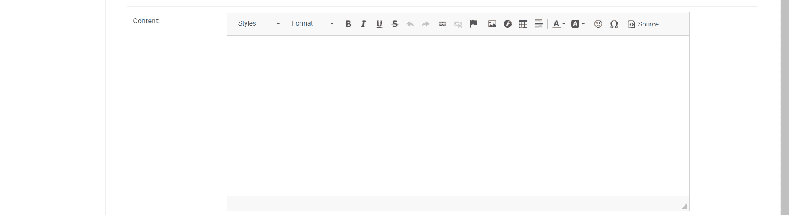

# 如何在您的 Django 网站中集成自定义富文本编辑器？

> 原文:[https://www . geesforgeks . org/如何集成-自定义-富文本-编辑在您的 django-网站/](https://www.geeksforgeeks.org/how-to-integrate-custom-rich-text-editor-in-your-django-website/)

在本文中，我们将在 Django 应用程序中实现 [tinymce](https://www.tiny.cloud/) 文本编辑器。

**django-tinymce 是什么？**

django-tinymce 是一个 django 应用程序，它包含一个小部件来将表单字段呈现为 tinymce 编辑器。

**功能** :-

*   用作表单小部件或视图。
*   增强了对内容语言的支持。
*   与 TinyMCE 拼写检查器集成。
*   为对话框启用预定义的链接和图像列表。
*   支持 django-static file
*   可以压缩 TinyMCE 的 Javascript 代码。

### 如何在 Django 项目中添加 Tinymce 编辑器？

**步骤 1–**安装 django 并创建 Django 项目和应用程序。

**步骤 2–**安装 django-tinymce:

```py
pip install django-tinymce
```

**步骤 3–**

在 settings.py 中将 tinymce 添加到您项目的 INSTALLED_APPS 中:

```py
INSTALLED_APPS = (
   ...
   'tinymce',
)
```

**步骤 4–**

将 <u>tinymce.urls</u> 添加到项目的 urls.py 中:

```py
urlpatterns = [
   ...
   url(r'^tinymce/', include('tinymce.urls')),
]
```

**步骤 5–**

相应地编辑您的 models.py 文件，并为富文本编辑器引入一个 **HTMLField() 【T1:】**

```py
from django.db import models
from tinymce.models import HTMLField
class MyModel(models.Model):
   ...
   content = HTMLField()
```

这将在您的 django 应用程序中集成一个简单的富文本编辑器。

您的数据库管理面板中会有类似这样的内容:-



现在我们的任务是定制这个编辑器，使其看起来更好，并在其中添加更多功能。

### 添加更多定制–

**第 6 步–**

现在转到 Tinymce 下载页面，下载适合您的 django 应用程序的任何版本。

> **注意**–你也可以使用 Tinymce CDN 在你的 django 应用中集成 Tinymce。

**第 7 步–**

现在复制您下载的 Tinymce 文件，并将其粘贴到项目的静态文件夹中。像<u>静态/js/tinymce</u>

**第 8 步–**

现在转到 [Tinymce 演示页面](https://www.tiny.cloud/docs/demo/full-featured/)，选择您想要的文本编辑器。如果你需要更多的功能，你也可以选择付费版本。从编辑器中复制 JS 文件的内容。

**步骤 9–**

在 <u>static/js/tinymce</u> 文件夹新建一个文件 custom.js，将复制的内容粘贴在里面保存。在这个 JS 文件内容中有很多插件，你可以根据需要添加或删除它们。

**第 10 步–**

现在在您想要的模板中包含 tinymce.min.js 和 custom.js 文件。

```py
<!--Tinymce Text-Editor (Must be in Head Tag) -->
 <script src=""></script>
 <script type="text/javascript" src="" ></script>
```

**第 11 步–**

现在根据您的 Django 模型创建一个表单，并将其呈现在所需的模板中。您可以使用 *{{ form.as_p }}或{{ form.as_ul }}或{{ form.as_table }}* 显示新的富文本编辑器。如果您想在文本编辑器中显示默认正文文本，并且可以查看表单的页面源，根据需要复制和编辑它，删除{{ }}部分，粘贴复制的表单并在 django 模板中呈现它。