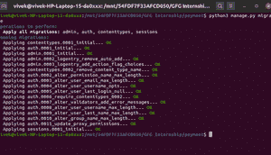

# 【Mysql 数据库如何与 Django 集成？

> 原文:[https://www . geesforgeks . org/how-integrate-MySQL-database-with-django/](https://www.geeksforgeeks.org/how-to-integrate-mysql-database-with-django/)

Django 是一个基于 Python 的网络框架，允许您快速创建高效的网络应用程序。它也被称为电池内置框架，因为 Django 为一切提供内置功能，包括 Django 管理界面、默认数据库——sqllite 3 等。

【Mysql 数据库如何与 Django 集成？

安装 Mysql 数据库

[https://dev . MySQL . com/downloads/installer/](https://dev.mysql.com/downloads/installer/)

下载后安装安装程序并设置管理员和密码。

安装 Django

```
pip install django
```

然后安装另一个库来使用 mysql 数据库

```
pip install mysqlclient
```

创建新项目

```
django-admin startproject MyDB
```

```
cd MyDB
```

**设置. py**

## 蟒蛇 3

```
DATABASES = {
    'default': {
        'ENGINE': 'django.db.backends.mysql',
        'NAME': 'mydb',
        'USER': 'root',
        'PASSWORD': 'admin',
        'HOST':'localhost',
        'PORT':'3306',
    }
}
```

在数据库变量中打开 settings.py 配置 mysql 数据库值，并添加数据库值。

```
python manage.py migrate
```



然后创建新应用程序

```
python manage.py startapp main
```

**主/车型. py**

## 蟒蛇 3

```
from django.db import models
from django.contrib.auth.models import User

#Create your models here.
class PublishedArticle(models.Model):
    todo = models.CharField(max_length=40)
    date = models.DateField(auto_now=True)
```

```
python manage.py migrate
```

已发布的文章表将在数据库中创建。因此，Mysql 数据库被成功集成