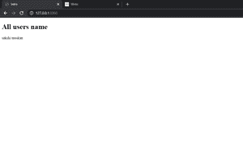

# 如何将附加上下文传递到基于类的视图(Django)？

> 原文:[https://www . geeksforgeeks . org/如何将附加上下文传递到基于类的视图中-django/](https://www.geeksforgeeks.org/how-to-pass-additional-context-into-a-class-based-view-django/)

一旦知道要注意什么，从基于类的视图向模板传递上下文就很容易了。有两种方法可以做到这一点——一种是获取上下文数据，另一种是修改 extra_context 变量。让我们看看如何逐一使用这两种方法。

**说明:**

举例说明如何使用 get_context_data 方法和 extra_context 变量将上下文传递到模板中。考虑一个名为 geeksforgeeks 的项目，它有一个名为 geeks 的应用程序。

```py
Refer to the following articles to check how to create a project and an app in django.

       How to Create Basic Project using MVT in Django?
       How to Create an App in Django ?
```

### **方法 1** :使用 get_context_data 方法

在 models.py 中添加以下代码:

## 蟒蛇 3

```py
from django.db import models

# Create your models here.
class YourModel(models.Model):
    first_name = models.CharField(max_length=30)
    last_name = models.CharField(max_length=30)
    def __str__(self):
        return self.first_name
```

创建这个模型后，我们需要运行两个命令来为其创建数据库。

```py
python manage.py makemigrations
python manage.py migrate
```

在 app 目录(极客)中创建名为 templates 的文件夹，在该文件夹中添加名为 Intro.html 的文件，并添加以下代码:

## 超文本标记语言

```py
<!-- Intro.html -->
<!DOCTYPE html>
<html lang="en" dir="ltr">
  <head>
    <meta charset="utf-8">
    <title>Intro</title>
  </head>
  <body>
    <h1>All users name </h1>
    
    {{user.first_name}}
    
  </body>
</html>
```

在 views.py 文件中添加以下代码:

## 蟒蛇 3

```py
from django.views.generic.base import TemplateView
from .models import YourModel

class Intro(TemplateView):
    template_name = 'Intro.html'
    def get_context_data(self,*args, **kwargs):
        context = super(Intro, self).get_context_data(*args,**kwargs)
        context['users'] = YourModel.objects.all()
        return context
```

在名为 geeksforgeeks 的项目的 urls.py 文件中添加以下代码:

## 蟒蛇 3

```py
from django.contrib import admin
from django.urls import path
from geeks.views import Intro

urlpatterns = [
    path('admin/', admin.site.urls),
    path('',Intro.as_view(),name="intro")
]
```

### **方法 2:** 使用 extra_context 变量

通过添加以下代码重写 views.py flle:

## 蟒蛇 3

```py
from django.views.generic.base import TemplateView
from .models import YourModel

class Intro(TemplateView):
    template_name = 'Intro.html'
    extra_context={'users': YourModel.objects.all()}
```

通过这两种方法，您将看到相同的输出。我们来看看 [http://localhost:8000/](http://127.0.0.1:8000/) 上有什么，在做这个之前别忘了给你的模型加一些数据。

```py
How to add data to your model
   Django ORM – Inserting, Updating & Deleting Data
```

### **输出–**

