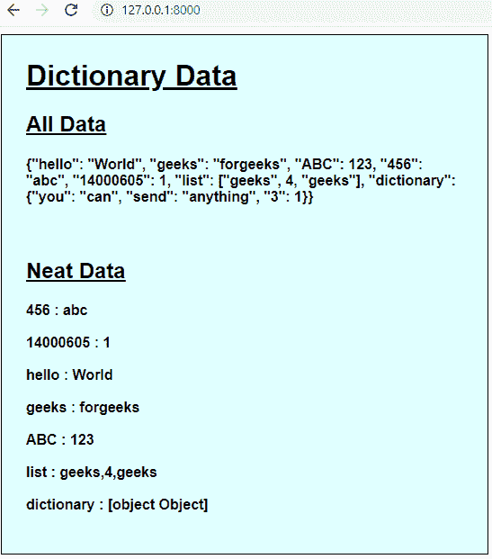
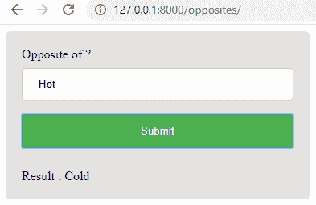

# 如何在 Django 框架中将数据传递给 javascript？

> 原文:[https://www . geesforgeks . org/如何将数据传递给 django-framework 中的 JavaScript/](https://www.geeksforgeeks.org/how-to-pass-data-to-javascript-in-django-framework/)

Django 是一个用于 web 开发的 python 框架，在 jinja2 模板引擎上工作。当数据在通过 views.py 后与模板一起呈现时，该数据在呈现时所在的 html 文件上变为静态。由于 django 是一个后端框架，因此要使用 python 的强大功能来动态使用数据，需要生成请求。这些请求可以是 GET、POST、AJAX 等类型。但是不调用后端，动态使用数据的唯一方法是将其传递给 JavaScript。通常向 JavaScript 传递几个值就可以了。但有时需要传递整个数据字典。这可以使用 JSON 和 django 模板标签来完成。

要查看更多关于 python 中 django 框架的信息，请访问–[Django 教程](https://www.geeksforgeeks.org/django-tutorial/)。

**In ‘views.py’ file –**

```py
from django.shortcuts import render
from json import dumps

def send_dictionary(request):
    # create data dictionary
    dataDictionary = {
        'hello': 'World',
        'geeks': 'forgeeks',
        'ABC': 123,
        456: 'abc',
        14000605: 1,
        'list': ['geeks', 4, 'geeks'],
        'dictionary': {'you': 'can', 'send': 'anything', 3: 1}
    }
    # dump data
    dataJSON = dumps(dataDictionary)
    return render(request, 'main / landing.html', {'data': dataJSON})
```

**在‘landing . html’文件中–**

```py
<!DOCTYPE html>
<body>
    <div style="width: 40%;
    border: 1px solid black;
    background-color: lightcyan;
    font-family: Helvetica, sans-serif;">
        <div style="margin: 5%;">
            <h1>
                <u>Dictionary Data</u>
            </h1>
            <h2>
                <u>All Data</u>
            </h2>
            <h4 id='alldata'></h4><br>
            <h2>
                <u>Neat Data</u>
            </h2>
            <h4 id='neatdata'></h4>
        </div>
    </div>
</body>
</html>
<script>
    var data = JSON.parse("{{data|escapejs}}");
    var dataNode = document.getElementById('alldata');
    dataNode.innerHTML+="{{data|escapejs}}";
    dataNode = document.getElementById('neatdata');
    for(var x in data){
        dataNode.innerHTML+=x+' : '+data[x]+'<br><br>';
    }
</script>
```

**输出:**



现在，“字典”的值和我们在 python 中输入的不一样。这是因为 JavaScript 将字典视为单独的对象，因此要查看这些对象的数据，我们必须在 JavaScript 中单独指定。

## 用例–

让我们使用 Django 创建一个对面的 finder 网站。我们将单词之间的相反关系馈送给 Python，并将其发送给 JavaScript，以根据用户的输入来确定输出。

**在“views.py”文件中–**

```py
from django.shortcuts import render
from json import dumps

def opposites(request):
    # create data dictionary
    data = [
        ["Laugh", "Cry"],
        ["Even", "Odd"],
        ["Hot", "Cold"],
        ["Light", "Dark"],
        ["Opposite", "Same"],
        ["Far", "Near"],
        ["Give", "Take"],
        ["Night", "Day"],
        ["Import", "Export"],
        ["Hard", "Easy"],
        ["Never", "Always"],
        ["Late", "Early"],
        ["Less", "More"],
        ["Male", "Female"],
        ["Happiness", "Sadness"],
        ["Fast", "Slow"],
        ["Old", "Young"],
        ["Boy", "Girl"],
        ["Up", "Down"],
        ["Left", "Right"],
        ["Rich", "Poor"],
        ["Love", "Hate"],
        ["Inside", "Outside"],
        ["Bad", "Good"],
        ["Short", "Tall"],
    ]
    data = dumps(data)
    return render(request, "main/opposites.html", {"data": data})
```

**在“对立面. html”文件中–**

```py
<!DOCTYPE html>
<html>
<body>
<div>
  Opposite of ?
  <input type="text" id="input" placeholder="Input">
  <input type="submit" id='opp' value="Submit" onclick="opposite()">
  <br><br>Result : <h id='result'></h>
</div>
</body>
</html>
<script>
  function opposite(){
    var data = JSON.parse("{{data|escapejs}}");
    var input = document.getElementById("input").value;
    var result = document.getElementById("result")
    var flag = 1;
    for(var x in data){
      if(input.toLowerCase()==data[x][0].toLowerCase()){
        result.innerHTML = data[x][1];
        flag=0;
      }
      else if(input.toLowerCase()==data[x][1].toLowerCase()){
        result.innerHTML = data[x][0];
        flag=0;
      }
    }
    if(flag){
      result.innerHTML = "No results found"
    }
  }
</script>
```

**输出:**

