# 如何在 Django REST 框架中返回自定义 JSON？

> 原文:[https://www . geesforgeks . org/how-return-custom-JSON-in-django-rest-framework/](https://www.geeksforgeeks.org/how-to-return-custom-json-in-django-rest-framework/)

在本文中，我们将创建基于类的视图，并将其与序列化器类相结合，为每个 HTTP 请求返回 JSON 表示。对于基于类的视图，我们将使用一组通用视图，这有助于实现最少的代码行。

*   泛型类和视图器
*   与关系资源交互的 HTTP 请求

## 泛型类和视图器

我们将利用泛型类视图来实现 get、post、delete、put 和 patch 方法。为此，我们需要使用来自 *rest_framework.generics* 模块的两个泛型类视图。它们是:

*   listcreateapiview
*   **RetrieveUpdateDestroyAPIView**

*ListCreateApiew*类视图实现了 get 方法(检索一个 queryset 的列表)和 post 方法(创建一个模型实例)。并且，*RetrieveUpdateDestroyAPIView*类视图实现了 get(检索模型实例)、delete(删除模型实例)、put(完全更新模型实例)和 patch(部分更新模型实例)。

在 Django REST 框架中，这两个通用视图被实现为 mixin 类。*列表创建视图*使用来自 *rest_framework.mixins* 模块的*列表模型融合*和*创建模型融合*以及来自*rest _ framework . generics*模块的*泛型视图*。让我们看看它的声明。

## 蟒蛇 3

```
class ListCreateAPIView(mixins.ListModelMixin, 
                        mixins.CreateModelMixin, GenericAPIView):
```

*RetrieveUpdateDestroyAPIView*使用来自 *rest_framework.mixins* 模块的 *RetrieveModelMixin* 、 *UpdateModelMixin* 和*destroymidxin*以及来自*rest _ framework . generics*模块的*generic piview*。让我们看看它的声明。

## 蟒蛇 3

```
class RetrieveUpdateDestroyAPIView(mixins.RetrieveModelMixin, 
                                   mixins.UpdateModelMixin, 
                                   mixins.DestroyModelMixin, 
                                   GenericAPIView):
```

现在，让我们回到我们的 RESTFul web 服务代码，并创建所需的一组基于 Django 类的视图。可以打开*restpi \ robots \ view . py*Python 文件，用下面的代码替换。

## 蟒蛇 3

```
from django.shortcuts import render

from rest_framework import generics
from rest_framework.response import Response
from rest_framework.reverse import reverse

from robots.models import RobotCategory
from robots.models import Manufacturer
from robots.models import Robot

from robots.serializers import RobotCategorySerializer
from robots.serializers import ManufacturerSerializer
from robots.serializers import RobotSerializer

class ApiRoot(generics.GenericAPIView):
    name = 'api-root'
    def get(self, request, *args, **kwargs):
        return Response({
            'robot-categories': reverse(RobotCategoryList.name, request=request),
            'manufacturers': reverse(ManufacturerList.name, request=request),
            'robots': reverse(RobotList.name, request=request)
            })            

class RobotCategoryList(generics.ListCreateAPIView):
    queryset = RobotCategory.objects.all()
    serializer_class = RobotCategorySerializer

class RobotCategoryDetail(generics.RetrieveUpdateDestroyAPIView):
    queryset = RobotCategory.objects.all()
    serializer_class = RobotCategorySerializer
    name = 'robotcategory-detail'

class ManufacturerList(generics.ListCreateAPIView):
    queryset = Manufacturer.objects.all()
    serializer_class = ManufacturerSerializer
    name = 'manufacturer-list'

class ManufacturerDetail(generics.RetrieveUpdateDestroyAPIView):
    queryset = Manufacturer.objects.all()
    serializer_class = ManufacturerSerializer
    name = 'manufacturer-detail'        

class RobotList(generics.ListCreateAPIView):
    queryset = Robot.objects.all()
    serializer_class = RobotSerializer
    name = 'robot-list'

class RobotDetail(generics.RetrieveUpdateDestroyAPIView):
    queryset = Robot.objects.all()
    serializer_class = RobotSerializer
    name = 'robot-detail'
```

这里*机器人目录列表*、*制造商列表*和*机器人列表*是*泛型的子类。ListCreateAPIView*；*robotcategoredtail*、 *ManufacturerDetail* 、 *RobotDetail* 是*泛型的子类，retrieveupdatedestroyapiview .*每个子类都有一个 *queryset* 属性、 *serializer_class* 属性和一个*名称*属性。 *queryset* 属性存储所有检索到的对象， *serializer_class* 属性存储 serializer 类，name 属性用于标识每个视图。

除了基于类的视图之外，您可以注意到一个*apirroot*类，它是*rest _ framework . generics . generic piview*的子类。

## 蟒蛇 3

```
class ApiRoot(generics.GenericAPIView):
    name = 'api-root'
    def get(self, request, *args, **kwargs):
        return Response({
            'robot-categories': reverse(RobotCategoryList.name, request=request),
            'manufacturers': reverse(ManufacturerList.name, request=request),
            'robots': reverse(RobotList.name, request=request)
            })
```

类为我们的 RESTful web 服务的根创建了一个端点，方便浏览资源集合。此类中定义的 get 方法返回一个响应对象，该对象具有描述性名称及其 URL。这里，它返回机器人类别列表、制造商列表和机器人列表的描述性名称和网址。

接下来，我们需要在正则表达式中指定 URL 模式，以便为*view . py*Python 文件中定义的基于类的视图运行特定的方法。客户端 HTTP 请求必须与这个正则表达式匹配，才能运行*视图. py* 文件中的方法。您可以在 *restapi/robots* 中创建*URL . py*文件，并添加以下代码。

## 蟒蛇 3

```
from django.conf.urls import url
from robots import views

urlpatterns = [
    url(r'^robot-categories/{content}apos;,
        views.RobotCategoryList.as_view(),
        name=views.RobotCategoryList.name),

    url(r'^robot-categories/(?P<pk>[0-9]+){content}apos;,
        views.RobotCategoryDetail.as_view(),
        name=views.RobotCategoryDetail.name),

    url(r'^manufacturers/{content}apos;,
        views.ManufacturerList.as_view(),
        name=views.ManufacturerList.name),

    url(r'^manufacturers/(?P<pk>[0-9]+){content}apos;,
        views.ManufacturerDetail.as_view(),
        name=views.ManufacturerDetail.name),

    url(r'^robots/{content}apos;,
        views.RobotList.as_view(),
        name=views.RobotList.name),

    url(r'^robots/(?P<pk>[0-9]+){content}apos;,
        views.RobotDetail.as_view(),
        name=views.RobotDetail.name),

    url(r'^{content}apos;,
        views.ApiRoot.as_view(),
        name=views.ApiRoot.name),
]
```

最后一步，我们需要定义根 URL 配置。可以打开*restapi/restapi/URL . py*Python 文件，用下面的代码替换:

## 蟒蛇 3

```
from django.conf.urls import url, include

urlpatterns = [
    url(r'^', include('robots.urls')),
]
```

## 与资源交互的 HTTP 请求

是时候通过编写和发送各种 HTTP 请求来测试我们的代码了。在这里，我们将利用 HTTPie 命令和 CURL 命令。

### **创建新的机器人类别**

让我们编写并发送一个 HTTP Post 请求来创建一个新的机器人类别。HTTPie 命令是:

> http POST:8000/robot-categories/name =“铰接式机器人”注释=“灵活性、灵巧性和伸展性使铰接式机器人非常适合跨非平行平面的任务。”

**输出:**

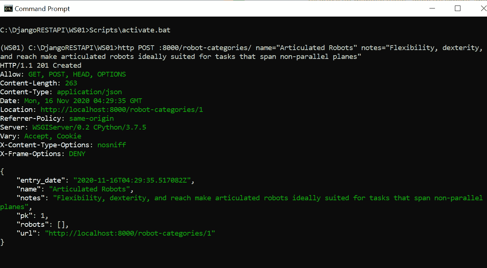

机器人类别发布请求

让我们使用 curl 命令创建另一个机器人类别。

> curl-iX POST-H " Content-Type:application/JSON "-d " { \ " name \ ":\ " SCARA 机器人\ "，\"notes\":\ "一种选择性柔顺铰接式机器人手臂(SCARA)是在两个平行平面之间执行操作的一个很好且经济高效的选择\ " } " localhost:8000/Robot-categories/

**输出:**

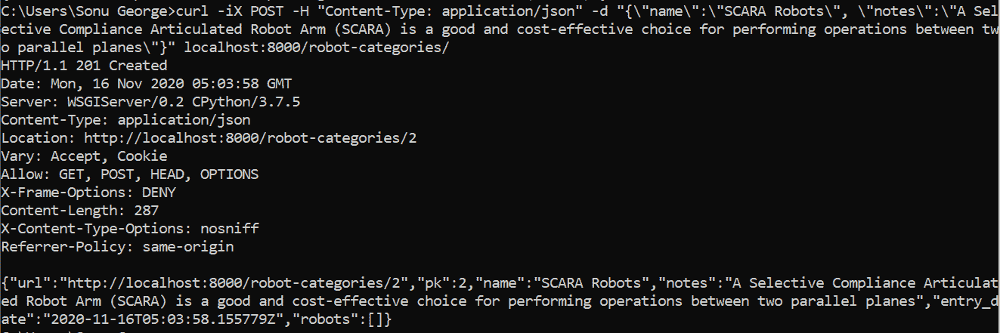

机器人类别开机自检请求

### **检索所有机器人类别**

让我们编写一个 GET 请求来检索所有的机器人类别。HTTPie 命令是:

> http:8000/机器人-类别/

**输出:**

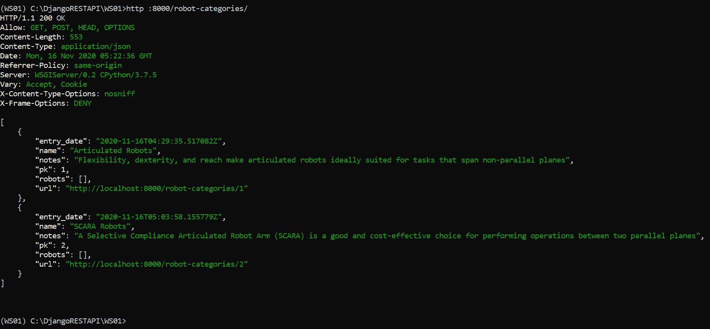

机器人类别获取请求(HTTPie 实用程序命令)

等效的卷曲命令是

> curl-iX GET localhost:8000/机器人-类别/

**输出:**

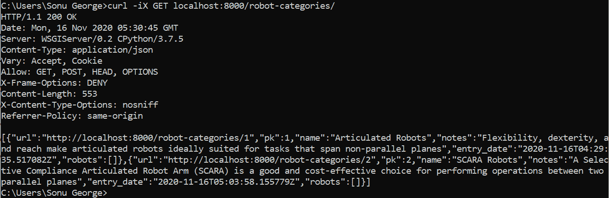

获取请求

### **检索单个机器人类别**

检索机器人类别的 HTTPie 命令是:

> http:8000/机器人-类别/1

**输出:**

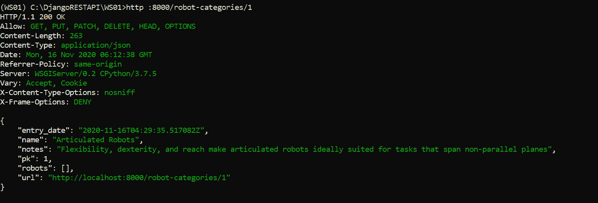

获取请求(单一类别)

等效的卷曲命令是:

> curl-iX GET localhost:8000/机器人-类别/1

### **创建新制造商**

让我们编写并发送一个 HTTP POST 请求来创建一个制造商。HTTPie 命令是:

> http:8000/制造商/名称=“FANUC 全球”评级=4 注=“自动化专家和工业机器人制造商”

**输出:**

> HTTP/1.1 201 已创建
> 
> 允许:获取、发布、标题、选项
> 
> 内容-长度:219
> 
> 内容类型:应用程序/json
> 
> 日期:Mon，2020 年 11 月 16 日格林尼治标准时间 06:36:12
> 
> 位置:http://localhost:8000/manufacturers/1
> 
> 推荐人-政策:同源
> 
> 服务器:wsgisserver/0.2 cpython/3 . 7 . 5
> 
> 变化:接受，饼干
> 
> x-内容-类型-选项:否
> 
> x 帧选项:拒绝
> 
> {
> 
> “entry _ date”:“2020-11-16t 06:36:12.449074 z”，
> 
> “机器人”:[]，
> 
> 【名称】:“FANUC 环球”，
> 
> 《说明》:“自动化专家和工业机器人制造商”，
> 
> 【PK】:1、
> 
> 【评级】:4、
> 
> " URL:" " http://localhost:8000/manufacturers/1 "
> 
> }

让我们使用 curl 命令创建另一个制造商。

> curl-iX POST-H " Content-Type:application/JSON "-d " { \ " name \ ":\ " ABB \ "，\"rating\":5，\"notes\ ":“专注于电气化、工业自动化、机器人、离散自动化和运动”} " localhost:8000/制造商/

**输出:**

> HTTP/1.1 201 已创建
> 
> 日期:格林威治标准时间 2020 年 11 月 16 日 06:49:43
> 
> 服务器:wsgisserver/0.2 cpython/3 . 7 . 5
> 
> 内容类型:应用程序/json
> 
> 位置:http://localhost:8000/manufacturers/2
> 
> 变化:接受，饼干
> 
> 允许:获取、发布、标题、选项
> 
> x 帧选项:拒绝
> 
> 内容-长度:242
> 
> x-内容-类型-选项:否
> 
> 推荐人-政策:同源
> 
> {“URL”:“http://localhost:8000/manufacturers/2”、“PK”:2、“name”:“ABB”、“rating”:5、
> 
> “注释”:“专注于电气化、工业自动化、机器人、离散自动化
> 
> 和 Motion "，" entry _ date ":" 2020-11-16t 06:49:43.108992 z "，" robots":[]}

### **检索制造商**

让我们编写一个检索制造商的请求。HTTPie 命令是:

> http:8000/制造商/2

**输出:**

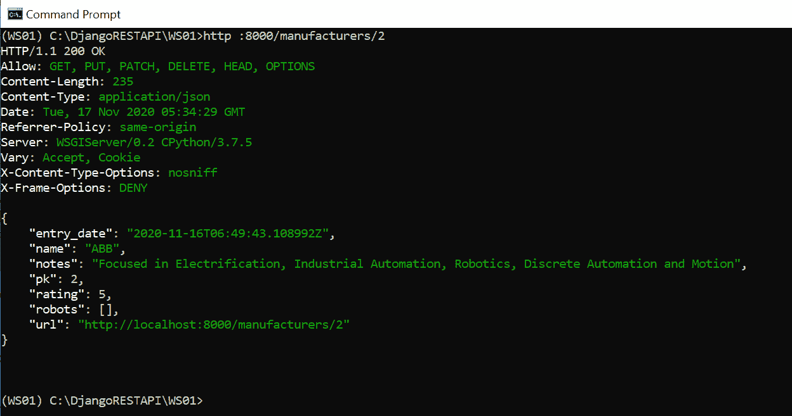

检索单个制造商

等效的卷曲命令是:

> curl-iX GET localhost:8000/厂家/2

### **添加机器人详情**

我们已经填充了机器人类别和制造商的详细信息。现在，让我们编写并发送一个 POST 请求来添加机器人细节。HTTPie 命令是

> http POST:8000/Robots/name =“FANUC M-710 IC/50”robot _ category =“铰接式机器人”currency =“USD”price = 37000 制造商=“FANUC 全球”制造 _ date =“2019-10-12 00:00:00:00.0000000+00:00”add _ details =“Axes 6，有效载荷 50 KG，达到 2050 MM”

**输出:**

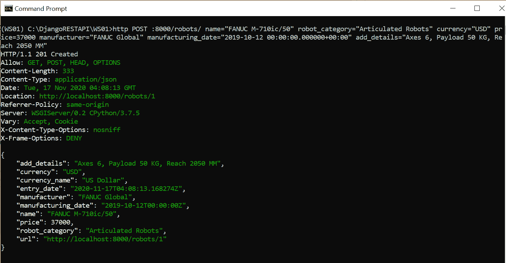

机器人入口(HTTP 实用程序饼图命令)

让我们编写一个 curl 命令来创建一个新条目。

> curl-iX POST-H " Content-Type:application/JSON "-d " { \ " name \ ":\ " SR-3iA \ "，\"robot_category\":\"SCARA 机器人\ "，\"currency\":\"USD\ "，\"price\":37000，\ " manufacturing \ ":\ " FANUC 环球\ "，\ " manufacturing _ date \ ":\ " 2019-10-12 00:00:00:00.000000000+00:00 \ "，\"add_details\":\"Axis 4，Payload 3 KG，Reach 400

**输出:**

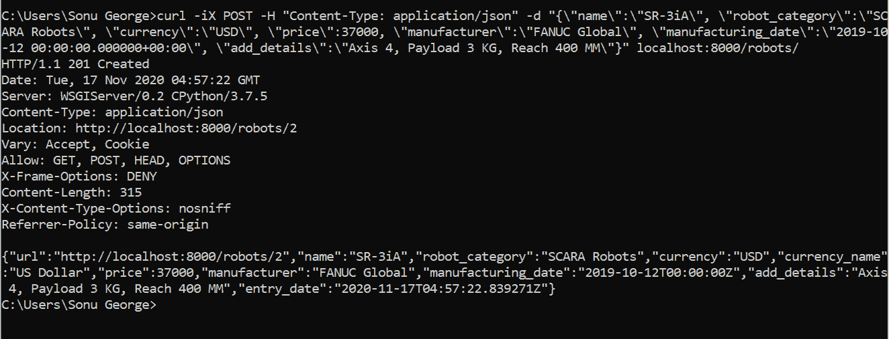

让我们在机器人中再添加几个条目。HTTPie 命令包括:

> http POST:8000/Robots/name = " IRB 120 " robot _ category = "铰接式机器人" currency="USD" price=14500 制造商= " ABB " manufacturing _ date = " 2020-05-10 00:00:00:00.000000+00:00 " add _ details = " Axes 6，Payload 3 KG，Reach 0.58m "
> 
> http POST:8000/Robots/name = " IRB 910SC " robot _ category = " SCARA Robots " currency = " USD " price = 25000 制造商= " ABB " manufacturing _ date = " 2020-05-10 00:00:00:00.000000+00:00 " add _ details = " Axes 4，Payload 6 KG，Reach 0.65m "

让我们来看看机器人、机器人类别和制造商列表。

> http :8000/robots/

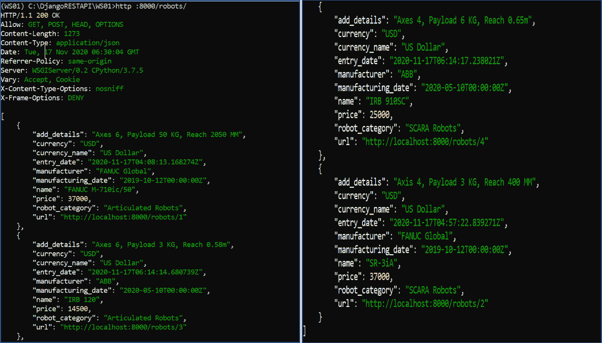

机器人列表

> http:8000/机器人-类别/

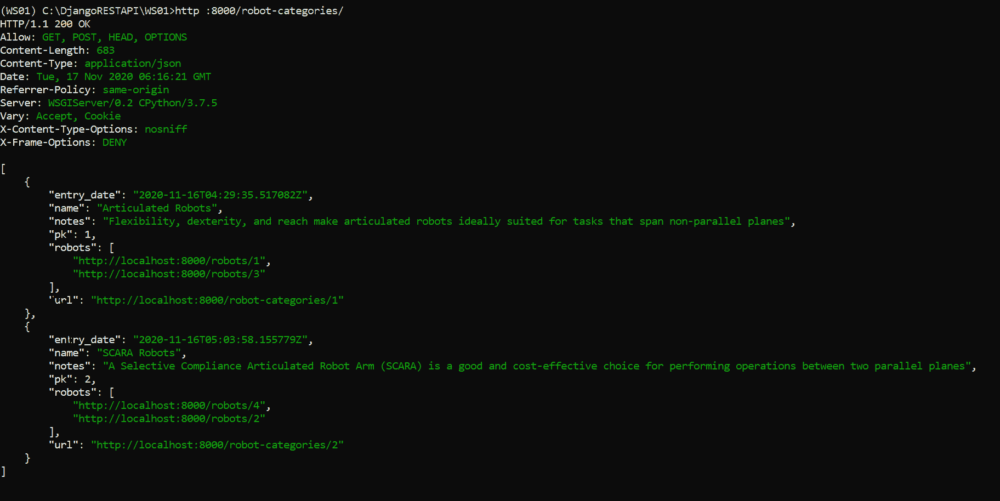

机器人类别列表

> http:8000/制造商/

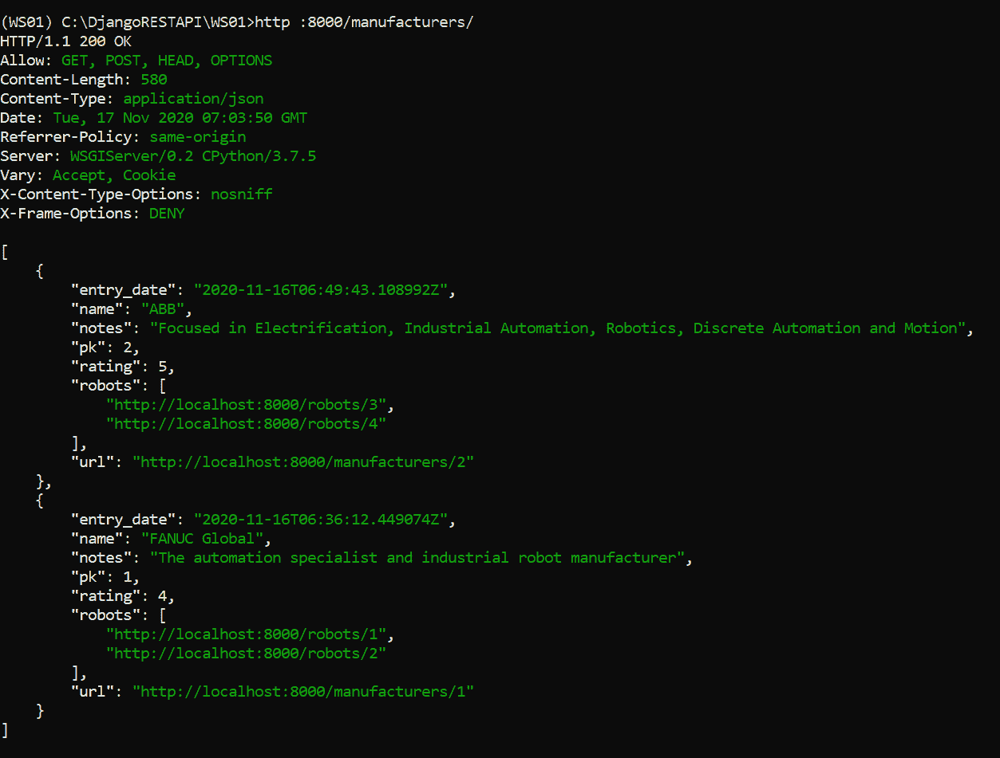

制造商列表

在机器人类别和制造商条目中，您可以注意到机器人在其网址形式中被提及。

### **放置、修补和删除资源**

现在让我们编写 PUT、PATCH 和 DELETE 请求。我们将添加一个新的机器人类别(测试类别)和制造商(测试制造商)。HTTPie 命令如下:

> http POST:8000/机器人-类别/名称=“测试类别”注意事项=“测试”
> 
> http POST:8000/制造商/名称=“测试制造商”评级=1 注=“测试”

让我们添加几个属于*测试类别*和*测试厂商*的机器人。HTTPie 命令如下:

> http POST:8000/robots/name = " TEST 1 " robot _ Category = " TEST Category " currency = " USD " price = 37000 制造商= " TEST Manufacturer " manufacturing _ date = " 2019-10-12 00:00:00:00.0000000+00:00 " add _ details = " TEST "
> 
> http POST:8000/robots/name = " TEST 2 " robot _ Category = " TEST Category " currency = " USD " price = 37000 制造商= " TEST Manufacturer " manufacturing _ date = " 2019-10-12 00:00:00:00.0000000+00:00 " add _ details = " TEST "
> 
> http POST:8000/robots/name = " TEST 3 " robot _ Category = " TEST Category " currency = " USD " price = 37000 制造商= " TEST Manufacturer " manufacturing _ date = " 2019-10-12 00:00:00:00.0000000+00:00 " add _ details = " TEST "

让我们使用下面的 psql 命令检查数据库中的条目。

> 从 robots_robot 中选择*；

**输出:**

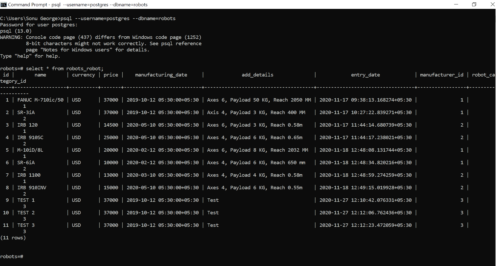

您可以注意到新条目被添加到我们的数据库中。

**PUT HTTP 动词**

现在让我们使用 **PUT HTTP 动词**来编辑最后一个名为 TEST 3 的条目，它有 11 作为主键。

HTTPUtility Pie 命令是:

> http PUT:8000/robots/11 name = " TEST 3 " robot _ Category = " TEST Category " currency = " USD " price = 12000 制造商= " TEST Manufacturer " manufacturing _ date = " 2020-10-12 00:00:00:00.0000000+00:00 " add _ details = " Test3 "

**输出:**

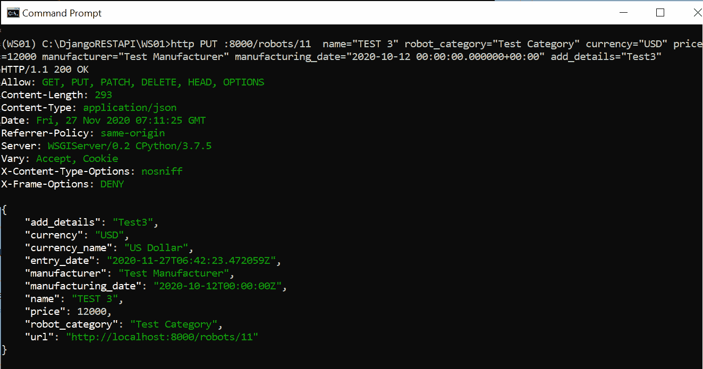

等效的卷曲命令是

> curl-iX PUT-H " Content-Type:application/JSON "-d " { \ " name \ ":\ " TEST 3 \ "，\ " robot _ Category \ ":\ " TEST Category \ "，\"currency\":\"USD\ "，\"price\":12000，\ "制造商\":\"Test Manufacturer\ "，\ " manufacturing _ date \ ":\ " 2020-10-12 00:00:00:00.00000000+00:00 \ "，\ " add _ details \ ":\ " TEST 3 \ " } " localhost:8000/000

**补丁 HTTP 动词**

让我们部分编辑具有主键 11 的资源。 **PATCH** 请求的 HTTPie 命令是:

> http PATCH :8000/robots/11 价格=15000 add_details="Test3 Patch "

**输出:**

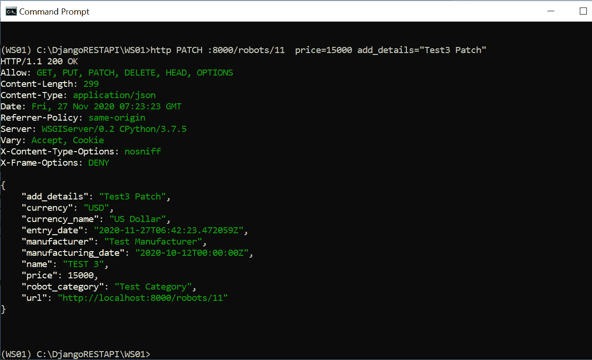

等效的卷曲命令是:

> curl-iX PATCH-H " Content-Type:application/JSON "-d " { \ " price \ ":15000，\ " add _ details \ ":\ " Test3 PATCH \ " } " localhost:8000/robots/11

**删除 HTTP 动词**

现在，让我们使用 **DELETE** HTTP 动词删除具有主键 11 的条目。HTTPie 命令是:

> http DELETE :8000/robots/11

**输出:**

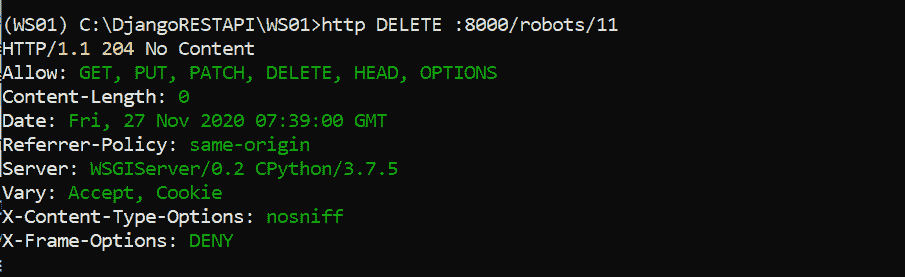

等效的卷曲命令是

> curl-iX DELETE localhost:8000/robots/11

现在，我们需要检查如果删除机器人类别会发生什么。根据我们的代码，如果一个类别被删除，那么属于该特定类别的所有机器人也应该被清除。让我们删除我们的*测试类别(*主 id 3)。HTTPie 命令是

> http DELETE:8000/机器人-类别/3

**输出:**

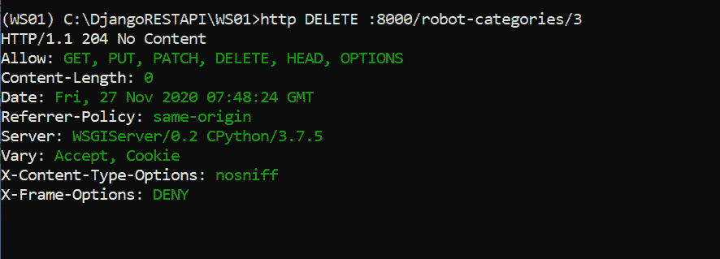

让我们看看机器人桌子。我们一共增加了 3 个机器人(*测试 1、测试 2、测试 3* )属于*测试类别*。已经使用删除请求删除了主 id 为 11 ( *测试 3* )的机器人。数据库中存在主 id 为 9(测试 1)和 10(测试 2)的其余两个机器人。由于我们删除了*测试类别，*自动将另外两个机器人从表格中清除。让我们使用 psql 命令来检查数据库。

> 从 robots_robot 中选择*；

**输出:**

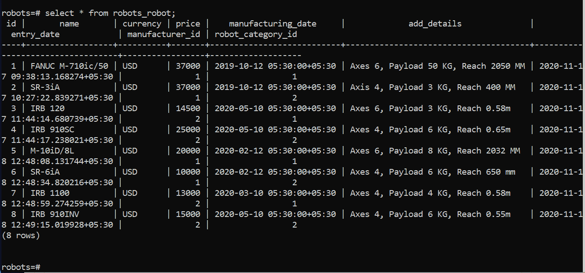

你可以注意到属于*测试类别*的机器人被成功清除。这是在代码的帮助下实现的， *on_delete=models。CASCADE，*在机器人模型中将机器人类别定义为外键时提到。

## 摘要

在本文中，我们了解了实现 HTTP 请求的泛型类视图。为此，我们使用了 rest_framework.generics 模块中的两个泛型类视图，***ListCreateAPIView***和***RetrieveUpdateDestroyAPIView***。我们还编写了不同的 HTTP 请求来与相关资源进行交互。