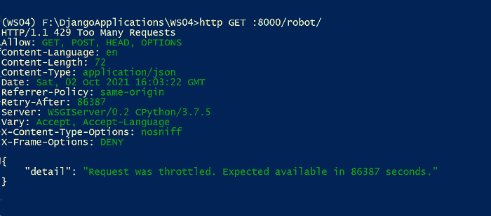
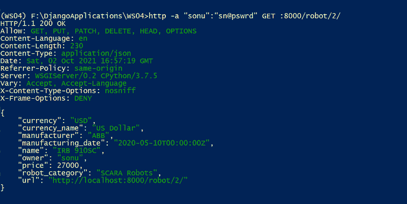
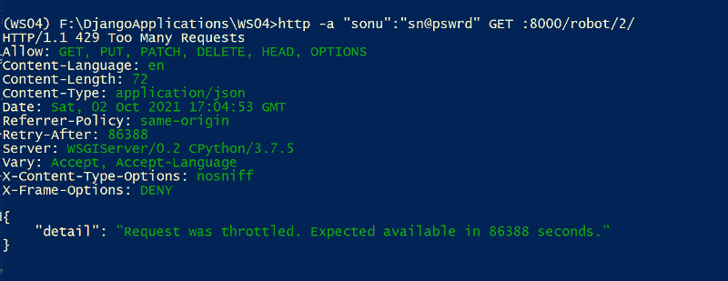

# 如何用 Django Rest 框架

节流 API

> 原文:[https://www . geesforgeks . org/how-to-throttle-API-with-django-rest-framework/](https://www.geeksforgeeks.org/how-to-throttle-api-with-django-rest-framework/)

你有没有穿过天桥，注意到上面写着限制桥重的标志？这些限制是为了确保公共安全。Django REST 框架使用了一个类似的名为节流的过程，该过程控制客户端向应用编程接口发出请求的速率。这种速率限制可以确保可伸缩性，防止低性能和拒绝服务(DoS)攻击，并改善整体用户体验。

Django REST 框架在*REST _ Framework . throttling*模块中有三个节流类——anon rate、UserRate 和 ScopedRate 节流。所有这些类都指定了限制规则，表示在给定时间范围内请求的最大数量。这些类有不同的机制来指定范围——将以前的信息与新的请求进行比较。让我们深入研究一下 DRF 节流特性。

*   匿名电话
*   userratethroattle
*   scopedratethroattle

**注意:**请参考[在 API 中添加权限-Django REST 框架](https://www.geeksforgeeks.org/adding-permission-in-api-django-rest-framework/)和[自定义对象级权限-Django REST 框架](https://www.geeksforgeeks.org/customizing-object-level-permissions-django-rest-framework/)使用带节流的权限

## 匿名电话

AnonRateThrottle 将限制未经身份验证的用户。使用传入请求的 IP 地址，生成一个唯一的密钥来进行限制。允许的请求率由以下任一项决定:

*   类的 rate 属性–通过重写 AnonRateThrottle 并设置属性来提供。
*   DEFAULT _ 节气门 _RATES['anon']设置。

让我们全局设置节流策略。您可以打开 settings.py 文件，并在下面提到节流等级和节流速率:

## 蟒蛇 3

```
REST_FRAMEWORK = {

    'DEFAULT_AUTHENTICATION_CLASSES'🙁
        'rest_framework.authentication.BasicAuthentication',
        )
    'DEFAULT_THROTTLE_CLASSES': [
        'rest_framework.throttling.AnonRateThrottle',

    ],
    'DEFAULT_THROTTLE_RATES': {
        'anon': '2/day'
    }
}
```py

您可以将秒、分钟、小时或天作为节流期(节流率)。

让我们尝试使用 HTTPie 命令来检索机器人。这里，我们在不提供任何凭据的情况下检索列表。

> http GET :8000/robot/

输出

```
HTTP/1.1 200 OK
Allow: GET, POST, HEAD, OPTIONS
Content-Language: en
Content-Length: 2106
Content-Type: application/json
Date: Sat, 02 Oct 2021 14:29:40 GMT
Referrer-Policy: same-origin
Server: WSGIServer/0.2 CPython/3.7.5
Vary: Accept, Accept-Language
X-Content-Type-Options: nosniff
X-Frame-Options: DENY

[
    {
        "currency": "USD",
        "currency_name": "US Dollar",
        "manufacturer": "ABB",
        "manufacturing_date": "2020-05-10T00:00:00Z",
        "name": "IRB 1100",
        "owner": "sonu",
        "price": 25000,
        "robot_category": "Articulated Robots",
        "url": "http://localhost:8000/robot/7/"
    },
    {
        "currency": "USD",
        "currency_name": "US Dollar",
        "manufacturer": "ABB",
        "manufacturing_date": "2020-08-10T00:00:00Z",
        "name": "IRB 120",
        "owner": "sonu",
        "price": 35000,
        "robot_category": "Articulated Robots",
        "url": "http://localhost:8000/robot/8/"
    },
 ]
```py

这里，匿名节流率被设置为每天 2 个应用编程接口请求。所以，它不允许超过两个请求。如果您的请求率超过 2 个请求，您将获得以下输出。



## userratethroattle

UserRateThrottle 控制经过身份验证和未经身份验证的用户发送请求的速率。用户 id 是经过身份验证的请求的唯一缓存密钥，IP 地址是未经身份验证的请求的唯一缓存密钥。

允许的请求率由以下任一项决定:

*   类的 rate 属性–通过重写 UserRateThrottle 并设置属性来提供。
*   DEFAULT _ 节气门 _RATES['用户']设置。

您可以按如下方式编辑 REST_FRAMEWORK 字典:

## 蟒蛇 3

```
REST_FRAMEWORK = {

    'DEFAULT_AUTHENTICATION_CLASSES'🙁
        'rest_framework.authentication.BasicAuthentication',
        )
    'DEFAULT_THROTTLE_CLASSES': [
        'rest_framework.throttling.AnonRateThrottle',
        'rest_framework.throttling.UserRateThrottle'
    ],
    'DEFAULT_THROTTLE_RATES': {
        'anon': '2/day',
        'user': '5/day'
    }
}
```py

我们的 REST_FRAMEWORK 字典中的限制规则如下:

*   未经身份验证的用户每天最多 2 个请求
*   认证用户每天最多 5 个请求

下面经过身份验证的 HTTPie 命令每天允许 5 个请求。

> http-a " sonu ":" sn @ pswrd " get:8000/robot/

restful web 服务每天发出超过 5 个请求的请求太多。

## scopedratethroattle

ScopedRateThrottle 类控制我们的 RESTFul web 服务中特定功能的请求速率。这里正在访问的视图应该包括。节气门 _ 作用域属性。让我们在我们的 RobotDetail 类中添加一个节流范围，并提及该范围的节流率。

首先，让我们导入 ScopedRateThrottle。

> 从 rest_framework.throttling 导入 ScopedRateThrottle

现在添加下面几行代码

```
throttle_scope = 'robots'
throttle_classes = (ScopedRateThrottle,)
```py

我们的机器人细节类如下所示:

## 蟒蛇 3

```
class RobotDetail(generics.RetrieveUpdateDestroyAPIView):
    throttle_scope = 'robots'
    throttle_classes = (ScopedRateThrottle,)

    permission_classes = (
        permissions.IsAuthenticatedOrReadOnly,
        custompermission.IsCurrentUserOwnerOrReadOnly,
    )

    queryset = Robot.objects.all()
    serializer_class = RobotSerializer
    name = 'robot-detail'
```py

接下来，让我们为范围“机器人”添加节流率。

## 蟒蛇 3

```
REST_FRAMEWORK = {

    'DEFAULT_AUTHENTICATION_CLASSES'🙁
        'rest_framework.authentication.BasicAuthentication',
        )
    'DEFAULT_THROTTLE_CLASSES': [
        'rest_framework.throttling.AnonRateThrottle',
        'rest_framework.throttling.UserRateThrottle'
    ],
    'DEFAULT_THROTTLE_RATES': {
        'anon': '2/day',
        'user': '5/day',
        'robots': '3/day'
    }
}
```

让我们尝试通过身份验证的 HTTPie 请求来检索基于 id 的机器人，它利用 RobotDetail 类来获取基于 id 的机器人。命令如下:

> http-a " sonu ":" sn @ pswrd " get:8000/robot/2/

**输出**



在这里，我们的范围率是每天 3 个请求。如果超过 3 个请求，我们会收到太多请求。第四个请求的输出如下:

