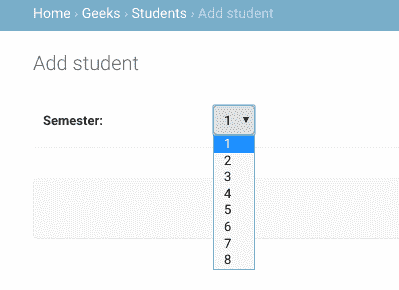

# 如何使用 Django 字段选择？

> 原文:[https://www . geesforgeks . org/how-用法-django-field-choice/](https://www.geeksforgeeks.org/how-to-use-django-field-choices/)

姜戈现场选择。根据文档，字段选择是一个序列，它本身由恰好两个项目的可选项组成(例如[ **(甲、乙)、(甲、乙)**……])，用作某些字段的选择。例如，考虑一个只能有{ 1，2，3，4，5，6 }选项的实地学期。选择将用户的输入限制在`models.py`中指定的特定值。如果给出了选择，它们将由[模型验证](https://docs.djangoproject.com/en/dev/ref/models/instances/#validating-objects)强制执行，并且默认表单小部件将是带有这些选择的选择框，而不是标准文本字段。选项可以是任何序列对象，不一定是列表或元组。

每个元组中的第一个元素是要在模型上设置的实际值，第二个元素是人类可读的名称。
例如，

```
SEMESTER_CHOICES = (
    ("1", "1"),
    ("2", "2"),
    ("3", "3"),
    ("4", "4"),
    ("5", "5"),
    ("6", "6"),
    ("7", "7"),
    ("8", "8"),
)

```

让我们在 django 项目中创建一个选择域，名为 geeksforgeeks。

```
from django.db import models

# specifying choices

SEMESTER_CHOICES = (
    ("1", "1"),
    ("2", "2"),
    ("3", "3"),
    ("4", "4"),
    ("5", "5"),
    ("6", "6"),
    ("7", "7"),
    ("8", "8"),
)

# declaring a Student Model

class Student(models.Model):
      semester = models.CharField(
        max_length = 20,
        choices = SEMESTER_CHOICES,
        default = '1'
        )
```

让我们在管理面板中查看学期是如何创建的。

你还可以将你的可用选择收集到命名的群组中，这些群组可用于组织目的:

```
MEDIA_CHOICES = [
    ('Audio', (
            ('vinyl', 'Vinyl'),
            ('cd', 'CD'),
        )
    ),
    ('Video', (
            ('vhs', 'VHS Tape'),
            ('dvd', 'DVD'),
        )
    ),
    ('unknown', 'Unknown'),
]

```

每个元组中的第一个元素是应用于组的名称。第二个元素是二元组的可迭代列表，每个二元组包含一个值和一个选项的人类可读名称。分组选项可以与单个列表中未分组的选项组合在一起(如本例中的未知选项)。
对于每个设置了选项的模型字段，Django 将添加一个方法来检索该字段当前值的人类可读名称。参见数据库应用编程接口文档中的`[get_FOO_display()](https://docs.djangoproject.com/en/dev/ref/models/instances/#django.db.models.Model.get_FOO_display)`。