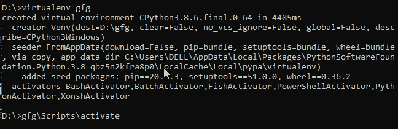
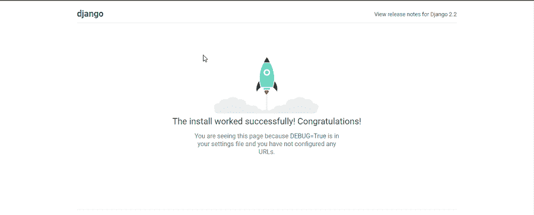
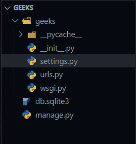
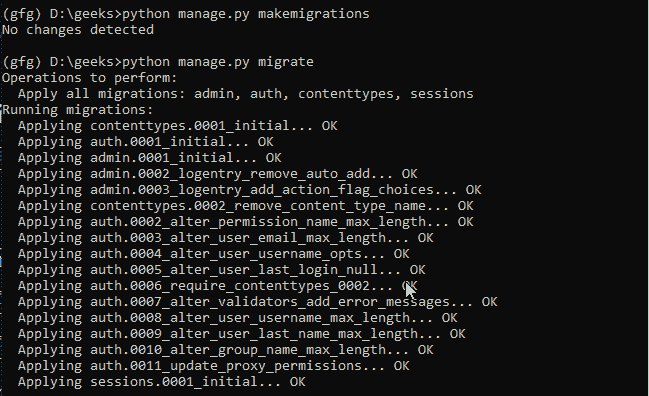
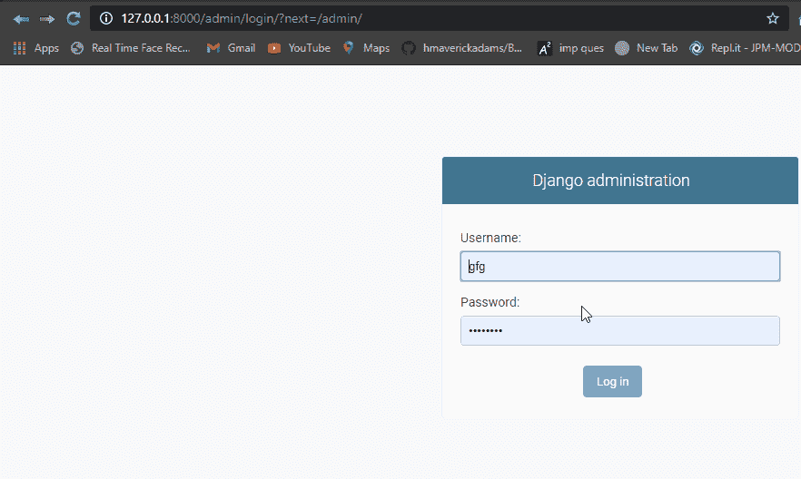
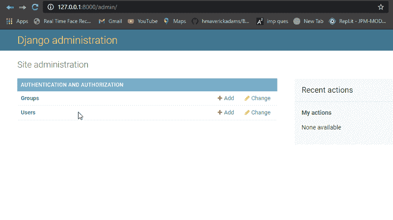

# 如何在 Django 使用 PostgreSQL 数据库？

> 原文:[https://www . geesforgeks . org/how-用法-PostgreSQL-database-in-django/](https://www.geeksforgeeks.org/how-to-use-postgresql-database-in-django/)

本文围绕如何将默认的 Django SQLite 服务器更改为 postgresSQL 展开。PostgreSQL 和 SQLite 是应用最广泛的 RDBMS 关系数据库管理系统。它们都是开源和免费的。在为应用程序选择数据库时，应该考虑一些主要差异。

另请查看–SqLite 和 PostgreSQL 之间的差异

### 在 Django 中设置 PostgreSQL

首先创建一个虚拟环境，以便使用该命令进行第一次安装 **virtualenv**

```
pip install virtualenv
```

然后我们将使用创建一个名为 **gfg** 的 virtualenv

```
virtualenv gfg
```

要进入虚拟环境，请创建使用



现在我们将在这里安装 Django，所以我使用的是 Django 2.2

```
pip install django==2.2.*
```

要让 Python 使用 Postgres，您需要安装“psycopg2”模块。

```
pip install psycopg2
```

现在让我们创建一个名为**极客**的 django 项目

```
django-admin startproject geeks
```

检查你的 django 是否运行顺利

```
python manage.py runserver
```



现在，转到下面的链接，下载并设置 [PostgreSQL](https://www.postgresql.org/download/) 。在你的 Postgres 服务器中创建一个数据库名 **gfg** 。现在是时候从 SQLite 切换到 PostgreSQL 了。

**文件夹结构–**



打开 settings.py 文件

现在用这个模板代码更改数据库设置

```
DATABASES = {
   'default': {
       'ENGINE': 'django.db.backends.postgresql',
       'NAME': ‘<database_name>’,
       'USER': '<database_username>',
       'PASSWORD': '<password>',
       'HOST': '<database_hostname_or_ip>',
       'PORT': '<database_port>',
   }
}
```

运行这些命令

```
python manage.py makemigrations
python manage.py migrate
```



现在让我们创建默认超级用户:

```
 python manage.py createsuperuser
```


现在再次运行您的服务器

```
python manage.py runserver
```

转到此路径并添加您在创建超级用户时所做的凭据

```
http://127.0.0.1:8000/admin/
```



如果您能够成功登录，那么您已经成功切换到 PostgreSQL

