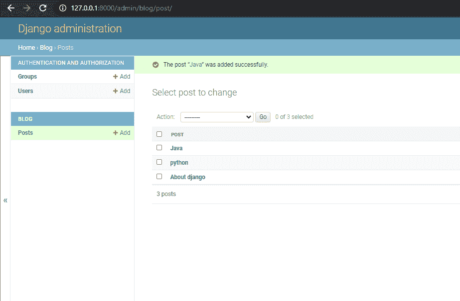

# 如何在 Django 使用 User 模型？

> 原文:[https://www . geesforgeks . org/如何使用-django 中的用户模型/](https://www.geeksforgeeks.org/how-to-use-user-model-in-django/)

Django 内置的认证系统很棒。在很大程度上，我们可以开箱即用地使用它，节省了大量的开发和测试工作。它适合大多数用例，并且非常安全。但是有时我们需要做一些微调来适应我们的网络应用程序。通常我们希望存储更多与用户相关的数据，但是下一个问题可能是 Django 开发人员应该如何引用用户？官方的姜戈文件列出了三种不同的方式:

*   用户
*   授权用户模型
*   get_user_model()

**说明:**

举例说明如何引用用户模型。考虑一个名为**我的网站**的项目，它有一个名为**博客**的应用程序。

> 请参考下面的文章，查看如何在 Django 中创建项目和应用程序。
> 
> [如何利用姜戈的 MVT 创建基础项目？](https://www.geeksforgeeks.org/how-to-create-a-basic-project-using-mvt-in-django/)
> 
> [如何在姜戈创建 App？](https://www.geeksforgeeks.org/how-to-create-an-app-in-django/)

**方法 1–直接用户模型:**

在 models.py 中添加以下代码:

## 蟒蛇 3

```
from django.db import models
from django.contrib.auth.models import User
# Create your models here.
class Post(models.Model):
    author = models.ForeignKey(User, on_delete=models.CASCADE)
    title = models.CharField(max_length=50)
    content= models.TextField()
    def __str__(self):
        return self.title
```

通过在 admin.py 中添加以下代码来注册这个模型。

```
from django.contrib import admin
from .models import Post

# Register your models here.
admin.site.register(Post)
```

某些类型的项目可能有身份验证需求，而 Django 的内置用户模型并不总是适合这些需求。例如，在一些网站上，使用电子邮件地址作为您的身份令牌而不是用户名更有意义。

Django 允许您通过为 AUTH_USER_MODEL 设置提供一个引用自定义模型的值来覆盖默认用户模型。

**方法 2–AUTH _ USER _ MODEL:**

当在 models.py 文件中引用用户模型时，推荐使用 AUTH_USER_MODEL。

为此，您需要通过子类化抽象用户或抽象基础用户来创建自定义用户模型。

*   抽象用户:如果您对用户模型中的现有字段感到满意，并且只想删除用户名字段，请使用此选项。
*   抽象基础用户:如果您想从头开始创建自己的全新用户模型，请使用此选项。

> 有关创建自定义用户模型，请参考下面的文章:
> 
> [创建自定义用户模型](https://www.geeksforgeeks.org/creating-custom-user-model-using-abstractuser-in-django_restframework/)

如果您已经在名为 user 的应用程序中创建了一个自定义用户模型，那么您应该在您的 settings.py 文件中引用它，如下所示:

```
#settings.py

AUTH_USER_MODEL = 'users.CustomUser'
```

然后在 blog models.py 中添加以下代码:

## 蟒蛇 3

```
# blog/models.py
from django.conf import settings
from django.db import models

class Post(models.Model):
    author = models.ForeignKey(settings.AUTH_USER_MODEL,on_delete=models.CASCADE)
    title = models.CharField(max_length=50)
    content = models.TextField()
```

通过在 admin.py 中添加以下代码来注册这个模型。

```
from django.contrib import admin
from .models import Post

# Register your models here.
admin.site.register(Post)
```

**方法 3–get _ user _ model():**

如果您直接引用用户(例如，通过在外键中引用它)，您的代码将无法在 AUTH_USER_MODEL 设置已更改为不同用户模型的项目中工作。

引用用户模型的另一种方法是通过 get_user_model 返回当前活动的用户模型:要么是在 AUTH_USER_MODEL 中指定的自定义用户模型，要么是默认的内置用户。

在 models.py 中添加以下代码:

## 蟒蛇 3

```
from django.db import models
from django.contrib.auth import get_user_model
User=get_user_model()
# Create your models here.
class Post(models.Model):
    author = models.ForeignKey(User, on_delete=models.CASCADE)
    title = models.CharField(max_length=50)
    content= models.TextField()
    def __str__(self):
        return self.title
```

通过在 admin.py 中添加以下代码来注册这个模型。

```
from django.contrib import admin
from .models import Post

# Register your models here.
admin.site.register(Post)
```

**输出–**



以作者为用户创建实例