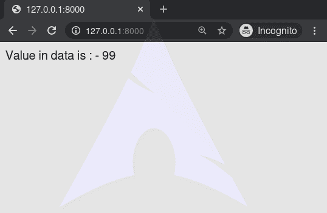
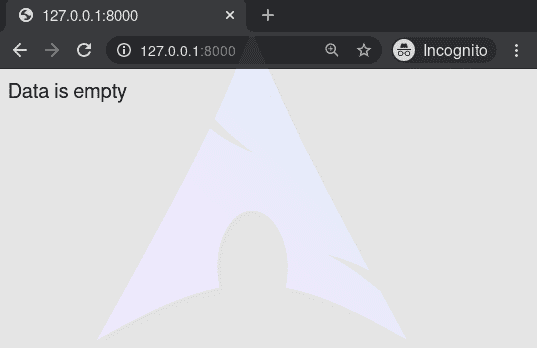

# if–姜戈模板标签

> 原文:[https://www.geeksforgeeks.org/if-django-template-tags/](https://www.geeksforgeeks.org/if-django-template-tags/)

Django 模板是使用 Django 模板语言标记的文本文档或 Python 字符串。Django 是一个强大的包含电池的框架，为在模板中呈现数据提供了便利。Django 模板不仅允许在视图和模板之间传递数据，还提供了一些有限的编程特性，比如变量、循环、注释、扩展等等。
本文围绕如何在模板中使用 **if 标签**展开。标记计算一个变量，如果该变量为“ **true** ”(即存在，不为空，并且不是假布尔值)，则输出块的内容。

**语法:**

```py

// statements

// statements

```

**示例:**

## 超文本标记语言

```py

    Number of athletes: {{ athlete_list|length }}

    Athletes should be out of the locker room soon!

    No athletes.

```

在上图中，如果运动员列表不为空，运动员的数量将由{{运动员列表|长度}}变量显示。
可以看到，if 标记可能包含一个或几个子句，以及一个子句，如果前面所有条件都失败，将显示该子句。这些条款是可选的。

## if–姜戈模板标签说明

举例说明如何在姜戈模板中使用 if 标签。考虑一个名为 geeksforgeeks 的项目，它有一个名为 geeks 的应用程序。

> 请参考以下文章，查看如何在 Django 中创建项目和应用程序。
> 
> *   [如何利用姜戈的 MVT 创建基础项目？](https://www.geeksforgeeks.org/how-to-create-a-basic-project-using-mvt-in-django/)
> *   [如何在姜戈创建 App？](https://www.geeksforgeeks.org/how-to-create-an-app-in-django/)

现在创建一个视图，我们将通过它传递上下文字典。

## 蟒蛇 3

```py
# import Http Response from django
from django.shortcuts import render

# create a function
def geeks_view(request):
    # create a dictionary
    context = {
        "data" : 99,
    }
    # return response
    return render(request, "geeks.html", context)
```

创建 url 路径以映射到此视图。在极客/URL . py 中，

## 蟒蛇 3

```py
from django.urls import path

# importing views from views.py
from .views import geeks_view

urlpatterns = [
    path('', geeks_view),
]
```

在 templates/geeks.html 中创建模板，

## 超文本标记语言

```py

Value in data is : - {{ data }}

Data is empty

```

让我们检查一下“/”上显示的内容是否显示在模板中。



### 

让我们检查一下语句是否有效。
现在让我们传递一个空数组，并使用空标记和 for 标记。
在极客/观点. py 中，

## 蟒蛇 3

```py
## import Http Response from django
from django.shortcuts import render

# create a function
def geeks_view(request):
    # create a dictionary
    context = {
        "data" : False,
    }
    # return response
    return render(request, "geeks.html", context)
```

现在，查看 [http://127.0.0.1:8000/](http://127.0.0.1:8000/) ，



### 高级用法

如果标签可以使用 and、or 或 not 来测试多个变量或否定给定的变量:

```py

    Both athletes and coaches are available.



    There are no athletes.



    There are some athletes or some coaches.



    There are no athletes or there are some coaches.



    There are some athletes and absolutely no coaches.

```