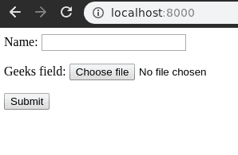
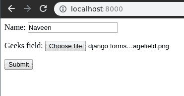
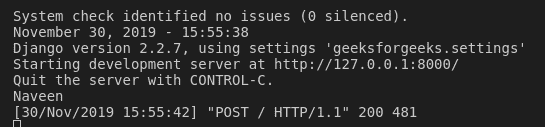

# ImageField–Django 表单

> 原文:[https://www.geeksforgeeks.org/imagefield-django-forms/](https://www.geeksforgeeks.org/imagefield-django-forms/)

Django 表单中的 ImageField 是上传图像文件的输入字段。该输入的默认小部件是 [ClearableFileInput](https://docs.djangoproject.com/en/2.2/ref/forms/widgets/#django.forms.ClearableFileInput) 。它规范化为:一个**上传文件**对象，将文件内容和文件名包装成一个对象。本文围绕如何用 Django 表单上传图像以及如何将图像保存到数据库展开。
**注:**

*   当 Django 处理文件上传时，文件数据最终被放入**请求中。文件**(有关请求对象的更多信息，请参见请求和响应对象的文档)。
*   处理文件时，请确保 HTML 表单标记包含 enctype="multipart/form-data "属性。

**语法**

```
field_name = forms.ImageField(**options)
```

## Django 表单图像字段说明

使用示例说明图像字段。考虑一个名为 geeksforgeeks 的项目，它有一个名为 geeks 的应用程序。

> 请参考以下文章，查看如何在 Django 中创建项目和应用程序。
> 
> *   [如何利用姜戈的 MVT 创建基础项目？](https://www.geeksforgeeks.org/how-to-create-a-basic-project-using-mvt-in-django/)
> *   [如何在姜戈创建 App？](https://www.geeksforgeeks.org/how-to-create-an-app-in-django/)

将以下代码输入**极客** app 的 forms.py 文件。

## 蟒蛇 3

```
from django import forms

class GeeksForm(forms.Form):
    name = forms.CharField()
    geeks_field = forms.ImageField()
```

将极客应用添加到 INSTALLED_APPS

## 蟒蛇 3

```
# Application definition

INSTALLED_APPS = [
    'django.contrib.admin',
    'django.contrib.auth',
    'django.contrib.contenttypes',
    'django.contrib.sessions',
    'django.contrib.messages',
    'django.contrib.staticfiles',
    'geeks',
]
```

现在要将这个表单呈现为一个视图，我们需要一个视图和一个映射到该 URL 的 URL。让我们先在极客 app 的 views.py 中创建一个视图，

## 蟒蛇 3

```
from django.shortcuts import render
from .forms import GeeksForm

# Create your views here.
def home_view(request):
    context = {}
    context['form'] = GeeksForm()
    return render( request, "home.html", context)
```

这里，我们从 forms.py 导入该特定表单，并在视图中创建它的一个对象，以便它可以在模板中呈现。
现在，要创建一个姜戈表单，你需要创建一个 home.html，在那里你可以设计他们喜欢的东西。让我们在 home.html 创建一个表单。

## 超文本标记语言

```
<form method="POST" enctype="multipart/form-data">
    
    {{ form.as_p }}
    <input type="submit" value="Submit">
</form>
```

最后，在 URL . py
中映射到该视图的 URL

## 蟒蛇 3

```
from django.urls import path

# importing views from views..py
from .views import home_view

urlpatterns = [
    path('', home_view ),
]
```

让我们运行服务器并检查实际发生了什么，运行

```
Python manage.py runserver
```



因此，极客 _ 字段**图像字段**是通过将“_”替换为“”而创建的。它是从用户输入图像文件的字段。

## 如何使用 ImageField–Django 表单上传文件？

ImageField 用于输入数据库中的图像文件。可以输入电子邮件标识等。到目前为止，我们已经讨论了如何实现 ImageField，但是如何在视图中使用它来执行逻辑部分。为了执行一些逻辑，我们需要将输入到字段中的值输入到 python 字符串实例中。
ImageField 不同于其他字段，需要妥善处理。如上所述，从图像字段获取的数据将存储在**请求中。文件**对象。让我们在 Django 模型中创建一个 ImageField 来演示使用数据库中的表单保存图像。要从 github 获取[上传文件的工作代码，请点击此处](https://github.com/naveenkrnl/geeksforgeeks/tree/a09aa57e3ffa26c0073bd509aa78f71214dba9df)。
在 models.py 中，

## 蟒蛇 3

```
from django.db import models

# Create your models here.
class GeeksModel(models.Model):
    title = models.CharField(max_length = 200)
    img = models.ImageField(upload_to = "images/")

    def __str__(self):
        return self.title
```

在 views.py 中，

## 蟒蛇 3

```
from django.shortcuts import render
from .forms import GeeksForm
from .models import GeeksModel

# Create your views here.
def home_view(request):
    context = {}
    if request.method == "POST":
        form = GeeksForm(request.POST, request.FILES)
        if form.is_valid():
            name = form.cleaned_data.get("name")
            img = form.cleaned_data.get("geeks_field")
            obj = GeeksModel.objects.create(
                                 title = name,
                                 img = img
                                 )
            obj.save()
            print(obj)
    else:
        form = GeeksForm()
    context['form']= form
    return render(request, "home.html", context)
```

让我们解释一下这段代码的作用，这段代码将用户上传的文件保存在 GeeksModel ImageField 数据库中。每当上传一个文件时，它都会被保存以供请求。以关键字作为字段名称的 FILES 对象。因此，我们创建了一个模型，用户上传的图像被保存在其中。让我们现在尝试将图像文件保存到数据库中。



它已成功加载，文件保存在极客应用程序的极客模型中。Obove 对象被打印，因此 obj 的实例被创建。



## 核心字段参数

核心字段参数是为每个字段提供的参数，用于对特定字段应用某种约束或赋予特定特征。例如，向 ImageField 添加一个必需的参数= False 将使用户可以将其留空。每个字段类构造函数至少接受这些参数。有些字段类采用额外的、特定于字段的参数，但以下参数应始终被接受:

<figure class="table">

| 字段选项 | 描述 |
| --- | --- |
| [必需](https://www.geeksforgeeks.org/required-django-form-field-validation/) | 默认情况下，每个字段类都假定该值是必需的，因此要使其不是必需的，您需要将 required 设置为 False |
| 标签 | label 参数允许您为此字段指定“人性化”标签。当字段显示在表单中时使用。 |
| [标签 _ 后缀](https://www.geeksforgeeks.org/label-django-form-field-validation/) | 标签后缀参数允许您在每个字段的基础上覆盖表单的[标签后缀](https://docs.djangoproject.com/en/2.2/ref/forms/fields/#label-suffix)。 |
| 小部件 | widget 参数允许您指定呈现此字段时要使用的 Widget 类。有关更多信息，请参见[小部件](https://docs.djangoproject.com/en/2.2/ref/forms/widgets/)。 |
| [帮助 _ 文字](https://www.geeksforgeeks.org/help_text-django-form-field-validation/) | 帮助文本参数允许您为此字段指定描述性文本。如果提供 help_text，当字段通过方便的表单方法之一呈现时，它将显示在字段旁边。
 |
| [错误信息](https://www.geeksforgeeks.org/error_messages-django-form-field-validation/) | error_messages 参数允许您覆盖该字段将引发的默认消息。传入一个字典，其关键字与您想要覆盖的错误消息相匹配。 |
| [验证器](https://www.geeksforgeeks.org/django-form-field-custom-widgets/) | validators 参数允许您为此字段提供一个验证函数列表。
 |
| [本地化](http://localize) | localize 参数允许对表单数据输入以及呈现的输出进行本地化。 |
| [禁用](https://www.geeksforgeeks.org/disabled-django-form-field-validation/)。 | 禁用的布尔参数设置为真时，使用禁用的 HTML 属性禁用表单字段，这样用户就无法编辑它。
 |

</figure>