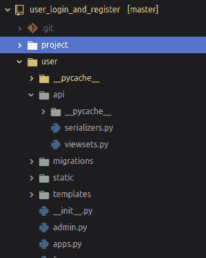
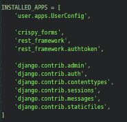
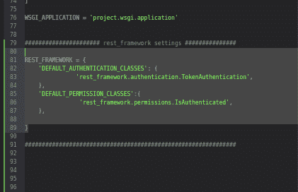
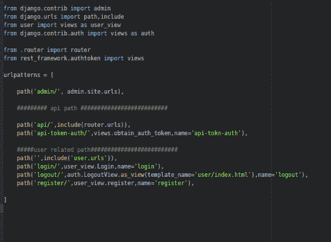
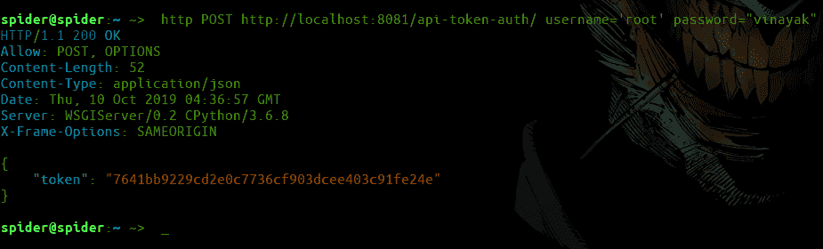
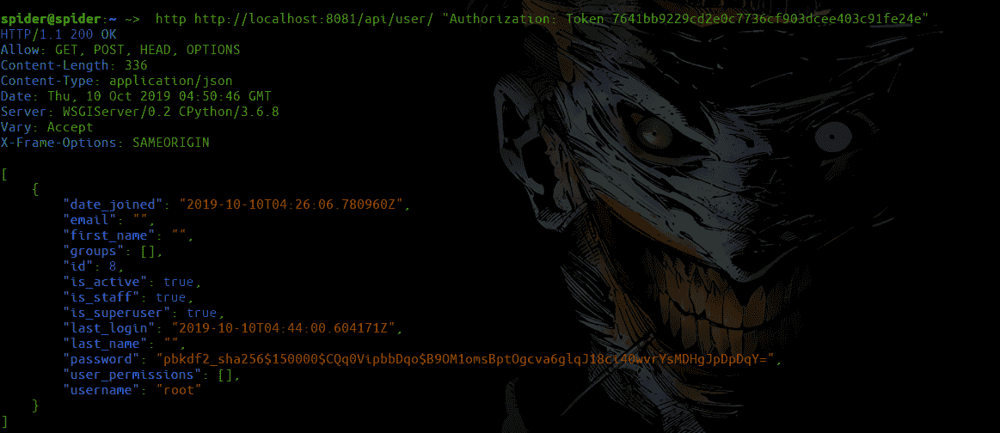

# 使用 Django REST 框架

实现令牌认证

> 原文:[https://www . geesforgeks . org/implement-token-authentication-use-django-rest-framework/](https://www.geeksforgeeks.org/implement-token-authentication-using-django-rest-framework/)

令牌身份验证是指交换用户名和密码以获得将在所有后续请求中使用的令牌，从而在服务器端识别用户。本文围绕使用 Django REST 框架实现令牌认证来制作一个 [API](https://www.geeksforgeeks.org/rest-api-introduction/) 。令牌认证通过提供令牌来交换用户名和密码。

#### 所需模块:

*   **姜戈:**

```
pip install django
```

*   **脆皮 _ 形态:**

```
 pip install --upgrade django-crispy-forms 
```

*   **django rest_framework :**

```
pip install djangorestframework
```

*   **HTTPie :**

```
pip install httpie
```

还有一个添加 API 的项目，这里我们使用[注册并登录](https://www.geeksforgeeks.org/django-sign-up-and-login-with-confirmation-email-python/)T2】

#### 创建视图集和序列化程序

转到给定项目
中的 ***用户*** 文件夹，创建一个 api 文件夹来保存所有 api 相关文件

```
 cd user && mkdir api 
```

现在，在 api 文件夹中创建*用户/API/序列化程序. py* 和*用户/API/视图集. py*

```
 cd user/api && touch serializers.py viewsets.py 
```



现在编辑*用户/API/序列化程序. py*

## 蟒蛇 3

```
from rest_framework import serializers
from django.contrib.auth.models import User

class userSerializers(serializers.ModelSerializer):

    class Meta:
        model = User
        fields =  '__all__'
```

同时编辑*用户/API/视图集。py*

## 蟒蛇 3

```
from rest_framework import viewsets
from .serializers import userSerializers
from django.contrib.auth.models import User

class userviewsets(viewsets.ModelViewSet):
    queryset = User.objects.all()
    serializer_class = userSerializers
```

**编辑设置. py**
在设置中添加 rest_framework 和 rest _ framework . authtoken in INSTALLED _ APPS . py



如下编辑 rest_framework 设置

```
REST_FRAMEWORK = {
    'DEFAULT_AUTHENTICATION_CLASSES': (
               'rest_framework.authentication.TokenAuthentication',
    ),
    'DEFAULT_PERMISSION_CLASSES':(
                'rest_framework.permissions.IsAuthenticated',
    ),

}
```



**创建路由器**
转到*项目/* 并创建路由器. py

```
 cd project/ && touch router.py 
```

编辑*项目/路由器. py* ，

## 蟒蛇 3

```
from user.api.viewsets import userviewsets
from rest_framework import routers

router = routers.DefaultRouter()
router.register('user', userviewsets, base_name ='user_api')
```

**编辑 url.py**
转到*项目/URL . py*
编辑
导入路由器和 rest_framework.authtoken 进行令牌认证

## 蟒蛇 3

```
from .router import router
from rest_framework.authtoken import views
```

添加 API 相关路径

## 蟒蛇 3

```
path('api/', include(router.urls)),
path('api-token-auth/', views.obtain_auth_token, name='api-token-auth'),
```



**测试 API**
首先，迁移模型

```
python manage.py migrate 
```

使用以下命令启动服务器

```
python manage.py runserver
```

打开另一个终端，让我们使用 HTTP POST 请求令牌来检查我们的 API，并粘贴用户名和密码。

```
http POST http://localhost:8081/api-token-auth/ username='your_username' password="your_password"
```



现在使用这个令牌从 API 获取数据，放置您的 API 令牌

```
http http://localhost:8081/api/user/ "Authorization: Token API_KEY_HERE"
```

