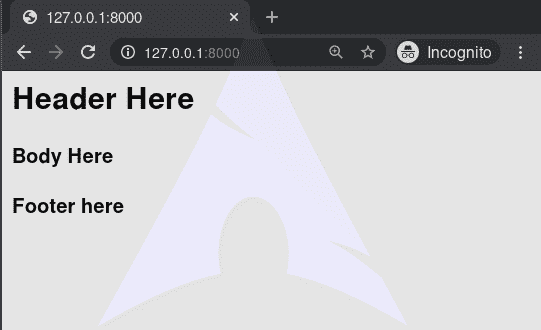

# 包括–姜戈模板标签

> 原文:[https://www.geeksforgeeks.org/include-django-template-tags/](https://www.geeksforgeeks.org/include-django-template-tags/)

Django 模板是使用 Django 模板语言标记的文本文档或 Python 字符串。Django 是一个强大的包含电池的框架，为在模板中呈现数据提供了便利。Django 模板不仅允许在视图和模板之间传递数据，还提供了一些有限的编程特性，如变量、for 循环、注释、扩展、include 等。
本文围绕如何在模板中使用**包含标签**展开。`include`标签加载一个模板，并用当前上下文渲染它。这是一种在模板中“包含”其他模板的方式。模板名称可以是变量，也可以是硬编码(带引号)的字符串，可以是单引号或双引号。

###### 句法

```


```

###### 例子

```

```

通常模板名称是相对于模板加载器的根目录的。字符串参数也可以是以**开始的相对路径。/** 或**../** 如[中所述扩展](https://docs.djangoproject.com/en/3.0/ref/templates/builtins/#extends)标签。

## 包括–姜戈模板标签说明

举例说明如何在姜戈模板中使用包含标签。考虑一个名为`geeksforgeeks`的项目，它有一个名为`geeks`的应用程序。

> 请参考以下文章，查看如何在 Django 中创建项目和应用程序。
> 
> *   [如何利用姜戈的 MVT 创建基础项目？](https://www.geeksforgeeks.org/how-to-create-a-basic-project-using-mvt-in-django/)
> *   [如何在姜戈创建 App？](https://www.geeksforgeeks.org/how-to-create-an-app-in-django/)

现在创建一个视图，我们将通过它访问模板，
在`geeks/views.py`中，

```
# import Http Response from django
from django.shortcuts import render

# create a function
def geeks_view(request):

    # return response
    return render(request, "geeks.html.html")
```

创建 url 路径以映射到此视图。在`geeks/urls.py`中，

```
from django.urls import path

# importing views from views.py
from .views import geeks_view

urlpatterns = [
    path('', geeks_view),
]
```

现在我们将创建三个模板来演示**包括标签**。在`geeks.html`中创建基础模板，

```
<html>
    <!-- Include header -->
    

    <h4>Body Here</h4>

    <!-- Include Footer -->
    
</html>
```

在模板/组件 1.html 中创建两个组件

```
<!-- component1.html -->
<h2> Header Here </h2>>
```

和模板/组件 2.html

```
<!-- component2.html -->
<h4>Footer here</h4>
```

现在访问 [http://127.0.0.1:8000/](http://127.0.0.1:8000/) ，



#### 高级用法

可以使用关键字参数向模板传递额外的上下文:

```

```