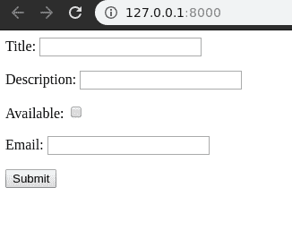
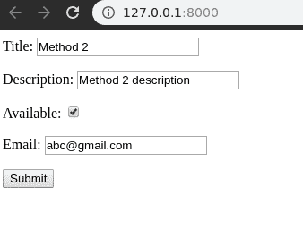

# 初始表单数据–姜戈表单

> 原文:[https://www . geesforgeks . org/initial-form-data-django-forms/](https://www.geeksforgeeks.org/initial-form-data-django-forms/)

在创建了 Django 表单之后，如果需要用一些初始数据填充表单的一些或所有字段，可以使用 Django 表单的功能来完成。它与占位符不同，但这些数据将在提交时传递到视图中。有多种方法可以做到这一点，最常见的是在 Django 视图中初始化表单时传递数据字典。其他方法包括通过表单域传递初始值或覆盖`__init__`方法。

### 如何将初始数据传递给 Django 表单？

使用示例传递初始数据的图示。考虑一个名为`geeksforgeeks`的项目，它有一个名为`geeks`的应用程序。

> 请参考以下文章，查看如何在 Django 中创建项目和应用程序。
> 
> *   [如何利用姜戈的 MVT 创建基础项目？](https://www.geeksforgeeks.org/how-to-create-a-basic-project-using-mvt-in-django/)
> *   [如何在姜戈创建 App？](https://www.geeksforgeeks.org/how-to-create-an-app-in-django/)

现在让我们在“极客/表单. py”中创建一个演示表单，

```
from django import forms

// creating a django form
class GeeksForm(forms.Form):
    title = forms.CharField()
    description = forms.CharField()
    available = forms.BooleanField()
    email = forms.EmailField()
```

现在要呈现这个表单，我们需要创建视图和模板，用于向用户显示表单。在极客/视图. py 中，创建一个视图

```
from django.shortcuts import render
from .forms import GeeksForm

# creating a home view
def home_view(request):
    context = {}
    form = GeeksForm(request.POST or None)
    context['form'] = form
    return render(request, "home.html", context)
```

在模板/home.html 中，

```
<form method="POST">
    
    {{ form.as_p }}
    <input type="submit" value="Submit">
</form>
```

现在让我们通过运行

```
Python manage.py runserver
```

访问[http://127 . 0 . 0 . 1:8000/](http://127.0.0.1:8000/)


### 方法 1–在视图中添加初始表单数据

通过字典添加初始数据的第一种也是最常用的方法是在窗体初始化期间的 view.py。下面是`views.py`的代码，加上了一些数据。

```
from django.shortcuts import render
from .forms import GeeksForm

def home_view(request):
    context ={}

    # dictionary for initial data with 
    # field names as keys
    initial_dict = {
        "title" : "My New Title",
        "description" : " A New Description",
        "available":True,
        "email":"abc@gmail.com"
    }

    # add the dictionary during initialization
    form = GeeksForm(request.POST or None, initial = initial_dict)

    context['form']= form
    return render(request, "home.html", context)
```

现在打开 [http://127.0.0.1:8000/](http://127.0.0.1:8000/) 。该方法比所有方法都高级，并且将覆盖在其他方法中提供的任何数据。
T3】

### 方法 2–使用表单中的字段添加初始表单数据

您可以使用表单中的字段添加初始数据。为此，有一个属性 **initial** 。
在形式上，

```
from django import forms

class GeeksForm(forms.Form):
    # adding initial data using initial attribute
    title = forms.CharField(initial = "Method 2 ")
    description = forms.CharField(initial = "Method 2 description")
    available = forms.BooleanField(initial = True)
    email = forms.EmailField(initial = "abc@gmail.com")
```

现在访问， [http://127.0.0.1:8000/](http://127.0.0.1:8000/) 。可以看到数据被更新为方法 2。



通过这种方式，可以将初始数据添加到表单中，以方便用户的工作或任何相关目的。这些数据将被传递给用户定义的模型或视图，并作为用户在表单中输入的正常数据。