# 使用 Django REST 框架将 Django 与 Reactjs 集成

> 原文:[https://www . geeksforgeeks . org/integrating-django-with-reactjs-using-django-rest-framework/](https://www.geeksforgeeks.org/integrating-django-with-reactjs-using-django-rest-framework/)

在本文中，我们将学习使用 Django REST 框架在 Django 后端和 React js 前端之间进行通信的过程。为了更好地理解这个概念，我们将构建一个**简单任务管理器**，并介绍 React js 和 Django 之间这种集成的主要概念。

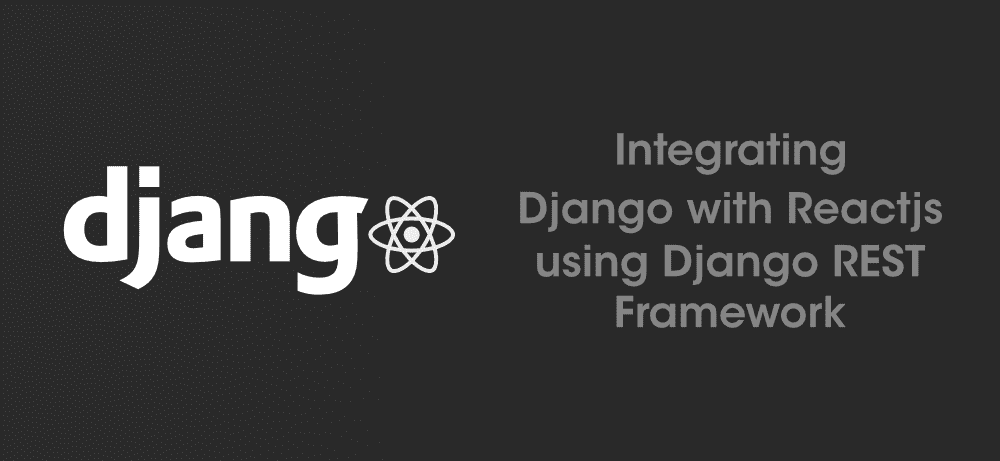

简而言之，Reactjs 是一个用于开发单页应用程序(SPA)的 Javascript 库，具有非常详细且结构良好的[文档](https://reactjs.org/docs/getting-started.html)。对于这个项目，React 将作为前端，通过对 Django 后端的请求来处理用户界面。

## 项目概述:

让我们先看看我们将要建造什么。下图显示了任务管理器的用户界面。

这个任务管理器应用程序是一种待办事项列表。这里我们将有三个按钮作为“已完成”、“未完成”和一个按钮来添加名为“添加任务”的任务，如上图所示。

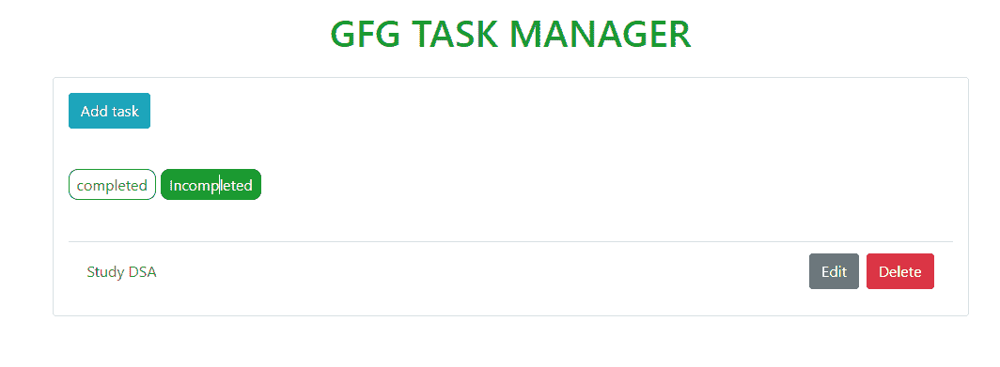

要添加任务，您可以点击添加任务按钮，这将在应用程序中打开一个窗口来添加任务，如下所示。在这里，我们可以为任务添加“标题”，并在“描述”部分对其进行描述。最后，您可以根据任务的状态(即已完成或未完成)来选中或取消选中，如下图所示:

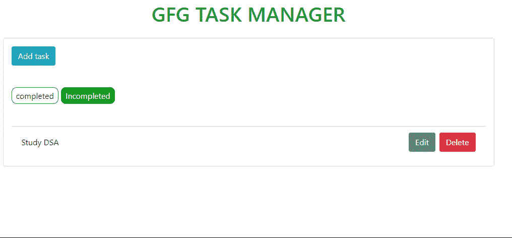

“保存”任务后，您可以在“已完成”和“未完成”选项卡之间导航，以跟踪任务，如下所示:

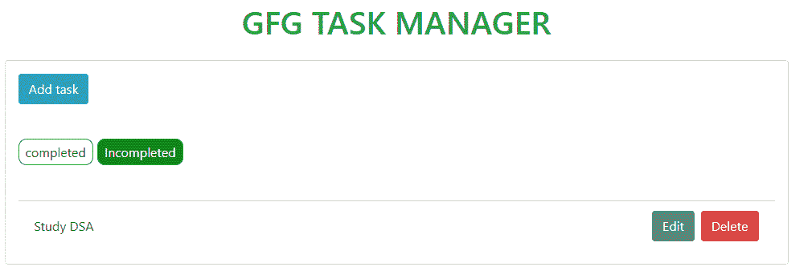

在这里，您还可以选择“删除”或“编辑”现有任务，如下所示:


上面执行的所有操作都由 Django REST 框架管理。

## 项目设置:

### 先决条件:

因此，以下是该项目的先决条件:

*   [Python 3](https://www.python.org/downloads/) (最好是 Python 3.5 及以上)
*   [节点 js](https://nodejs.org/en/download/)
*   [VS 代码](https://code.visualstudio.com/download)(或者，您选择的 IDE)

要验证您是否安装了 python 3，请在命令提示符下使用以下命令(由于此项目是在 Windows 机器上开发的，我们将使用命令提示符，但根据您的操作系统，您可以使用终端):

```
python -V
```

这将在您的系统上显示当前的 python 版本，如下所示:

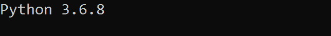

要检查节点模块是否已安装，请使用以下命令:

```
node --version
```

这将显示您系统上的节点版本，如下所示:

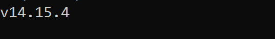

此时，我们可以开始了，因为我们的系统中安装了 Python 和 Node js。

## 实施:

让我们从后端开始。

### 后端(Django):

现在让我们打开命令提示符。现在，按照与本文相同的顺序执行以下步骤。

**步骤 1:** 使用以下命令创建一个名为 ***【姜戈-反应-应用】*** 的目录(该命令可能会根据您的操作系统略有变化):

```
mkdir django-react-app
```

**步骤 2:** 移动到我们刚刚使用以下命令创建的目录中:

```
cd django-react-project
```

**步骤 3:** 现在使用以下命令创建一个虚拟环境:

```
python -m venv dar
```

我们已经将我们的虚拟环境***【Dar】***命名为 Django 和 react 的简称。这是必要的，因为我们不必全局安装软件包和依赖项。这也是一个很好的编程实践。

**步骤 4:** 使用以下命令激活我们刚刚创建的虚拟环境:

```
dar\Scripts\activate.bat
```

这将激活我们的虚拟机，如下所示:

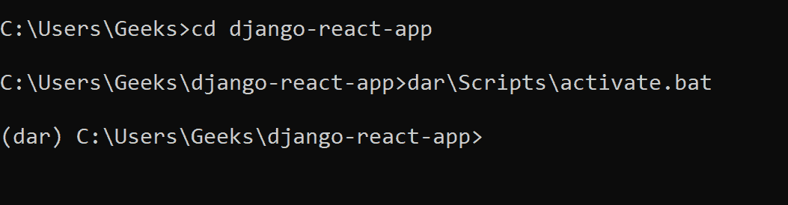

**步骤 5:** 现在使用以下命令在虚拟机内部安装 Django:

```
pip install django
```

安装完成后，您将收到类似的消息:

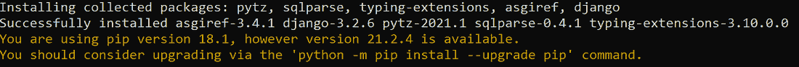

**第 6 步:**现在让我们为我们的 Django 后端创建名为“ ***【后端】*** 的项目。为此，请使用以下命令:

```
django-admin startproject backend
```

Django-react 应用程序将是我们的主文件夹，在它里面，我们将有两个文件夹，一个用于后端，一个用于前端，我们稍后将创建。

**步骤 7:** 现在使用以下命令导航到后端文件夹:

```
cd backend
```

**第 8 步:**现在我们将启动我们的应用程序，并使用以下命令将其称为“todo”:

```
python manage.py startapp todo
```

该应用程序使用上面的命令创建，如下所示:

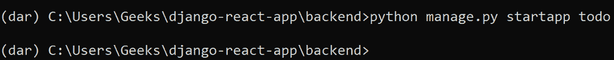

现在让我们开始启动 VS 代码，并打开其中的项目文件夹。在此阶段，我们的项目结构如下所示:

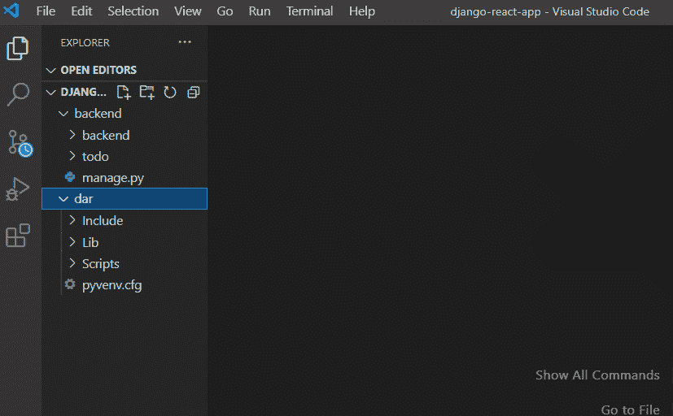

**步骤 9:** 现在使用下面的命令迁移项目:

```
python manage.py migrate
```

迁移将按如下所示应用:

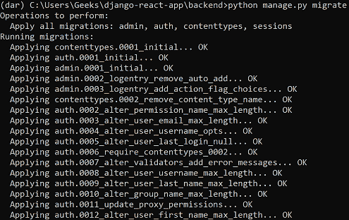

**步骤 10:** 现在让我们使用以下命令运行服务器:

```
python manage.py runserver
```

现在可以访问本地主机 [](http://127.0.0.1:8000/) 查看项目是否已经正常启动。如下图所示，项目已经启动并运行:

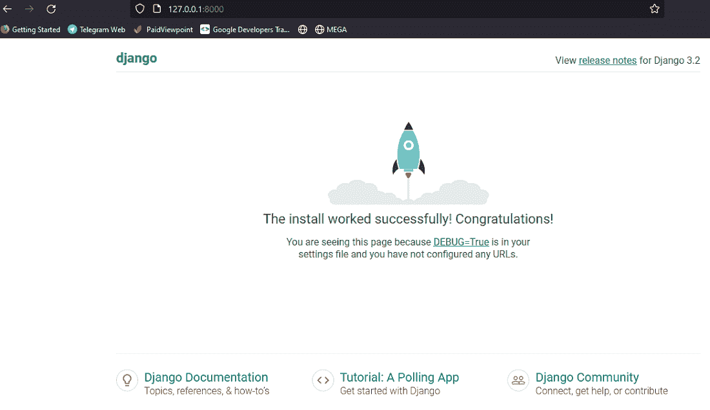

**步骤 11:** 现在我们需要在 ***设置. py*** 文件里面进行一些配置步骤。在 INSTALLED_APPS 部分添加我们创建的应用程序的名称(即 todo)，如下所示:

## 蟒蛇 3

```
# Application definition

INSTALLED_APPS = [
    'django.contrib.admin',
    'django.contrib.auth',
    'django.contrib.contenttypes',
    'django.contrib.sessions',
    'django.contrib.messages',
    'django.contrib.staticfiles',
    'todo',
]
```

此时，settings.py 文件如下所示:

## 蟒蛇 3

```
from pathlib import Path

# Build paths inside the project like this: BASE_DIR / 'subdir'.
BASE_DIR = Path(__file__).resolve().parent.parent

# Quick-start development settings - unsuitable for production
# See https://docs.djangoproject.com/en/3.2/howto/deployment/checklist/

# SECURITY WARNING: keep the secret key used in production secret!
SECRET_KEY = 'django-insecure-_c3!4)8+yce2l-ju@gz@b6(e0$00y@xhx7+lxk1p==k+pyqko3'

# SECURITY WARNING: don't run with debug turned on in production!
DEBUG = True

ALLOWED_HOSTS = []

# Application definition

INSTALLED_APPS = [
    'django.contrib.admin',
    'django.contrib.auth',
    'django.contrib.contenttypes',
    'django.contrib.sessions',
    'django.contrib.messages',
    'django.contrib.staticfiles',
    'todo',
]

MIDDLEWARE = [
    'django.middleware.security.SecurityMiddleware',
    'django.contrib.sessions.middleware.SessionMiddleware',
    'django.middleware.common.CommonMiddleware',
    'django.middleware.csrf.CsrfViewMiddleware',
    'django.contrib.auth.middleware.AuthenticationMiddleware',
    'django.contrib.messages.middleware.MessageMiddleware',
    'django.middleware.clickjacking.XFrameOptionsMiddleware',
]

ROOT_URLCONF = 'backend.urls'

TEMPLATES = [
    {
        'BACKEND': 'django.template.backends.django.DjangoTemplates',
        'DIRS': [],
        'APP_DIRS': True,
        'OPTIONS': {
            'context_processors': [
                'django.template.context_processors.debug',
                'django.template.context_processors.request',
                'django.contrib.auth.context_processors.auth',
                'django.contrib.messages.context_processors.messages',
            ],
        },
    },
]

WSGI_APPLICATION = 'backend.wsgi.application'

# Database
# https://docs.djangoproject.com/en/3.2/ref/settings/#databases

DATABASES = {
    'default': {
        'ENGINE': 'django.db.backends.sqlite3',
        'NAME': BASE_DIR / 'db.sqlite3',
    }
}

# Password validation
# https://docs.djangoproject.com/en/3.2/ref/settings/#auth-password-validators

AUTH_PASSWORD_VALIDATORS = [
    {
        'NAME': 'django.contrib.auth.password_validation.UserAttributeSimilarityValidator',
    },
    {
        'NAME': 'django.contrib.auth.password_validation.MinimumLengthValidator',
    },
    {
        'NAME': 'django.contrib.auth.password_validation.CommonPasswordValidator',
    },
    {
        'NAME': 'django.contrib.auth.password_validation.NumericPasswordValidator',
    },
]

# Internationalization
# https://docs.djangoproject.com/en/3.2/topics/i18n/

LANGUAGE_CODE = 'en-us'

TIME_ZONE = 'UTC'

USE_I18N = True

USE_L10N = True

USE_TZ = True

# Static files (CSS, JavaScript, Images)
# https://docs.djangoproject.com/en/3.2/howto/static-files/

STATIC_URL = '/static/'

# Default primary key field type
# https://docs.djangoproject.com/en/3.2/ref/settings/#default-auto-field

DEFAULT_AUTO_FIELD = 'django.db.models.BigAutoField'
```

**步骤 12:** 接下来，我们需要创建一个**模型。**模型将确定待办事项如何存储在数据库中。我们将在模型中有三个属性:

*   **标题:**这将是任务的标题，最大长度为 150 个字符。
*   **描述:**这将是任务的描述，最大长度为 500 个字符。
*   **完成:**这将是一个布尔值，用于确定任务的当前状态。默认情况下，它将被设置为 false。

所以继续打开 ***models.py*** 文件和下面的代码:

## 蟒蛇 3

```
class Todo(models.Model):
    title=models.CharField(max_length=150)
    description=models.CharField(max_length=500)
    completed=models.BooleanField(default=False)
```

我们还将在 Todo 类中创建标题的字符串表示，如下所示:

## 蟒蛇 3

```
def __str__(self):

  #it will return the title
  return self.title G")
```

此时，我们的 *models.py* 文件将如下所示:

## 蟒蛇 3

```
from django.db import models

class Todo(models.Model):
    title=models.CharField(max_length=150)
    description=models.CharField(max_length=500)
    completed=models.BooleanField(default=False)

    # string representation of the class
    def __str__(self):

        #it will return the title
        return self.title
```

**步骤 13:** 现在让我们继续进行迁移。请注意，每次您更改 *models.py* 文件时，我们都需要进行迁移。请使用以下命令来执行此操作:

```
python manage.py makemigrations
```

当您的迁移准备就绪时，将生成以下消息:

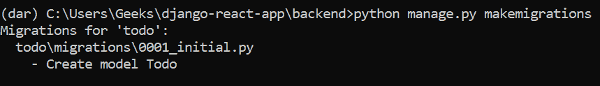

**步骤 14:** 现在，让我们使用以下命令应用所有迁移:

```
python manage.py migrate
```

这将应用于我们的迁移，如下所示:

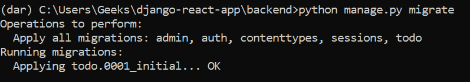

现在，我们可以使用管理站点(或接口)测试 CRUD 操作在 todo 模型文件上工作。为此，我们需要在 *admin.py* 文件中注册模型。

**第 15 步:**打开 ***admin.py*** 文件，并在其中添加以下代码:

## 蟒蛇 3

```
from django.contrib import admin

# import the model Todo
from .models import Todo

# create a class for the admin-model integration
class TodoAdmin(admin.ModelAdmin):

    # add the fields of the model here
    list_display = ("title","description","completed")

# we will need to register the
# model class and the Admin model class
# using the register() method
# of admin.site class
admin.site.register(Todo,TodoAdmin)
```