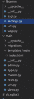

# 在姜戈项目中集成脸书评论插件

> 原文:[https://www . geesforgeks . org/integrating-Facebook-comments-plugin-in-django-project/](https://www.geeksforgeeks.org/integrating-facebook-comments-plugin-in-django-project/)

Django 是一个基于 Python 的网络框架，允许您快速创建高效的网络应用程序。它也被称为电池内置框架，因为 Django 为一切提供内置功能，包括 Django 管理界面、默认数据库——sqllite 3 等。在本文中，我们将学习在姜戈集成脸书评论插件。

### 如何集成 facebook 评论插件？

首先，我们必须安装 Django。打开 cmd 或终端

```py
pip install django
```

创建一个新的姜戈项目

```py
django-admin startproject fbcomm
```

然后写命令–

```py
cd fbcomm
```

创建新应用程序–

```py
python manage.py startapp main
```

**文件夹结构:-**



然后在 **settings.py 中的 INSTALLED_APPS 中添加应用名称。**


fbcomm/**URL . py**:-

## 蟒蛇 3

```py
from django.contrib import admin
from django.urls import path,include

urlpatterns = [
    path('admin/', admin.site.urls),
    path('',include("main.urls")),
]
```