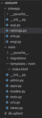
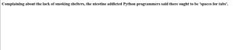

# 使用 Django 框架的笑话应用项目

> 原文:[https://www . geesforgeks . org/joke-application-project-use-django-framework/](https://www.geeksforgeeks.org/joke-application-project-using-django-framework/)

Django 是一个基于 Python 的高级网络框架，允许快速开发和干净、实用的设计。它也被称为电池内置框架，因为 Django 为一切提供内置功能，包括 Django 管理界面、默认数据库 SQLlite3 等。今天我们将在姜戈创建一个笑话应用程序。

### **安装–**

```py
pip3 install django
pip3 install pyjokes
```

### **基本设置–**

通过以下命令启动项目

```py
django-admim startproject jokeapp
```

将目录更改为 jokeapp

```py
cd jokeapp
```

启动服务器-通过在终端中键入以下命令启动服务器–

```py
python manage.py runserver
```

要检查服务器是否正在运行，请转到 web 浏览器并输入 http://127.0.0.1:8000/作为 URL。

### 创建主应用程序–

```py
python manage.py startapp main
```

转到主目录/文件夹，方法是:cd 主目录，用 index.html 文件创建一个文件夹

使用文本编辑器打开项目文件夹。目录结构应该如下所示:



现在在**设置中的 jokeapp 中添加主应用程序**


编辑 jokeapp 中的**URL . py**

## 蟒蛇 3

```py
from django.contrib import admin
from django.urls import path,include

urlpatterns = [
    path('admin/', admin.site.urls),
    path("",include("main.urls")),
]
```

在主应用程序(jokeapp/main/)中创建新的**URL . py**

## 蟒蛇 3

```py
from django.urls import path
from .views import *

urlpatterns = [
    path("",home, name="home"),
]
```

在主菜单中编辑**视图**

## 蟒蛇 3

```py
from django.shortcuts import render,HttpResponse
import pyjokes
# Create your views here.

def home(request):
    joke=pyjokes.get_joke()
    return render(request,"main/index.html",{"joke":joke})
```

在 main 里面创建新的模板文件夹，在 main 里面创建另一个文件夹，并创建新的文件 index.html。(主/模板/主/索引. html)

**index.html**

## 超文本标记语言

```py
<html>
  <head>
    <title>Home Page</title>
  </head>
<body>
<h3>{{joke}}</h3>
</body>
</html>
```

### 输出–

现在，您可以运行服务器来查看您的笑话应用程序

```py
python manage.py runserver
```

