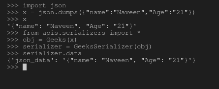
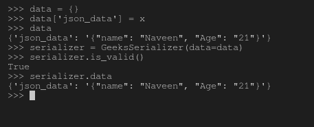

# 序列化程序中的 JSON field–Django REST 框架

> 原文:[https://www . geesforgeks . org/JSON field-in-serializer-django-rest-framework/](https://www.geeksforgeeks.org/jsonfield-in-serializers-django-rest-framework/)

在 Django REST 框架中，序列化的概念就是将数据库数据转换成 javascript 可以使用的数据类型。每个序列化程序都带有一些将要被处理的字段(条目)。例如，如果您有一个名为 Employee 的类，其字段为 Employee_id、Employee_name、is_admin 等。然后，您将需要自动字段、字符字段和 BooleanField 来通过 Django 存储和操作数据。类似地，序列化程序也以相同的原理工作，并且具有用于创建序列化程序的字段。
本文围绕 Django REST 框架中序列化器中的 JSONField 展开。

#### JSONField(联合王国)

JSONField 基本上是一个字段类，用于验证传入的数据结构是否由有效的 JSON 原语组成。在其替代二进制模式下，它将表示和验证 JSON 编码的二进制字符串。

它有以下参数–

*   **二进制**–如果设置为真，则该字段将输出并验证 JSON 编码的字符串，而不是原始数据结构。默认为假。
*   **编码器**–使用这个 JSON 编码器序列化输入对象。默认为无。

**语法–**

```
field_name = serializers.JSONField(*args, **kwargs)
```

#### 如何在序列化程序中使用 JSONField？

为了解释 JSONField 的用法，让我们从–[开始使用相同的项目设置如何使用 Django Rest 框架创建一个基本的 API？](https://geeksforgeeks.org/how-to-create-a-basic-api-using-django-rest-framework/)。
现在您的项目中有了一个名为 serializer 的文件，让我们创建一个以 JSONField 为字段的序列化程序。

```
# import serializer from rest_framework
from rest_framework import serializers

class Geeks(object):
    def __init__(self, json_data):
        self.json_data = json_data

# create a serializer
class GeeksSerializer(serializers.Serializer):
    # intialize fields
    json_data = serializers.JSONField()

```

现在让我们创建一些对象，并尝试序列化它们，检查它们是否真的在工作，运行–

```
Python manage.py shell
```

现在，在 shell 中运行以下 python 命令

```
# create a json object
>>> import json
>>> x = json.dumps({"name":"Naveen", "Age":"21"})
>>> x
'{"name": "Naveen", "Age": "21"}'

# import everything from serializers
>>> from apis.serializers import *

# create a object of type Geeks
>>> obj = Geeks(x)

# serialize the object
>>> serializer = GeeksSerializer(obj)

# print serialized data
>>> serializer.data
{'json_data': '{"name": "Naveen", "Age": "21"}'}

```

这是终端上所有这些操作的输出–



#### JSONField 上的验证

请注意，这些字段的主要座右铭是传递验证，例如 JSONField 只向 JSON 验证数据。让我们检查一下这些验证是否有效–

```
# Create a dictionary and add invalid values
>>> data = {}
>>> data['json_data'] = x

# dictionary created
>>> data
{'json_data': '{"name": "Naveen", "Age": "21"}'}

# deserialize the data
>>> serializer = GeeksSerializer(data=data)

# check if data is valid
>>> serializer.is_valid()
True

# check the errors
>>> serializer.errors
{}

```

下面是这些命令的输出，它清楚地显示了 json_data 有效–



#### 高级概念

验证是反序列化的一部分，不是序列化的一部分。如前所述，序列化是将已经生成的数据转换成另一种数据类型的过程，因此不需要这些默认的验证。反序列化需要验证，因为数据需要保存到数据库或指定的任何其他操作。所以如果你使用这些字段序列化数据。

## 序列化程序字段中的核心参数

| 争吵 | 描述 |
| --- | --- |
| [只读](https://www.geeksforgeeks.org/core-arguments-in-serializer-fields-django-rest-framework/#read_only) | 将该值设置为 True 以确保在序列化表示时使用该字段，但在反序列化期间创建或更新实例时不使用该字段 |
| [只写 _ 条](https://www.geeksforgeeks.org/core-arguments-in-serializer-fields-django-rest-framework/#write_only) | 将此设置为“真”，以确保该字段可以在更新或创建实例时使用，但在序列化表示时不包括在内。 |
| [必需](https://www.geeksforgeeks.org/core-arguments-in-serializer-fields-django-rest-framework/#required) | 将此设置为 False 还允许在序列化实例时从输出中省略对象属性或字典键。 |
| [默认](https://www.geeksforgeeks.org/core-arguments-in-serializer-fields-django-rest-framework/#default) | 如果设置，这将给出默认值，如果未提供输入值，该默认值将用于该字段。 |
| [允许 _ 空](https://www.geeksforgeeks.org/core-arguments-in-serializer-fields-django-rest-framework/#allow_null) | 通常情况下，如果将“无”传递给序列化程序字段，将会引发错误。如果“无”应被视为有效值，则将此关键字参数设置为“真”。 |
| [来源](https://www.geeksforgeeks.org/core-arguments-in-serializer-fields-django-rest-framework/#source) | 将用于填充字段的属性的名称。 |
| [验证器](https://www.geeksforgeeks.org/core-arguments-in-serializer-fields-django-rest-framework/#validators) | 应该应用于输入字段输入的验证函数列表，这些函数要么引发验证错误，要么简单地返回。 |
| [错误信息](https://www.geeksforgeeks.org/core-arguments-in-serializer-fields-django-rest-framework/#error_messages) | 错误信息的错误代码字典。 |
| 标签 | 一个短文本字符串，可用作 HTML 表单字段或其他描述性元素中的字段名称。 |
| [帮助 _ 文字](https://www.geeksforgeeks.org/core-arguments-in-serializer-fields-django-rest-framework/#help_text) | 一个文本字符串，可用作 HTML 表单字段或其他描述性元素中字段的描述。 |
| [初始](https://www.geeksforgeeks.org/core-arguments-in-serializer-fields-django-rest-framework/#initial) | 应该用于预先填充 HTML 表单字段值的值。 |