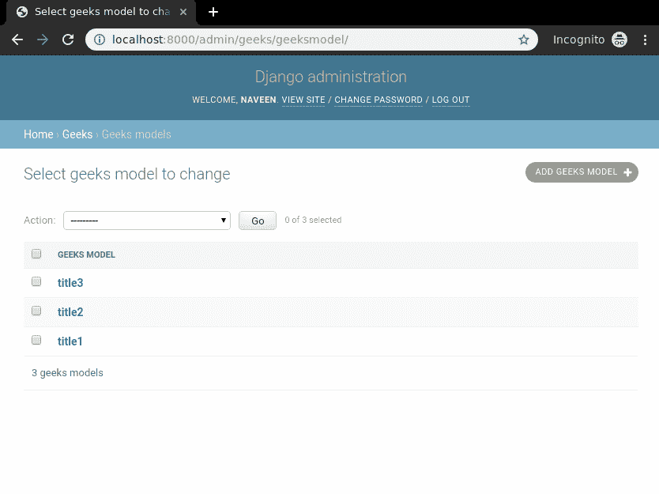
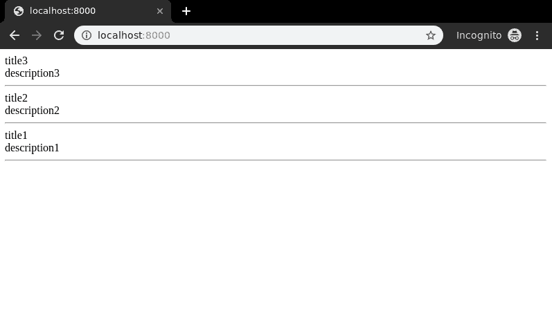
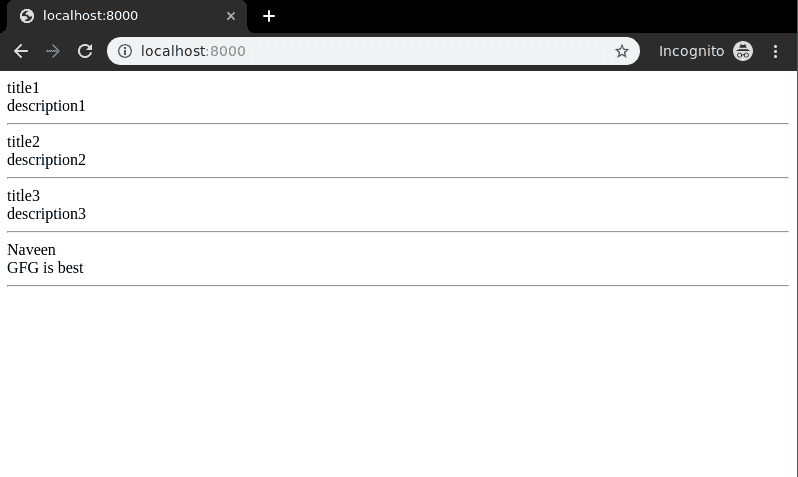

# 列表视图–基于功能的视图姜戈

> 原文:[https://www . geesforgeks . org/list-view-function-based-view-django/](https://www.geeksforgeeks.org/list-view-function-based-views-django/)

列表视图指的是以特定顺序列出数据库中某个表的所有或特定实例的视图(逻辑)。它用于在单个页面或视图上显示多种类型的数据，例如，电子商务页面上的产品。Django 为列表视图提供了非常普通的支持，但是让我们检查一下它是如何通过基于函数的视图手动完成的。本文围绕列表视图展开，其中涉及到 Django 表单、 [Django 模型](https://www.geeksforgeeks.org/django-models/)等概念。
对于列表视图，我们需要一个项目与一些模型和多个实例将被显示。

## 姜戈列表视图-基于功能的视图

使用示例说明如何创建和使用列表视图。考虑一个名为 geeksforgeeks 的项目，它有一个名为 geeks 的应用程序。

> 请参考以下文章，查看如何在 Django 中创建项目和应用程序。
> 
> *   [如何利用姜戈的 MVT 创建基础项目？](https://www.geeksforgeeks.org/how-to-create-a-basic-project-using-mvt-in-django/)
> *   [如何在姜戈创建 App？](https://www.geeksforgeeks.org/how-to-create-an-app-in-django/)

在你有一个项目和一个应用程序后，让我们创建一个模型，我们将通过我们的视图创建实例。在极客/模特. py 中，

## 蟒蛇 3

```py
# import the standard Django Model
# from built-in library
from django.db import models

# declare a new model with a name "GeeksModel"
class GeeksModel(models.Model):

    # fields of the model
    title = models.CharField(max_length = 200)
    description = models.TextField()

    # renames the instances of the model
    # with their title name
    def __str__(self):
        return self.title
```

创建这个模型后，我们需要运行两个命令来为其创建数据库。

```py
Python manage.py makemigrations
Python manage.py migrate
```

现在让我们使用 shell 创建这个模型的一些实例，运行 form bash，

```py
Python manage.py shell
```

输入以下命令

```py
>>> from geeks.models import GeeksModel
>>> GeeksModel.objects.create(
                       title="title1",
                       description="description1").save()
>>> GeeksModel.objects.create(
                       title="title2",
                       description="description2").save()
>>> GeeksModel.objects.create(
                       title="title2",
                       description="description2").save()
```

现在我们已经为后端做好了一切准备。验证已从[http://localhost:8000/admin/geeks/geeks model/](http://localhost:8000/admin/geeks/geeksmodel/)
创建实例



让我们为其创建一个视图和模板。极客/观点. py 中，

## 蟒蛇 3

```py
from django.shortcuts import render

# relative import of forms
from .models import GeeksModel

def list_view(request):
    # dictionary for initial data with
    # field names as keys
    context ={}

    # add the dictionary during initialization
    context["dataset"] = GeeksModel.objects.all()

    return render(request, "list_view.html", context)
```

在 templates/list_view.html 中创建模板，

## 超文本标记语言

```py
<div class="main">

    .

    {{ data.title }}<br/>
    {{ data.description }}<br/>
    <hr/>

    

</div>
```

我们来看看[上有什么 http://localhost:8000/](http://localhost:8000/)T2】


宾果游戏..！！列表视图工作正常。还可以显示过滤后的项目，或者根据各种功能以不同的顺序对它们进行排序。让我们以相反的方式订购这些物品。
在极客/观点. py 中，

## 蟒蛇 3

```py
from django.shortcuts import render

# relative import of models
from .models import GeeksModel

def list_view(request):
    # dictionary for initial data with
    # field names as keys
    context ={}

    # add the dictionary during initialization
    context["dataset"] = GeeksModel.objects.all().order_by("-id")

    return render(request, "list_view.html", context)
```

#### order_by 以不同顺序排列实例

现在访问[http://localhost:8000/](http://localhost:8000/)



#### 筛选以显示选择性实例

让我们创建一个不同的实例来展示过滤器是如何工作的。运行

```py
Python manage.py shell
```

现在，创建另一个实例，

```py
from geeks.models import GeeksModel
GeeksModel.objects.create(title = "Naveen", description = "GFG is Best").save()
```

现在访问[http://localhost:8000/](http://localhost:8000/)



让我们将这些数据过滤到标题中包含单词“title”的数据。
在**极客/观点. py**

## 蟒蛇 3

```py
from django.shortcuts import render

# relative import of forms
from .models import GeeksModel

def list_view(request):
    # dictionary for initial data with
    # field names as keys
    context ={}

    # add the dictionary during initialization
    context["dataset"] = GeeksModel.objects.all().filter(
        title__icontains = "title"
    )

    return render(request, "list_view.html", context)
```

现在再次访问

