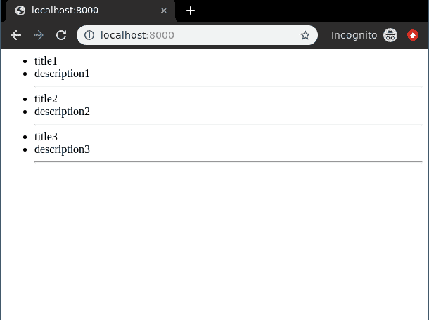
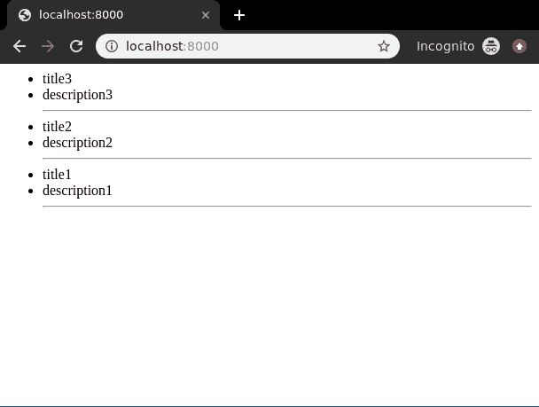

# 列表视图–基于类的视图姜戈

> 原文:[https://www . geesforgeks . org/listview-基于类-view-django/](https://www.geeksforgeeks.org/listview-class-based-views-django/)

列表视图是指显示数据库中一个表的多个实例的视图(逻辑)。我们已经在[列表视图-基于函数的视图姜戈](https://www.geeksforgeeks.org/list-view-function-based-views-django/)中讨论了列表视图的基础。基于类的视图提供了一种将视图实现为 Python 对象而不是函数的替代方法。它们不会取代基于函数的视图，但与基于函数的视图相比有一定的差异和优势:

*   与特定 HTTP 方法(GET、POST 等)相关的代码的组织。)可以通过单独的方法而不是条件分支来解决。
*   面向对象的技术，如 mixins(多重继承)可以用来将代码分解成可重用的组件。

基于类的视图比基于函数的视图管理起来更简单有效。一个有大量代码行的基于函数的视图可以被转换成只有很少代码行的基于类的视图。这就是面向对象编程产生影响的地方。

## 姜戈列表视图-基于功能的视图

使用示例说明**如何创建和使用列表视图**。考虑一个名为`geeksforgeeks`的项目，它有一个名为`geeks`的应用程序。

> 请参考以下文章，查看如何在 Django 中创建项目和应用程序。
> 
> *   [如何利用姜戈的 MVT 创建基础项目？](https://www.geeksforgeeks.org/how-to-create-a-basic-project-using-mvt-in-django/)
> *   [如何在姜戈创建 App？](https://www.geeksforgeeks.org/how-to-create-an-app-in-django/)

在你有一个项目和一个应用程序后，让我们创建一个模型，我们将通过我们的视图创建实例。在`geeks/models.py`中，

```py
# import the standard Django Model
# from built-in library
from django.db import models

# declare a new model with a name "GeeksModel"
class GeeksModel(models.Model):

    # fields of the model
    title = models.CharField(max_length = 200)
    description = models.TextField()

    # renames the instances of the model
    # with their title name
    def __str__(self):
        return self.title
```

创建这个模型后，我们需要运行两个命令来为其创建数据库。

```py
Python manage.py makemigrations
Python manage.py migrate

```

现在让我们使用 shell 创建这个模型的一些实例，运行 form bash，

```py
Python manage.py shell
```

输入以下命令

```py
>>> from geeks.models import GeeksModel
>>> GeeksModel.objects.create(
                       title="title1",
                       description="description1").save()
>>> GeeksModel.objects.create(
                       title="title2",
                       description="description2").save()
>>> GeeksModel.objects.create(
                       title="title2",
                       description="description2").save()

```

现在我们已经为后端做好了一切准备。验证实例是否已从[http://localhost:8000/admin/geeks/geeks model/](http://localhost:8000/admin/geeks/geeksmodel/)创建


基于类的视图自动设置从 A 到 z 的所有内容。只需指定为哪个模型创建列表视图，然后基于类的列表视图将自动尝试在`app_name/modelname_list.html`中找到模板。在我们的例子中是`geeks/templates/geeks/geeksmodel_list.html`。让我们创建基于类的视图。在`geeks/views.py`中，

```py
from django.views.generic.list import ListView
from .models import GeeksModel

class GeeksList(ListView):

    # specify the model for list view
    model = GeeksModel
```

现在创建一个 url 路径来映射视图。在极客/URL . py 中，

```py
from django.urls import path

# importing views from views..py
from .views import GeeksList
urlpatterns = [
    path('', GeeksList.as_view()),
]
```

在`templates/geeks/geeksmodel_list.html`创建模板，

```py
<ul>
    <!-- Iterate over object_list -->
    
    <!-- Display Objects -->
    <li>{{ object.title }}</li>
    <li>{{ object.description }}</li>

    <hr/>
    <!-- If objet_list is empty  -->
    
    <li>No objects yet.</li>
    
</ul>
```

我们来看看[上有什么 http://localhost:8000/](http://localhost:8000/)


### 在列表视图中操作 Queryset

默认情况下，列表视图将按照创建的顺序显示表的所有实例。如果要修改这些实例的顺序或顺序，需要重写 get_queryset 方法。
在`geeks/views.py`中，

```py
from django.views.generic.list import ListView
from .models import GeeksModel

class GeeksList(ListView):

    # specify the model for list view
    model = GeeksModel

    def get_queryset(self, *args, **kwargs):
        qs = super(GeeksList, self).get_queryset(*args, **kwargs)
        qs = qs.order_by("-id")
        return qs
```

现在检查一下，实例的顺序是否颠倒了。

这样可以以任何可能的方式修改整个查询集。