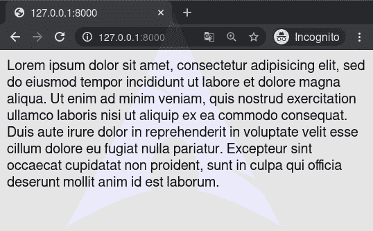

# lorem–django 模板标记

> 哎哎哎:# t0]https://www . geeksforgeeks . org/lorem-django 模板标签/

Django 模板是使用 Django 模板语言标记的文本文档或 Python 字符串。Django 是一个强大的包含电池的框架，为在模板中呈现数据提供了便利。Django 模板不仅允许在视图和模板之间传递数据，还提供了一些有限的编程特性，如变量、for 循环、注释、扩展、include、lorem 等。
本文围绕如何在模板中使用**传说标记**展开。`lorem`标签显示随机的“lorem ipsum”拉丁文本。这对于在模板中提供示例数据非常有用。

###### 句法

```


```

**计数**–包含要生成的段落或单词数的数字(或变量)(默认值为 1)。
**方法**–w 表示单词，p 表示 HTML 段落，b 表示纯文本段落块(默认为 b)。
**random**–random 这个词，如果给定的话，在生成文本时不使用常用段落(“Lorem ipsum dolor sit amet……”)。

###### 示例–

*   将输出常见的“lorem ipsum”段落。
*    will output the common “lorem ipsum” paragraph and two random paragraphs each wrapped in HTML

    标签。

*   将输出两个随机拉丁单词。

## lorem–姜戈模板标签说明

举例说明如何在姜戈模板中使用 lorem 标签。考虑一个名为`geeksforgeeks`的项目，它有一个名为`geeks`的应用程序。

> 请参考以下文章，查看如何在 Django 中创建项目和应用程序。
> 
> *   [如何利用姜戈的 MVT 创建基础项目？](https://www.geeksforgeeks.org/how-to-create-a-basic-project-using-mvt-in-django/)
> *   [如何在姜戈创建 App？](https://www.geeksforgeeks.org/how-to-create-an-app-in-django/)

现在创建一个视图，我们将通过它访问模板，
在`geeks/views.py`中，

```
# import Http Response from django
from django.shortcuts import render

# create a function
def geeks_view(request):

    # return response
    return render(request, "geeks.html.html")
```

创建 url 路径以映射到此视图。在`geeks/urls.py`中，

```
from django.urls import path

# importing views from views.py
from .views import geeks_view

urlpatterns = [
    path('', geeks_view),
]
```

现在我们将创建 s 模板来演示 **lorem 标签**。在`geeks.html`中创建基础模板，

```
<html>
    
</html>
```

现在访问 [http://127.0.0.1:8000/](http://127.0.0.1:8000/) ，

