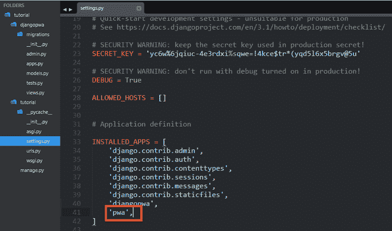

# 把 PWA 做成姜戈项目

> 原文:[https://www.geeksforgeeks.org/make-pwa-of-a-django-project/](https://www.geeksforgeeks.org/make-pwa-of-a-django-project/)

渐进式网络应用程序是一种使用网络技术开发的应用程序，可以像普通应用程序一样安装在任何设备上。

**先决条件:**准备部署的 django 项目。姜戈教程可以参考以下链接[https://www.geeksforgeeks.org/django-tutorial/](https://www.geeksforgeeks.org/django-tutorial/)

必须遵循以下步骤来创建一个 Django 项目的渐进式网络应用程序。

**步骤 1:** 首先使用以下命令安装 django pwa

```py
pip install django-pwa

```

**步骤 2:** 在**设置. py** 项目的已安装应用部分中添加“ **pwa** ”并在**URL . py**项目中给出以下路径–

```py
path(“, include(‘pwa.urls’))

```

**设置. py**



・T 0️ urls.py ・T 1️


**STEP 3:** 在 js 文件夹中，创建一个名为 **serviceworker.js** 的文件，并向其中添加以下代码。

## java 描述语言

```py
var staticCacheName = 'djangopwa-v1';

self.addEventListener('install', function(event) {
  event.waitUntil(
    caches.open(staticCacheName).then(function(cache) {
      return cache.addAll([
        '',
      ]);
    })
  );
});

self.addEventListener('fetch', function(event) {
  var requestUrl = new URL(event.request.url);
    if (requestUrl.origin === location.origin) {
      if ((requestUrl.pathname === '/')) {
        event.respondWith(caches.match(''));
        return;
      }
    }
    event.respondWith(
      caches.match(event.request).then(function(response) {
        return response || fetch(event.request);
      })
    );
});
```