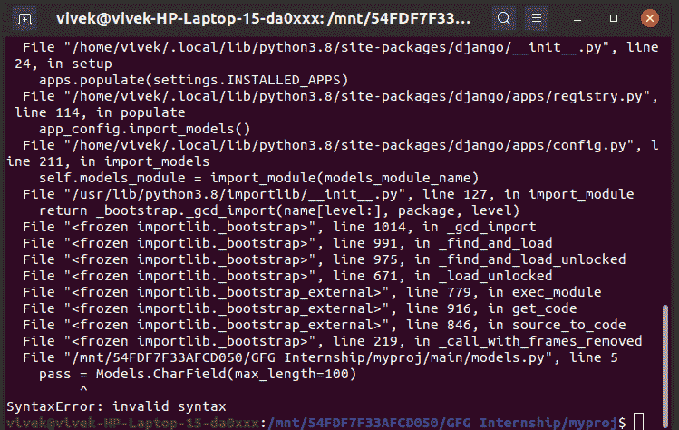
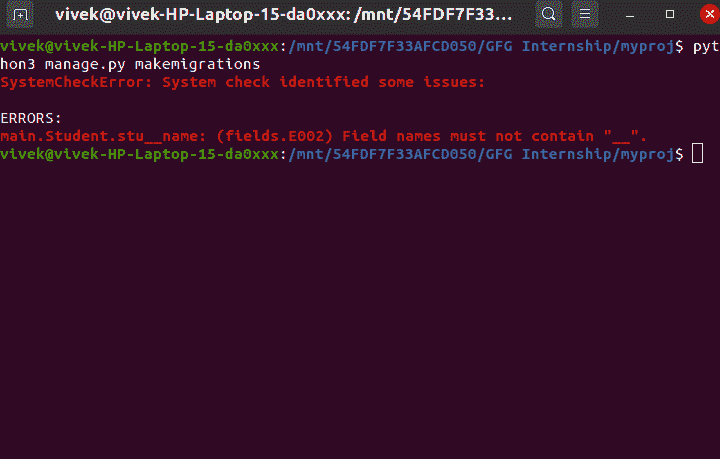
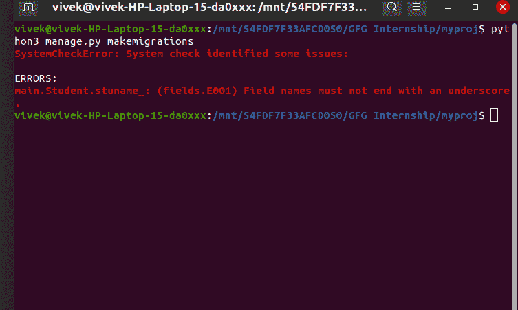

# Django 框架中的模型字段名限制

> 原文:[https://www . geesforgeks . org/model-field name-restrictions-in-django-framework/](https://www.geeksforgeeks.org/model-fieldname-restrictions-in-django-framework/)

Django 模型是 Django 用来创建表、表的字段和各种约束的内置特性。简而言之，Django 模型是一个与 Django 一起使用的数据库的 SQL。SQL(结构化查询语言)是复杂的，涉及许多不同的查询来创建、删除、更新或任何其他与数据库相关的东西。Django 模型简化了任务并将表格组织成模型。

本文围绕模型字段名的限制展开。

Django 对模型字段名进行了一些限制。

首先创建 django 项目来查看这些限制

```py
django-admin startapp myproj
```

```py
cd myproj
```

然后创建新的应用程序。

```py
python manage.py startapp main
```

在**设置中添加主应用程序。在 INSTALLED_APPS 中复制**


### **字段名限制–**

#### 1.字段名不能是 python 保留字

例 1

## 蟒蛇 3

```py
from django.db import models

# Create your models here.
class Student(models.Model):
    pass = models.CharField(max_length=100)
```

**错误:**



例 2

## 蟒蛇 3

```py
from django.db import models

# Create your models here.
class Student(models.Model):
    global = models.CharField(max_length=100)
```


#### 2.一个字段名在一行中不能包含多个下划线

## 蟒蛇 3

```py
from django.db import models

# Create your models here.
class Student(models.Model):
    stu__name = models.CharField(max_length=100)
```

**错误:**



#### 3.域名不能以下划线结尾

## 蟒蛇 3

```py
from django.db import models

# Create your models here.
class Student(models.Model):
    stuname_ = models.CharField(max_length=100)
```

**错误:**

