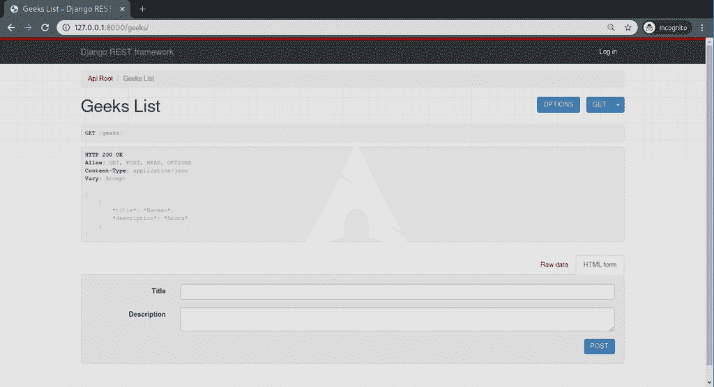

# 序列化程序中的模型序列化程序–姜戈 REST 框架

> 原文:[https://www . geesforgeks . org/model serializer-in-serializer-django-rest-framework/](https://www.geeksforgeeks.org/modelserializer-in-serializers-django-rest-framework/)

模型序列化程序是默认序列化程序之上的一个抽象层，它允许在 Django 中为模型快速创建序列化程序。Django REST 框架是默认 Django 框架的包装器，主要用于创建各种类型的 API。在通过 REST 框架创建应用编程接口之前，有三个阶段:将模型的数据转换为 JSON/XML 格式(序列化)，将这些数据呈现给视图，创建映射到视图集的网址。本文围绕 Django REST 框架的序列化程序中的模型序列化程序展开。

#### 模型串行器

模型序列化程序类提供了一个快捷方式，允许您自动创建一个序列化程序类，该类包含与模型字段相对应的字段。
模型序列化程序类与常规序列化程序类相同，不同之处在于:

*   它会根据模型自动为您生成一组字段。
*   它将自动为序列化程序生成验证器，例如 unique_together 验证器。
*   它包括`.create()`和`.update()`的简单默认实现。

**Syntax –**

```py
class SerializerName(serializers.ModelSerializer):
    class Meta:
        model = ModelName
        fields = List of Fields
```

**示例–**

```py
class AccountSerializer(serializers.ModelSerializer):
    class Meta:
        model = Account
        fields = ['id', 'account_name', 'users', 'created']
```

默认情况下，类中的所有模型字段都将映射到相应的序列化程序字段。

### 如何使用 Django REST 框架创建模型序列化器？

> *   [将休息框架添加到已安装 _ 应用程序](#add_rest_framework)
> *   [Create an app and model it](#create-app)
> *   [Serialize](#serialization)
> *   [Create a view set](#create-viewset)
> *   [URL defining API](#define-urls)
> *   [Run the server and check the API](#runserver)

#### 将 rest_framework 添加到 INSTALLED_APPS

要在您的项目中初始化 REST Framework，请转到`settings.py`，在 INSTALLED_APPS 中，在底部添加**“REST _ Framework”**。

```py
# Application definition

INSTALLED_APPS = [
    'django.contrib.admin',
    'django.contrib.auth',
    'django.contrib.contenttypes',
    'django.contrib.sessions',
    'django.contrib.messages',
    'django.contrib.staticfiles',
    'rest_framework',
]
```

#### 创建应用程序和模型

现在，让我们使用命令创建一个应用程序，

```py
python manage.py startapp apis
```

名为 API 的文件夹现在应该已经注册了。让我们将这个应用程序添加到 **INSTALLED_APPS** 和 urls.py 中。
In，`settings.py`，

```py
# Application definition

INSTALLED_APPS = [
    'django.contrib.admin',
    'django.contrib.auth',
    'django.contrib.contenttypes',
    'django.contrib.sessions',
    'django.contrib.messages',
    'django.contrib.staticfiles',
    'rest_framework',
    'apis',
]
```

现在，在 URLs . py . In**geeks forgeeks . URLs . py**中添加 apis urls，

```py
from django.contrib import admin
# include necessary libraries
from django.urls import path, include

urlpatterns = [
    path('admin/', admin.site.urls),
    # add apis urls
    path('', include("apis.urls"))
]
```

**创建一个模型**
为了演示，创建和使用一个 API，让我们创建一个名为“极客模型”的模型。在 apis 模型中

```py
from django.db import models

class GeeksModel(models.Model):
    title = models.CharField(max_length = 200)
    description = models.TextField()

    def __str__(self):
        return self.title
```

现在我们的应用程序已经准备好了，让我们序列化数据并从中创建视图。

#### 序列化

序列化程序允许将复杂的数据(如查询和模型实例)转换为本机 Python 数据类型，然后可以轻松地将其呈现为 JSON、XML 或其他内容类型。序列化程序还提供反序列化，允许在首先验证传入数据后，将已解析的数据转换回复杂类型。让我们开始创建一个序列化程序，在文件`apis/serializers.py`中，

```py
# import serializer from rest_framework
from rest_framework import serializers

# import model from models.py
from .models import GeeksModel

# Create a model serializer 
class GeeksSerializer(serializers.ModelSerializer):
    # specify model and fields
    class Meta:
        model = GeeksModel
        fields = ('title', 'description')
```

#### 创建视图集

为了将数据呈现到前端，并处理来自用户的请求，我们需要创建一个视图。在 Django REST 框架中，我们称这些为视图集，所以让我们在`apis/views.py`中创建一个视图，

```py
# import viewsets
from rest_framework import viewsets

# import local data
from .serializers import GeeksSerializer
from .models import GeeksModel

# create a viewset
class GeeksViewSet(viewsets.ModelViewSet):
    # define queryset
    queryset = GeeksModel.objects.all()

    # specify serializer to be used
    serializer_class = GeeksSerializer
```

#### 定义应用编程接口的网址

指定要访问的 API 的 url 路径，在`apis/urls.py`中，

```py
# basic URL Configurations
from django.urls import include, path
# import routers
from rest_framework import routers

# import everything from views
from .views import *

# define the router
router = routers.DefaultRouter()

# define the router path and viewset to be used
router.register(r'geeks', GeeksViewSet)

# specify URL Path for rest_framework
urlpatterns = [
    path('', include(router.urls)),
    path('api-auth/', include('rest_framework.urls'))
]
```

一切准备就绪后，让我们运行一些命令来激活服务器。

#### 运行服务器并检查应用编程接口

运行以下命令创建数据库，并运行 server，

```py
python manage.py makemigrations
python manage.py migrate
python manage.py runserver

```

现在访问[http://127 . 0 . 0 . 1:8000/极客/](http://127.0.0.1:8000/geeks/) ，


可以检查模型序列化程序是否创建了具有整体 CRUD 功能的端点。

要查看项目的代码，[点击这里](https://github.com/naveenkrnl/rest_framework_tutorial)

### 高级用法

**指定要包括哪些字段**
如果您只希望在模型序列化程序中使用默认字段的子集，您可以使用字段或排除选项来实现，就像使用[模型表单](https://www.geeksforgeeks.org/django-modelform-create-form-from-models/)一样。
例如:

```py
class AccountSerializer(serializers.ModelSerializer):
    class Meta:
        model = Account
        # specify field names
        fields = ['id', 'account_name', 'users', 'created']
```

或排除示例:

```py
class AccountSerializer(serializers.ModelSerializer):
    class Meta:
        model = Account
        # specify field names
        exclude = ['id']
```

**显式指定字段**
您可以向模型序列化程序添加额外的字段，或者通过在类上声明字段来覆盖默认字段，就像您对序列化程序类所做的那样。
例如，

```py
class AccountSerializer(serializers.ModelSerializer):
    # defining fields manually
    url = serializers.CharField(source ='get_absolute_url', read_only = True)

    class Meta:
        # specify model
        model = Account
```

**指定只读字段**
您可能希望将多个字段指定为只读。您可以使用快捷元选项只读字段，而不是显式添加每个具有只读=真属性的字段。
该选项应为字段名称的列表或元组，声明如下:

```py
class AccountSerializer(serializers.ModelSerializer):
    class Meta:
        model = Account
        fields = ['id', 'account_name', 'users', 'created']
        # specify read only fields
        read_only_fields = ['account_name']
```

要查看有关模型序列化程序的更多信息，请访问[模型序列化程序文档](https://www.django-rest-framework.org/api-guide/serializers/#modelserializer)

## 序列化程序字段中的核心参数

| 争吵 | 描述 |
| --- | --- |
| [只读](https://www.geeksforgeeks.org/core-arguments-in-serializer-fields-django-rest-framework/#read_only) | 将该值设置为 True 以确保在序列化表示时使用该字段，但在反序列化期间创建或更新实例时不使用该字段 |
| [只写 _ 条](https://www.geeksforgeeks.org/core-arguments-in-serializer-fields-django-rest-framework/#write_only) | 将此设置为“真”，以确保该字段可以在更新或创建实例时使用，但在序列化表示时不包括在内。 |
| [必需](https://www.geeksforgeeks.org/core-arguments-in-serializer-fields-django-rest-framework/#required) | 将此设置为 False 还允许在序列化实例时从输出中省略对象属性或字典键。 |
| [默认](https://www.geeksforgeeks.org/core-arguments-in-serializer-fields-django-rest-framework/#default) | 如果设置，这将给出默认值，如果未提供输入值，该默认值将用于该字段。 |
| [允许 _ 空](https://www.geeksforgeeks.org/core-arguments-in-serializer-fields-django-rest-framework/#allow_null) | 通常情况下，如果将“无”传递给序列化程序字段，将会引发错误。如果“无”应被视为有效值，则将此关键字参数设置为“真”。 |
| [来源](https://www.geeksforgeeks.org/core-arguments-in-serializer-fields-django-rest-framework/#source) | 将用于填充字段的属性的名称。 |
| [验证器](https://www.geeksforgeeks.org/core-arguments-in-serializer-fields-django-rest-framework/#validators) | 应该应用于输入字段输入的验证函数列表，这些函数要么引发验证错误，要么简单地返回。 |
| [错误信息](https://www.geeksforgeeks.org/core-arguments-in-serializer-fields-django-rest-framework/#error_messages) | 错误信息的错误代码字典。 |
| 标签 | 一个短文本字符串，可用作 HTML 表单字段或其他描述性元素中的字段名称。 |
| [帮助 _ 文字](https://www.geeksforgeeks.org/core-arguments-in-serializer-fields-django-rest-framework/#help_text) | 一个文本字符串，可用作 HTML 表单字段或其他描述性元素中字段的描述。 |
| [初始](https://www.geeksforgeeks.org/core-arguments-in-serializer-fields-django-rest-framework/#initial) | 应该用于预先填充 HTML 表单字段值的值。 |