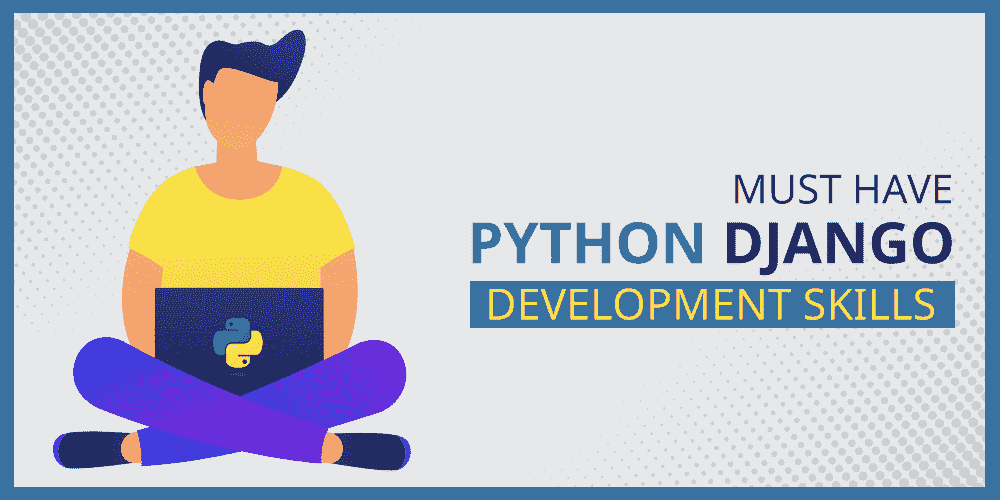

# 必须具备 Python Django 开发技能

> 原文:[https://www . geesforgeks . org/必备-python-django-development-skills/](https://www.geeksforgeeks.org/must-have-python-django-development-skills/)

我们都知道 Python 编程语言的流行。在大多数科技公司中，这种语言用于开发应用程序的后端部分。此外，这种语言广泛用于数据科学、自动化和其他领域。Django 是 Python 最受欢迎的框架，现在它被用于许多应用程序中，这也是大多数开发人员和学生更喜欢选择这种语言的原因。

[**【Django】**](https://www.geeksforgeeks.org/django-tutorial/)让你的代码干净、健壮、可扩展。Django 拥有优秀的文档，它让您的代码更加干净和高效。Django 提供了快速的开发和高度的安全性。Python 程序员的工资日益增长，这也是 Django 开发者需求量大的另一个原因。

学习 Django 给你很多好处。选择这个框架有很多原因，我们已经讨论过了。从链接中了解更多关于 Python 和 Django 框架的信息…

*   [为项目选择 Django 框架的十大理由](https://www.geeksforgeeks.org/top-10-reasons-to-choose-django-framework-for-your-project/)
*   [学姜戈要懂多少 Python？](https://www.geeksforgeeks.org/how-much-python-should-you-know-to-learn-django/)

在这个博客中，我们将讨论作为一名 Django 开发人员应该具备的 5 项基本技能。

### **1。系统编程**

Python 的内置接口使这种语言成为创建可移植程序和系统管理实用程序的理想工具。在 Python 程序的帮助下，你可以做很多事情。你可以找到文件和目录。您可以运行其他程序，也可以使用各种进程和线程执行并行计算。掌握系统编程的原因有很多。

### **2。图形界面创建**

Python 语言的简单性和高速开发使其成为创建图形用户界面的绝佳工具。详细说明这样的技能在职业生涯中不会是多余的是没有任何意义的。

### 3.网络脚本开发

在网络脚本开发中，Python 解释器起着重要的作用。它带有标准的互联网模块，允许程序进行各种网络操作。这些操作在客户端模式和服务器模式下执行。Python 的库使得 web 脚本开发任务变得简单多了。这些技能应该是为了掌握高级 Python 编程。

### 4.快速原型

用 Python 和 C 编写的组件在 Python 程序中是相同的。因此，您可以先用 Python 创建系统原型，然后将选定的组件转移到编译语言中，如 [C](https://www.geeksforgeeks.org/c-programming-language/) 、 [C++](https://www.geeksforgeeks.org/c-plus-plus/) 。Python 并不要求他们的系统在原型调试完成后就完全重写。

系统中不需要 C++提供的性能的部分保留在 Python 中。这简化了这种系统的维护和使用。所以工程师也应该具备 C 和 C++语言的知识。

### **5。数学和科学计算编程**

Python 中的附加工具有助于数学计算，并且 Python 能够创建动画效果和三维对象。它允许你组织并行计算等等。这方面的一个例子是流行的 SciPy 扩展，它为科学计算提供了额外的库。如果你已经掌握了这项技能，那么你的能力将会大大提高。

### **附加技能**

在姜戈学习其他技能对于在信息技术行业获得一个体面的位置很重要，如下所示…

*   用英语表达解决问题的能力。
*   能够与客户沟通，了解他们的需求。
*   已完成项目的投资组合
*   使用 MySQL 或 PostgreSQL 等数据库的经验
*   除了 JavaScript 之外，还具备 HTML、CSS、Bootstrap 方面的前端知识
*   UNIX/LINUX 的开发
*   高负载信息系统开发。
*   信息系统优化
*   有版本控制的经验，如 Git 或 SVN。
*   部署技能
*   时间管理和项目管理
*   与团队成员合作。
*   使用单元测试或其他模块(如 nose、coverage)测试技能。

现在让我们讨论一些特定于 Python 和 Django 的技能集，作为 Django 开发人员，您应该具备这些技能…

### **蟒蛇专用技能套装**

*   Python 的常见特性以及可以使用它的地方…
*   关于 Python 包的知识。
*   熟悉 PEP8。它是如何工作的，为什么它有帮助，以及如何记录您的代码。
*   Python 的基础知识，如元组、字典、列表、列表理解。
*   熟悉装修师，为什么使用？
*   熟悉发电机和使用它们的优势。
*   关于正则表达式的知识。
*   基于类和基于函数的视图，它们之间的区别

### **姜戈专用技能套装**

*   熟悉 MVC 和 MVT。MVT 如何在姜戈工作？MVT 和 MVC 有什么区别？
*   在姜戈，移民是如何工作的？
*   了解 RESTful APIs。
*   Django rest 框架如果你在前端使用任何框架。
*   关于 ORM 的知识。
*   什么是 QuerySet？
*   查询模型以获取条目、显示条目并修改它们。
*   如何过滤查询集？
*   表单和模型表单的区别
*   请求对象及其主要特征
*   CSRF 和姜戈阻止它的是什么？
*   请求和响应对象

### 结论

如果你的 python 基础很清楚，学习 Django 就会变得更容易。有时很难找到成为 Django 开发人员所需的必要技能。现实情况是，你不需要知道 Python 或 Django 中的所有内容，就能成为一名优秀的开发人员。一旦你进入这个行业，一旦你面对现实世界的用户问题，你会慢慢地、逐渐地学会一切。与其他团队成员合作将帮助您提高技能。