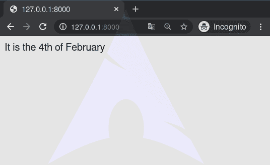

# 现在–姜戈模板标签

> 原文:[https://www.geeksforgeeks.org/now-django-template-tags/](https://www.geeksforgeeks.org/now-django-template-tags/)

Django 模板是使用 Django 模板语言标记的文本文档或 Python 字符串。Django 是一个强大的包含电池的框架，为在模板中呈现数据提供了便利。Django 模板不仅允许在视图和模板之间传递数据，还提供了一些有限的编程特性，如变量、for 循环、注释、扩展、now 等。
本文围绕如何在模板中使用**现在标记**展开。`now`标签显示当前日期和/或时间，使用根据给定字符串的格式。这种字符串可以包含格式说明符字符，如[日期过滤器](https://docs.djangoproject.com/en/3.0/ref/templates/builtins/#std:templatefilter-date)部分所述。

###### 句法

```

```

###### 例子

```
It is 

```

将显示上述标签，【2020 年 2 月 4 日星期二

## 现在–姜戈模板标签说明

举例说明如何在姜戈模板中使用 now 标签。考虑一个名为`geeksforgeeks`的项目，它有一个名为`geeks`的应用程序。

> 请参考以下文章，查看如何在 Django 中创建项目和应用程序。
> 
> *   [如何利用姜戈的 MVT 创建基础项目？](https://www.geeksforgeeks.org/how-to-create-a-basic-project-using-mvt-in-django/)
> *   [如何在姜戈创建 App？](https://www.geeksforgeeks.org/how-to-create-an-app-in-django/)

现在创建一个视图，我们将通过它访问模板，
在`geeks/views.py`中，

```
# import Http Response from django
from django.shortcuts import render

# create a function
def geeks_view(request):

    # return response
    return render(request, "geeks.html.html")
```

创建 url 路径以映射到此视图。在`geeks/urls.py`中，

```
from django.urls import path

# importing views from views.py
from .views import geeks_view

urlpatterns = [
    path('', geeks_view),
]
```

现在我们将创建一个模板来演示**现在标记**。在`geeks.html`中创建基础模板，

```
<html>
 It is the 
</html>
```

现在访问 [http://127.0.0.1:8000/](http://127.0.0.1:8000/) ，



#### 高级用法

也可以使用语法``将输出`(as a string)`存储在变量中。如果您想在像 blocktrans 这样的模板标签中使用``，例如:

```

 Copyright {{ current_year }}
```