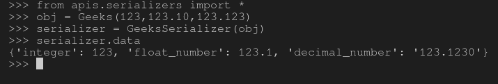
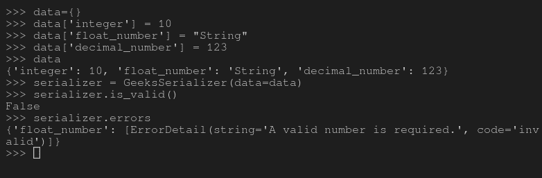

# 序列化程序中的数值字段–姜戈 REST 框架

> 原文:[https://www . geesforgeks . org/numeric-field-in-serializer-django-rest-framework/](https://www.geeksforgeeks.org/numeric-fields-in-serializers-django-rest-framework/)

在 Django REST 框架中，序列化的概念就是将数据库数据转换成 javascript 可以使用的数据类型。每个序列化程序都带有一些将要被处理的字段(条目)。例如，如果您有一个名为 Employee 的类，其字段为 Employee_id、Employee_name、is_admin 等。然后，您将需要自动字段、字符字段和 BooleanField 来通过 Django 存储和操作数据。类似地，序列化程序也以相同的原理工作，并且具有用于创建序列化程序的字段。
本文围绕 Django REST 框架中序列化器中的数值字段展开。有三个主要字段——整数字段、浮点字段和十进制字段。

#### -你是什么意思

IntegerField 基本上是一个整数字段，它根据 Python 的 **int** 实例验证输入。与[IntegerField-Django 车型](https://www.geeksforgeeks.org/integerfield-django-models/)相同

它有以下参数–

*   **最大值**验证提供的数值不大于该值。
*   **min_value** 验证提供的数字不小于该值。

**语法–**

```
field_name = serializers.IntegerField(*args, **kwargs)
```

#### 浮动字段

FloatField 基本上是一个浮动字段，它根据 Python 的 **float** 实例来验证输入。与[浮动场-姜戈模型](https://www.geeksforgeeks.org/floatfield-django-models/)相同

它有以下参数–

*   **最大值**验证提供的数值不大于该值。
*   **min_value** 验证提供的数字不小于该值。

**语法–**

```
field_name = serializers.FloatField(*args, **kwargs)
```

#### 十进制字段

十进制字段基本上是一个十进制字段，根据 Python 的**十进制**实例验证输入。与[德米拉尔菲尔德-姜戈车型](https://www.geeksforgeeks.org/decimalfield-django-models/)相同

它有以下参数–

*   **最大位数**数字中允许的最大位数。它必须是无或大于或等于小数位数的整数。
*   **小数位数**与数字一起存储的小数位数。
*   **最大值**验证提供的数值不大于该值。
*   **min_value** 验证提供的数字不小于该值。
*   **本地化**设置为真，根据当前区域设置启用输入和输出的本地化。

**语法–**

```
field_name = serializers.DecimalField(*args, **kwargs)
```

#### 如何在序列化程序中使用数值字段？

为了解释数值字段的用法，让我们从–[开始使用相同的项目设置如何使用 Django Rest 框架创建一个基本的 API？](https://geeksforgeeks.org/how-to-create-a-basic-api-using-django-rest-framework/)。
现在您的项目中有了一个名为 serializer 的文件，让我们创建一个以 IntegerField、FloatField 和 DecimalField 为字段的序列化程序。

```
# import serializer from rest_framework
from rest_framework import serializers

class Geeks(object):
    def __init__(self, integer, float_number, decimal_number):
        self.integer = integer
        self.float_number = float_number
        self.decimal_number = decimal_number

# create a serializer
class GeeksSerializer(serializers.Serializer):
    # intialize fields
    integer = serializers.IntegerField()
    float_number = serializers.FloatField()
    decimal_number = serializers.DecimalField()
```

现在让我们创建一些对象，并尝试序列化它们，检查它们是否真的在工作，运行–

```
Python manage.py shell
```

现在，在 shell 中运行以下 python 命令

```
# import everything from serializers
>>> from apis.serializers import *

# create a object of type Geeks
>>> obj = Geeks(123, 123.10, 123.123)

# serialize the object
>>> serializer = GeeksSerializer(obj)

# print serialized data
>>> serializer.data
{'integer': 123, 'float_number': 123.1, 'decimal_number': '123.1230'}

```

这是终端上所有这些操作的输出–



#### 数值字段的验证

请注意，这些字段的主要座右铭是传递验证，例如 IntegerField 只向 Python 的 int 验证数据。让我们检查一下这些验证是否有效–

```
# Create a dictionary and add invalid values
>>> data={}
>>> data['integer'] = 10
>>> data['float_number'] = "String"
>>> data['decimal_number'] = 123

# dictionary created
>>> data
{'integer': 10, 'float_number': 'String', 'decimal_number': 123}

# deserialize the data
>>> serializer = GeeksSerializer(data=data)

# check if data is valid
>>> serializer.is_valid()
False

# check the errors
>>> serializer.errors
{'float_number': [ErrorDetail(string='A valid number is required.', 
code='invalid')]}
}

```

以下是这些命令的输出，其中明确显示电子邮件和电话号码无效–



#### 高级概念

验证是反序列化的一部分，不是序列化的一部分。如前所述，序列化是将已经生成的数据转换成另一种数据类型的过程，因此不需要这些默认的验证。反序列化需要验证，因为数据需要保存到数据库或指定的任何其他操作。所以如果你使用这些字段序列化数据。

## 序列化程序字段中的核心参数

| 争吵 | 描述 |
| --- | --- |
| [只读](https://www.geeksforgeeks.org/core-arguments-in-serializer-fields-django-rest-framework/#read_only) | 将该值设置为 True 以确保在序列化表示时使用该字段，但在反序列化期间创建或更新实例时不使用该字段 |
| [只写 _ 条](https://www.geeksforgeeks.org/core-arguments-in-serializer-fields-django-rest-framework/#write_only) | 将此设置为“真”，以确保该字段可以在更新或创建实例时使用，但在序列化表示时不包括在内。 |
| [必需](https://www.geeksforgeeks.org/core-arguments-in-serializer-fields-django-rest-framework/#required) | 将此设置为 False 还允许在序列化实例时从输出中省略对象属性或字典键。 |
| [默认](https://www.geeksforgeeks.org/core-arguments-in-serializer-fields-django-rest-framework/#default) | 如果设置，这将给出默认值，如果未提供输入值，该默认值将用于该字段。 |
| [允许 _ 空](https://www.geeksforgeeks.org/core-arguments-in-serializer-fields-django-rest-framework/#allow_null) | 通常情况下，如果将“无”传递给序列化程序字段，将会引发错误。如果“无”应被视为有效值，则将此关键字参数设置为“真”。 |
| [来源](https://www.geeksforgeeks.org/core-arguments-in-serializer-fields-django-rest-framework/#source) | 将用于填充字段的属性的名称。 |
| [验证器](https://www.geeksforgeeks.org/core-arguments-in-serializer-fields-django-rest-framework/#validators) | 应该应用于输入字段输入的验证函数列表，这些函数要么引发验证错误，要么简单地返回。 |
| [错误信息](https://www.geeksforgeeks.org/core-arguments-in-serializer-fields-django-rest-framework/#error_messages) | 错误信息的错误代码字典。 |
| 标签 | 一个短文本字符串，可用作 HTML 表单字段或其他描述性元素中的字段名称。 |
| [帮助 _ 文字](https://www.geeksforgeeks.org/core-arguments-in-serializer-fields-django-rest-framework/#help_text) | 一个文本字符串，可用作 HTML 表单字段或其他描述性元素中字段的描述。 |
| [初始](https://www.geeksforgeeks.org/core-arguments-in-serializer-fields-django-rest-framework/#initial) | 应该用于预先填充 HTML 表单字段值的值。 |