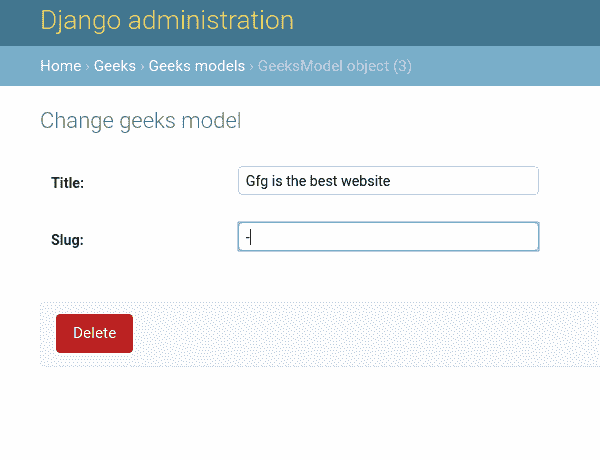
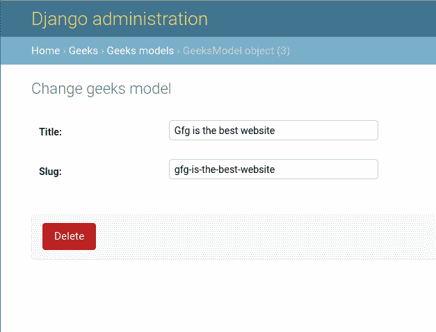

# 覆盖保存方法–姜戈模型

> 原文:[https://www . geesforgeks . org/override-the-save-method-django-models/](https://www.geeksforgeeks.org/overriding-the-save-method-django-models/)

save 方法是从模型继承的方法。为将实例保存到特定模型中而执行的模型。每当试图从管理界面或 django shell 创建模型实例时，save()函数就会运行。我们可以在将数据存储到数据库之前覆盖保存功能，以应用一些约束或填充一些仅准备好的字段，如 [SlugField](https://www.geeksforgeeks.org/slugfield-django-models/) 。
从技术上讲，不建议覆盖 save 方法来实现这些功能，因为 save 方法中的任何错误都会导致整个数据库崩溃。因此，如果您在编写 save 方法和错误处理方面是完美的，或者不要尝试 save 方法并尝试在表单、视图、模型等中实现这些功能。

## Django 覆盖保存方法解释

使用示例说明**覆盖保存方法**。考虑一个名为 geeksforgeeks 的项目，它有一个名为 geeks 的应用程序。

> 请参考以下文章，查看如何在 Django 中创建项目和应用程序。
> 
> *   [如何利用姜戈的 MVT 创建基础项目？](https://www.geeksforgeeks.org/how-to-create-a-basic-project-using-mvt-in-django/)
> *   [如何在姜戈创建 App？](https://www.geeksforgeeks.org/how-to-create-an-app-in-django/)

将以下代码输入**极客** app 的 models.py 文件。我们将使用 CharField 对所有字段选项进行实验。我们将覆盖 save 方法来自动填充 SlugField。

## 蟒蛇 3

```
from django.db import models

# importing slugify from django
from django.utils.text import slugify

# Create your models here.
class GeeksModel(models.Model):
    title = models.CharField(max_length = 200)
    slug = models.SlugField()

    def save(self, *args, **kwargs):
        self.slug = slugify(self.title)
        super(GeeksModel, self).save(*args, **kwargs)
```

让我们解释一下在上面的代码中发生了什么。**从父类保存()方法**将被覆盖，所以我们使用**超级关键字**。slugify 是一个将任何字符串转换为 slug 的函数。所以我们基本上是把标题转换成鼻涕虫。让我们尝试用“Gfg 是最好的网站”来创建一个实例。



让我们检查一下我们在管理界面中创建了什么。



#### 覆盖保存方法的高级概念

正如本文开头所定义的，通常不建议覆盖 save 方法。让我们看看为什么？
上述代码在每次使用保存方法或对模型进行任何更改时都会重新创建废料。
第二个原因是，如果一个人只需要改变标题，而不需要改变 slug，因为 slug 正在重定向到一个特定的链接，并在一些搜索引擎上排名。生产服务器中会产生一个很大的问题。不幸的是，这使得这种验证方法的使用不正确。可以有多种方法来解决上述问题，一种方法是将 slug 声明为只读字段，然后在重写方法中对 slug 进行任何更改之前，我们可以检查它是否为空。这可能会解决问题。因此，在您能够处理 save 方法中的错误之前，不要覆盖它。