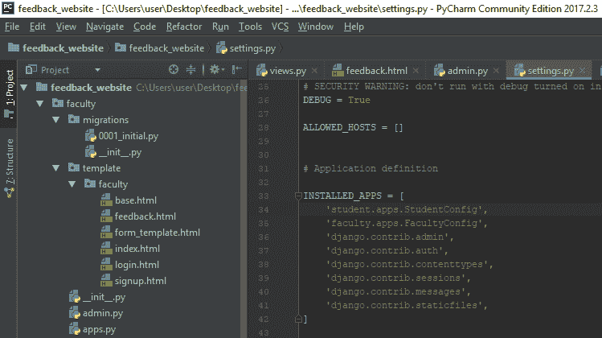
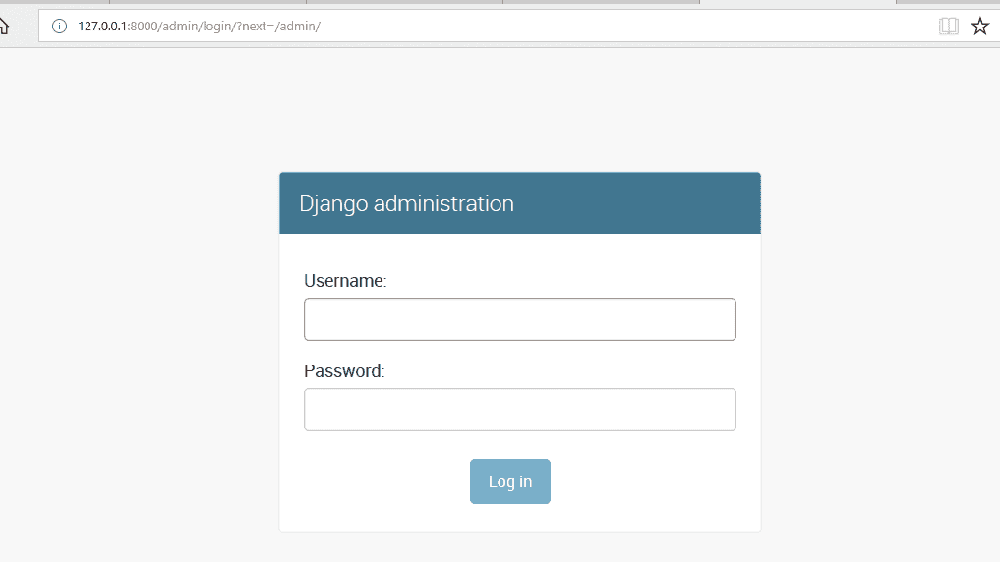
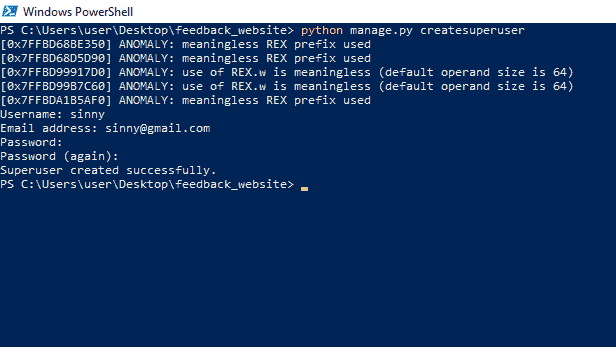
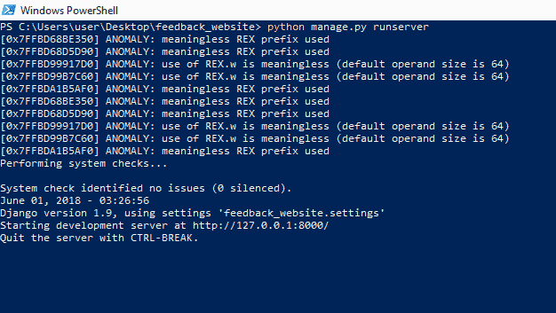
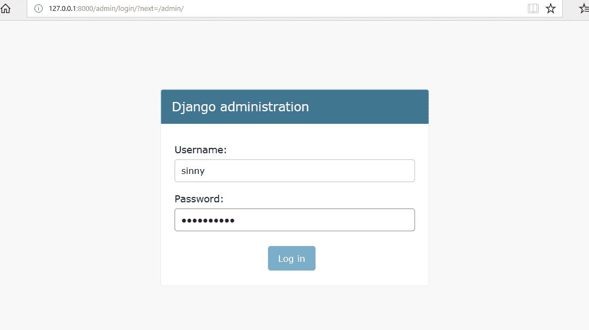
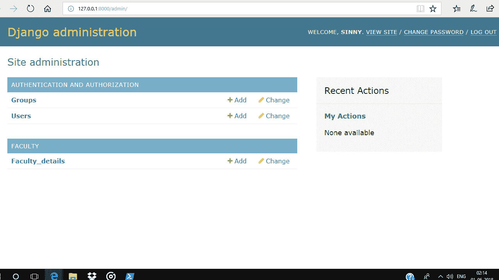

# Python | Django 管理界面

> 原文:[https://www . geesforgeks . org/python-django-admin-interface/](https://www.geeksforgeeks.org/python-django-admin-interface/)

**先决条件:** [姜戈-介绍-安装](https://www.geeksforgeeks.org/django-introduction-and-installation/) | [姜戈-介绍-设置-2-创建项目](https://www.geeksforgeeks.org/django-introduction-set-2-creating-a-project/)

**Django** 提供默认的管理界面，可以直接对模型进行创建、读取、更新、删除等操作。它从模型中读取解释和给出数据信息的数据集，以提供一个用户可以调整应用程序内容的即时界面。这是一个内置模块，旨在为用户执行与管理相关的工作。

**激活和使用管理界面**
默认情况下，管理应用程序(django.contrib.admin)处于启用状态，并且已经添加到 settings.py 文件中的 INSTALLED_APPS 列表中。



要在浏览器上访问此管理界面，请在“localhost:8000/admin/”处写入“/admin/”，它会显示如下所示的输出:



它会提示输入登录详细信息，如果之前没有创建登录 id，则可以使用下面给出的命令创建新的超级用户:

```py
python manage.py createsuperuser

```



现在，在启动开发服务器后访问管理登录页面，这可以通过使用下面给出的命令来完成。

```py
python manage.py runserver

```



输入用户名和密码，然后点击登录。



登录成功后，显示如下界面:。



这就是所谓的 Django 管理仪表板，用户可以在其中添加、删除和更新属于任何注册模型的数据。