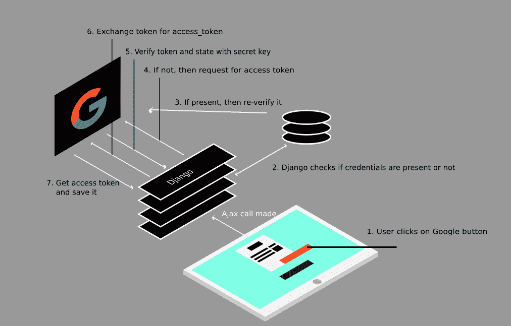
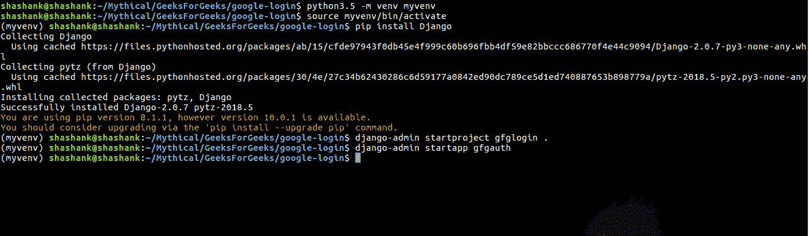
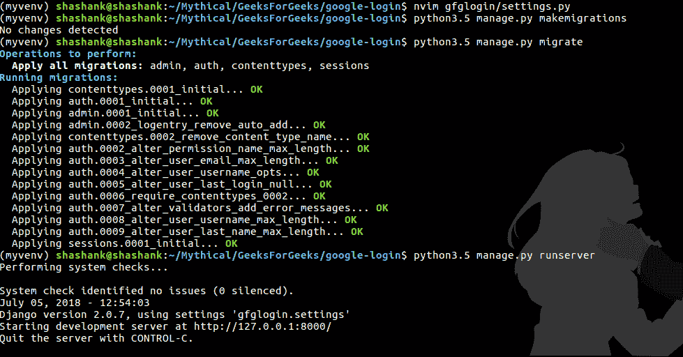
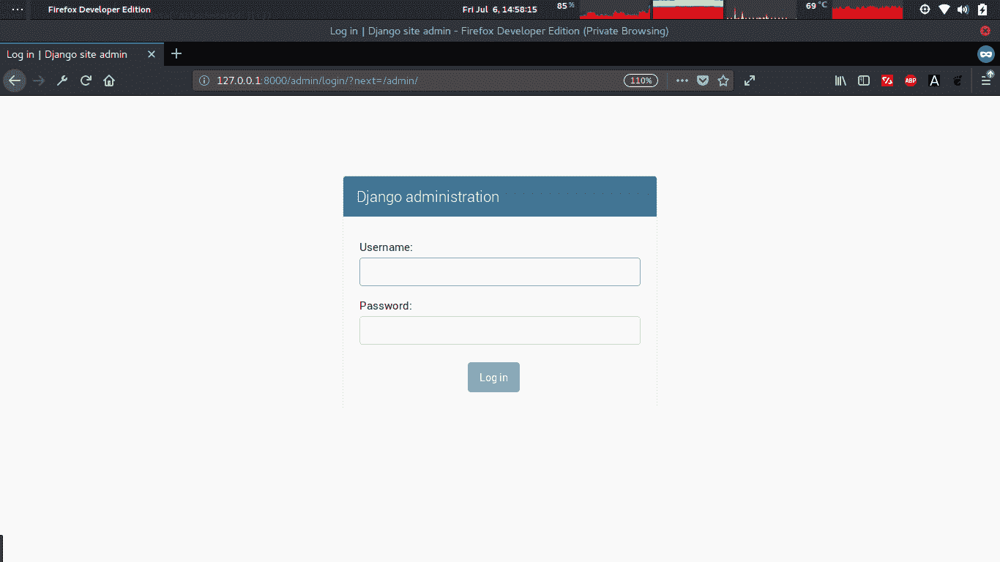
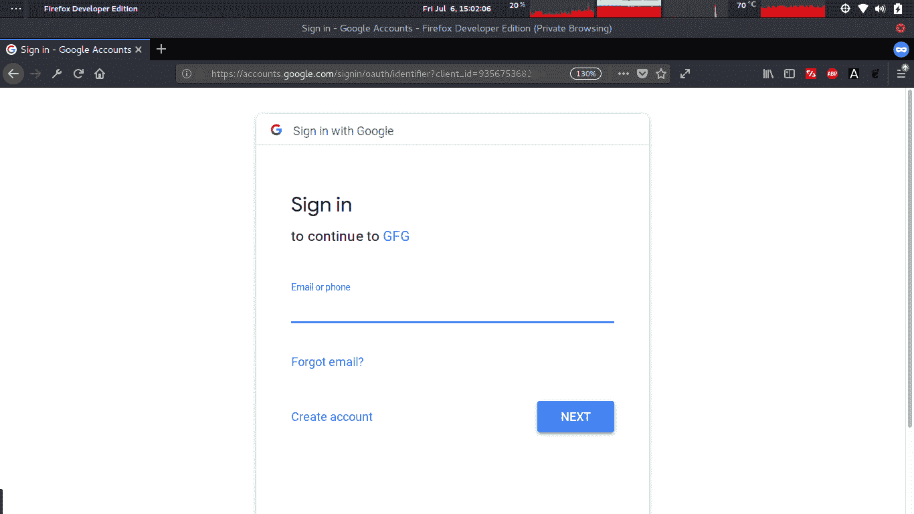
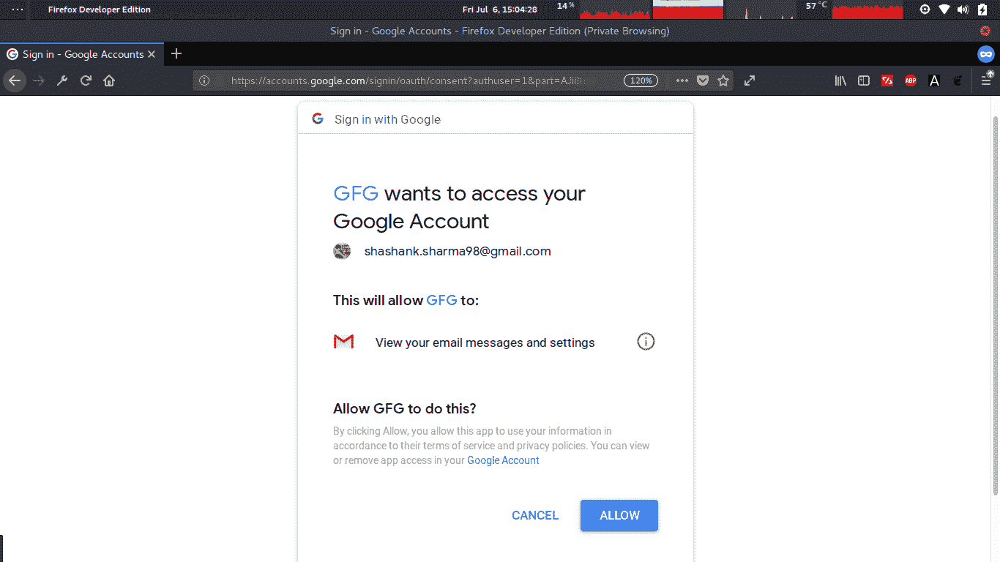

# Python Django |谷歌认证，从头开始取邮件

> 原文:[https://www . geesforgeks . org/python-django-Google-身份验证-从零开始获取邮件/](https://www.geeksforgeeks.org/python-django-google-authentication-and-fetching-mails-from-scratch/)

谷歌认证和从零开始获取邮件意味着不使用任何已经设置了该认证过程的模块。我们将使用谷歌应用编程接口 python 客户端和谷歌提供的`oauth2client` 。有时，用这些库实现这种谷歌认证真的很难，因为没有合适的文档可用。但是读完之后，事情就完全清楚了。

现在让我们创建 Django 2.0 项目，然后实现谷歌认证服务，然后提取邮件。我们做提取邮件只是为了展示如何在认证后请求许可。



**步骤#1:** 创建姜戈项目

第一步是创建虚拟环境，然后安装依赖项。所以我们将使用`venv`:

```
mkdir google-login && cd google-login

python3.5 -m venv myvenv
source myvenv/bin/activate

```

这个命令将创建一个文件夹`myvenv` ，通过它我们刚刚激活了虚拟环境。现在打字

```
pip freeze
```

那么您必须看到其中没有安装任何依赖项。现在首先让我们安装 Django:

```
pip install Django==2.0.7
```

这是我们使用的姜戈版本，但也可以使用任何其他版本。现在下一步是创建一个项目，让我们将其命名为`gfglogin`:

```
django-admin startproject gfglogin .
```

因为我们在谷歌登录目录中，这就是为什么我们希望 django 项目只在当前目录中，以便您需要使用。在当前目录指示的末尾。然后创建一个 app，将逻辑从主项目中分离出来，所以创建一个名为`gfgauth`的 app:

```
django-admin startapp gfgauth
```

所以整体终端会看起来像:


因为我们创建了一个应用程序。将该应用名称添加到`INSTALLED_APP` 列表中的`settings.py`中。现在我们已经运行了 Django 项目，所以让我们先迁移它，然后检查是否有任何错误。

```
python manage.py makemigrations
python manage.py migrate
python manage.py runserver
```

因此，在迁移之后，应该能够运行服务器并在那个特定的 url 上看到 Django 的起始页。


**步骤 2:** 安装依赖项

既然我们已经成功启动了项目，那么让我们安装基本需求。首先，我们需要`googleapiclient`，这是需要的，因为我们必须创建一个有助于与 API 交互的资源对象。因此，准确地说，我们将利用它的“构建”方法。

要安装:

```
pip install google-api-python-client==1.6.4
```

现在第二个模块是`oauth2client`，这将确保所有的认证、凭证、流程和许多更复杂的东西，所以使用这个很重要。

```
pip install oauth2client==4.1.2
```

最后安装`jsonpickle`(以防没安装)因为制作`CredentalsField`时会被`oauth2client` 使用。

```
pip install jsonpickle==0.9.6
```

所以这些是我们唯一需要的依赖。现在让我们进入编码部分，看看它是如何工作的。

**第三步:**创建模型

使用模型来存储我们从应用编程接口获得的凭证，因此只需要处理两个主要字段。第一个是`id` ，它将是 ForeignKey，第二个是`credential` ，它将等于 CredentialsField。此字段需要从 oauth2client 导入。所以我们的`models.py`会是这样的:

```
from django.contrib import admin
from django.contrib.auth.models import User
from django.db import models
from oauth2client.contrib.django_util.models import CredentialsField

class CredentialsModel(models.Model):
    id = models.ForeignKey(User, primary_key = True, on_delete = models.CASCADE)
    credential = CredentialsField()
    task = models.CharField(max_length = 80, null = True)
    updated_time = models.CharField(max_length = 80, null = True)

class CredentialsAdmin(admin.ModelAdmin):
    pass,
```

目前`task` 和`updated_time` 只是增加了额外的字段，因此可以删除。因此，该凭据将保存数据库中的凭据数据。

**重要指南:**

当我们导入`CredentialsField`时，那么自动地 `__init__`方法在后面执行，如果你注意到路径
`/google-login/myvenv/lib/python3.5/site-packages/oauth2client/contrib/django_util/__init__.py` 第 233 行的代码

他们正在导入 urlresolvers，以便可以从中使用相反的方法。现在的问题是这个 urlresolvers 在 Django 1.10 或者 Django 1.11 之后已经被删除了，如果你在 Django 2.0 上工作，那么它会给出一个错误，urlresolvers 找不到或者不在那里。

现在为了克服这个问题，我们需要改变 2 行，首先将那个导入`from django.core import urlresolvers` 替换为`from django.urls import reverse`

然后将 411 线`urlresolvers.reverse(...)` 更换为`reverse(...)`

现在你应该可以成功运行它了。

创建这些模型后:

```
python manage.py makemigrations
python manage.py migrate

```

**第 4 步:**创建视图

现在我们只有 3 个主要视图来处理请求。首先是显示主页，状态，谷歌按钮，这样我们就可以发送认证请求。第二个视图将在点击 google 按钮时被触发，这意味着一个 AJAX 请求。第三是处理来自谷歌的返回请求，这样我们就可以接受来自它的 access_token，并将其保存在我们的数据库中。

首先，让我们做一下谷歌认证的事情:

所以现在我们需要指定到 API 的流程，我们需要询问什么权限，我的密钥和重定向 url 是什么。为此，请输入:

```
FLOW = flow_from_clientsecrets(
    settings.GOOGLE_OAUTH2_CLIENT_SECRETS_JSON,
    scope='https://www.googleapis.com/auth/gmail.readonly',
    redirect_uri='http://127.0.0.1:8000/oauth2callback',
    prompt='consent')

```

如你所见`settings.GOOGLE_OAUTH2_CLIENT_SECRETS_JSON`，进入`settings.py`文件，输入:

```
GOOGLE_OAUTH2_CLIENT_SECRETS_JSON = 'client_secrets.json'
```

这告诉姜戈`json` 文件存在的地方。我们稍后将下载此文件。指定流程后，让我们开始逻辑。

每当我们需要查看某人是否被授权时，我们首先检查我们的数据库该用户凭证是否已经存在。如果没有，那么我们向 API url 发出请求，然后获取凭据。

```
def gmail_authenticate(request):
    storage = DjangoORMStorage(CredentialsModel, 'id', request.user, 'credential')
    credential = storage.get()

    if credential is None or credential.invalid:
        FLOW.params['state'] = xsrfutil.generate_token(settings.SECRET_KEY,
                                                              request.user)
        authorize_url = FLOW.step1_get_authorize_url()
        return HttpResponseRedirect(authorize_url)
    else:
        http = httplib2.Http()
        http = credential.authorize(http)
        service = build('gmail', 'v1', http = http)
        print('access_token = ', credential.access_token)
        status = True

        return render(request, 'index.html', {'status': status})
```

我们使用 DjangoORMStorage(由`oauth2client`提供)，这样我们就可以从 Django 数据存储中存储和检索凭据。所以我们需要为它传递 4 个参数。首先是模型类，里面有 CredientialsField。第二个是拥有凭证的唯一 id，意思是密钥名，第三个是拥有凭证的键值，最后一个是我们在`models.py`中指定的那个凭证字段的名称。

然后我们从存储中获取值，看看它是否有效。如果它无效，那么我们创建一个用户令牌，并获得一个授权 url，在这里我们将用户重定向到谷歌登录页面。重定向后，用户将填写表格，一旦用户被谷歌授权，谷歌将发送数据到*回拨网址*与`access_token` ，我们稍后将这样做。现在，如果用户凭据已经存在，那么它将重新验证凭据，并返回 access_token，或者有时返回刷新的 access_token，以防前一个令牌过期。

现在我们需要处理回调 url，为此:

```
def auth_return(request):
    get_state = bytes(request.GET.get('state'), 'utf8')
    if not xsrfutil.validate_token(settings.SECRET_KEY, get_state,
                                   request.user):
        return HttpResponseBadRequest()

    credential = FLOW.step2_exchange(request.GET.get('code'))
    storage = DjangoORMStorage(CredentialsModel, 'id', request.user, 'credential')
    storage.put(credential)

    print("access_token: % s" % credential.access_token)
    return HttpResponseRedirect("/")
```

现在在回调 url 中，当我们从 google 获得一个响应时，我们捕获数据并从中获取状态，状态只不过是我们通过 generateToken 生成的令牌。因此，我们要做的是用 secret_key 验证令牌，即我们生成的令牌和生成它的用户。这些事情通过`xsrfutil.validate_token`方法得到验证，该方法确保令牌不会随着时间而变得太旧，并且它仅在给定的特定时间生成。如果这些事情没有很好地解决，那么它会给你错误，否则你将进入下一步，与谷歌共享回调响应的代码，这样你就可以获得 access_token。

这是两步验证，在成功获取凭据后，我们使用 DjangoORMStorage 将其保存在 Django 数据存储中，因为只有这样，我们才能获取凭据并将其存储到 CredentialsField 中。一旦我们将它存储起来，我们就可以将用户重定向到任何特定的页面，这就是获取 access_token 的方法。

现在让我们创建一个主页，它将告诉用户是否登录。

```
def home(request):
    status = True

    if not request.user.is_authenticated:
        return HttpResponseRedirect('admin')

    storage = DjangoORMStorage(CredentialsModel, 'id', request.user, 'credential')
    credential = storage.get()

    try:
        access_token = credential.access_token
        resp, cont = Http().request("https://www.googleapis.com/auth/gmail.readonly",
                                     headers ={'Host': 'www.googleapis.com',
                                             'Authorization': access_token})
    except:
        status = False
        print('Not Found')

    return render(request, 'index.html', {'status': status})
```

现在我们假设用户在姜戈被认证，这意味着用户不再是匿名的，并且信息保存在数据库中。现在，为了支持匿名用户，我们可以删除数据库中的凭据检查，或者创建一个临时用户。

回到主页视图，首先我们将检查用户是否经过身份验证，这意味着用户不是匿名的，如果是，那么让他登录，否则首先检查凭据。如果用户已经从谷歌登录，那么它将显示状态为真，否则它将显示假。

现在来看模板，让我们创建一个。首先进入根文件夹，创建一个名为“模板”的文件夹，然后在里面创建`index.html`:

```

<!DOCTYPE html>
<html lang="en">

<head>
    <meta charset="UTF-8">
    <script src=""></script>
    <title>Google Login</title>
</head>
<body>

<div>
    <div>
        
            <a href="/gmailAuthenticate" onclick="gmailAuthenticate()" title="Google">Google</a>
        
            <p>Your are verified</p>
        
    </div>

</div>
</body>
</html>
```

现在这个页面非常简化，所以没有 css 或样式，只有一个简单的链接来检查。现在你会注意到 *js 文件*也。所以再次转到根文件夹，创建一个目录作为`static/js/`

在 *js* 里面创建一个 javascript 文件`main.js`:

```
function gmailAuthenticate(){
    $.ajax({
        type: "GET",
        url: "ajax/gmailAuthenticate",
        // data: '',
        success: function (data) {
            console.log('Done')
        }
    });
};
```

这个 *js 文件*用于将逻辑从 HTML 文件中分离出来，并对 Django 进行一次 AJAX 调用。现在我们已经完成了视图的所有部分。

**第五步:**创建网址和基本设置

在主项目 URL 中的意思是`gfglogin/urls.py`编辑并放:

```
from django.contrib import admin
from django.urls import path, include

urlpatterns = [
    path('admin/', admin.site.urls),
    path('', include('gfgauth.urls')),
]
```

因为我们需要测试 gfgauth 应用的工作情况。现在里面`gfgauth/urls.py` 类型:

```
from django.conf.urls import url
from . import views

urlpatterns = [
    url(r'^gmailAuthenticate', views.gmail_authenticate, name ='gmail_authenticate'),
    url(r'^oauth2callback', views.auth_return),
    url(r'^{content}apos;, views.home, name ='home'),
]
```

可以看到，gmailAuthenticate 用于 AJAX 调用，oauth2callback 用于回调 url，最后一个是主页 url。在运行之前，有几个设置我们还没有讨论过:

在`settings.py`你需要编辑:

1.  在模板列表中，在 DIRS 列表中添加“模板”。
2.  最后的设置. py 文件添加:

    ```
    STATIC_URL = '/static/'
    STATICFILES_DIRS = (
        os.path.join(BASE_DIR, 'static'),
    )

    GOOGLE_OAUTH2_CLIENT_SECRETS_JSON = 'client_secrets.json'

    ```

所以我们只是指定了模板和静态文件在哪里，最重要的是 google oauth2 客户端机密 json 文件在哪里。现在我们将下载这个文件。

**步骤#6:** 生成 Oauth2 客户端机密文件

前往[谷歌开发者控制台页面](https://console.developers.google.com/cloud-resource-manager)，创建一个项目，并命名为任何你喜欢的项目。创建后，前往项目仪表板，点击左上角的导航菜单。然后点击 API 服务，然后点击凭证页面。单击创建凭据(在继续之前，您可能需要设置产品名称，因此请首先进行设置)。现在选择网络应用程序，因为我们正在使用 Django。在此之后指定名称，然后简单地转到重定向 URIs，在那里键入:

```
http://127.0.0.1:8000/oauth2callback

```

然后保存它。您不需要指定授权的 Javascript 来源，所以现在将其留空。保存后，您将能够看到您的所有凭据，只需下载凭据，它将以一些随机名称保存，因此只需重新格式化文件名并键入“client_secrets ”,并确保它是 json 格式。然后保存并粘贴到 Django 项目根文件夹中(其中有 manage.py)。

**第七步:**运行它

现在再检查一下是否一切正确。请确保您已经迁移了它。此外，在继续之前，创建一个超级用户，这样您就不会再匿名了:

```
python3.5 manage.py createsuperuser
```

键入所有必要的详细信息，然后执行以下操作:

```
python3.5 manage.py runserver
```

并转到 http://127.0.0.1:8000

你会看到:


这非常好，现在在这里输入您的超级用户凭证，然后您将能够看到管理仪表板。请避免这种情况，并再次访问 http://127.0.0.1:8000

现在你应该可以看到谷歌链接，现在点击它，你会看到:



现在，正如你所看到的，上面写着登录继续前往 GFG，这里 GFG 是我的项目名称。所以它工作得很好。现在输入您的凭据，提交后您将看到:



因为我们请求邮件许可，这就是为什么它要求用户允许它。如果它显示错误，那么在谷歌控制台，你可能需要激活 Gmail 应用编程接口到你的项目。现在，一旦您允许它，您将获得凭据并保存在您的数据库中。如果用户点击取消，那么您需要编写更多的代码来处理这样的流程。

现在，如果您允许的话，您将能够在您的控制台/数据库上看到 access_token。获得 access_token 后，您可以利用它来获取用户电子邮件和所有其他东西。

在此仓库 [**查看完整代码在此**](https://github.com/shashank-sharma/google-oauth-mail) 。