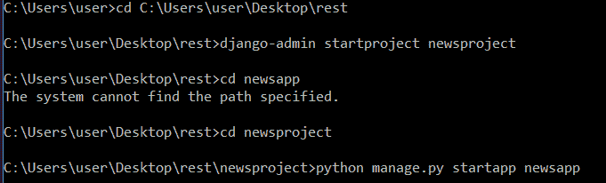
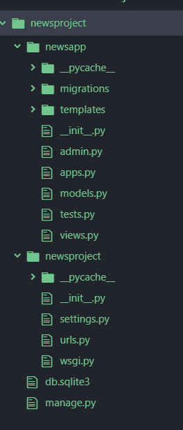
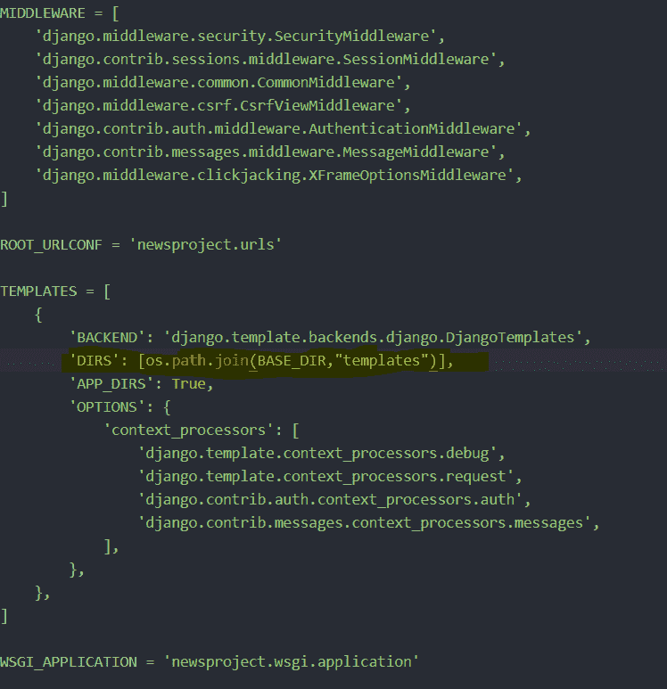

# Python |姜戈新闻 App

> 原文:[https://www.geeksforgeeks.org/python-django-news-app/](https://www.geeksforgeeks.org/python-django-news-app/)

**Django** 是一个用 Python 编写的高级框架，允许我们创建服务器端 web 应用程序。在本文中，我们将看到如何使用 Django 创建一个新闻应用程序。
我们将使用**新闻 Api** 并从 Api 获取所有头条新闻。在这里阅读更多关于 api 的[新闻 api](https://newsapi.org/docs/client-libraries/python) 。
在命令提示符或终端中执行以下步骤:



使用文本编辑器打开 newsproject 文件夹。目录结构应该是这样的



在你的新闻 app 中创建一个“模板”文件夹，并将其放入设置中。pyT3】



**在 view . py–**
在 view 中，我们创建了一个名为 index 的视图，它接受一个请求并呈现一个 html 作为响应。首先，我们从 NewsApiClient 导入 newsapi。

```py
# importing api
from django.shortcuts import render
from newsapi import NewsApiClient

# Create your views here. 
def index(request):

    newsapi = NewsApiClient(api_key ='YOURAPIKEY')
    top = newsapi.get_top_headlines(sources ='techcrunch')

    l = top['articles']
    desc =[]
    news =[]
    img =[]

    for i in range(len(l)):
        f = l[i]
        news.append(f['title'])
        desc.append(f['description'])
        img.append(f['urlToImage'])
    mylist = zip(news, desc, img)

    return render(request, 'index.html', context ={"mylist":mylist})
```

在**模板**文件夹中创建 index.html。

## 超文本标记语言

```py
<!DOCTYPE html>
<html lang="en" dir="ltr">
  <head>
    <meta charset="utf-8">
    <title></title>

<link rel="stylesheet" href="https://stackpath.bootstrapcdn.com/bootstrap/4.3.1/css/bootstrap.min.css" integrity="sha384-ggOyR0iXCbMQv3Xipma34MD+dH/1fQ784/j6cY/iJTQUOhcWr7x9JvoRxT2MZw1T" crossorigin="anonymous">
<!-- Optional theme -->
  </head>
  <body>
    <div class="jumbotron" style="color:black">

      <h1 style ="color:white">
   Get The latest news on our website
      </h1>

    </div>

    <div class="container">
      
              
              <h1>news:</h1> {{ new }}
              {{ value|linebreaks }}

              <h4>description:</h4>{{ des }}
              {{ value|linebreaks }}

      
    </div>

  </body>
</html>
```

现在将视图映射到**URL . py**

```py
from django.contrib import admin
from django.urls import path
from newsapp import views

urlpatterns = [
   path('', views.index, name ='index'),
    path('admin/', admin.site.urls),
]
```

您的项目输出应该如下所示–

<video class="wp-video-shortcode" id="video-319052-1" width="640" height="360" preload="metadata" controls=""><source type="video/mp4" src="https://media.geeksforgeeks.org/wp-content/uploads/20190626143109/screen_recorder_video_2019_26_6_14_29_59.mp4?_=1">[https://media.geeksforgeeks.org/wp-content/uploads/20190626143109/screen_recorder_video_2019_26_6_14_29_59.mp4](https://media.geeksforgeeks.org/wp-content/uploads/20190626143109/screen_recorder_video_2019_26_6_14_29_59.mp4)</video>