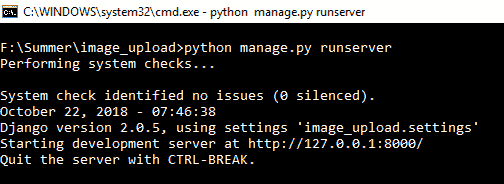
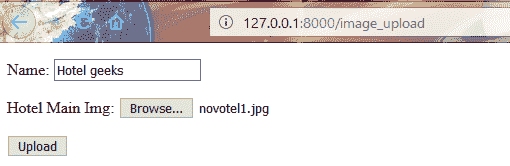
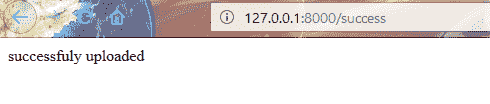
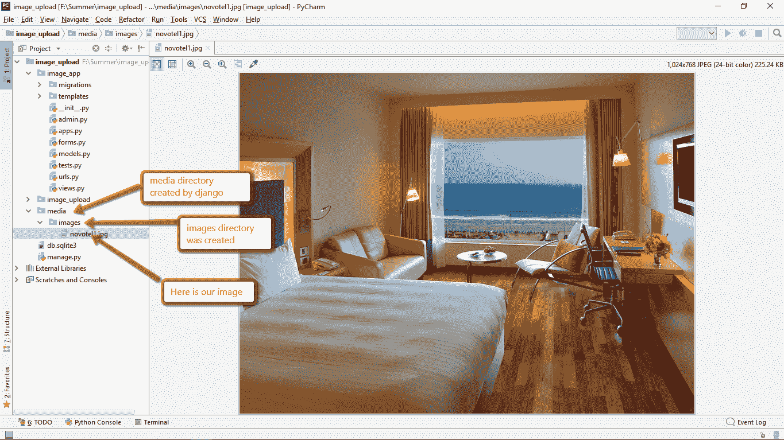
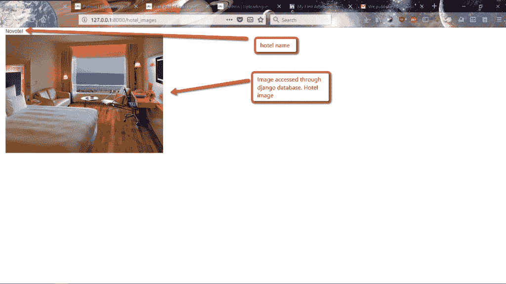

# Python |在 Django 上传图片

> 原文:[https://www . geesforgeks . org/python-uploading-images-in-django/](https://www.geeksforgeeks.org/python-uploading-images-in-django/)

先决条件–[姜戈简介](https://www.geeksforgeeks.org/django-introduction-and-installation/)

在大多数网站中，我们经常处理媒体数据，如图像、文件等。在 django 中，我们可以借助模型场`ImageField`来处理图像。

在本文中，我们在名为 **image_upload** 的示例项目中创建了应用程序`image_app`。

第一步是在`settings.py`文件中添加下面的代码。

```py
MEDIA_ROOT =  os.path.join(BASE_DIR, 'media')
MEDIA_URL = '/media/'
```

**MEDIA_ROOT** 为服务器路径，用于在计算机中存储文件。
**MEDIA_URL** 是浏览器通过 Http 访问文件的参考 URL。

在`urls.py`中，我们应该这样编辑配置

```py
from django.conf import settings
from django.conf.urls.static import static
if settings.DEBUG:
        urlpatterns += static(settings.MEDIA_URL,
                              document_root=settings.MEDIA_ROOT)

```

一个样本`models.py`应该是这样的，因为我们已经创建了一个**酒店模型**，它由酒店名称和它的形象组成。
在本项目中，我们从酒店预订网站的用户处获取酒店名称及其图像。

```py
# models.py
 class Hotel(models.Model):
    name = models.CharField(max_length=50)
    hotel_Main_Img = models.ImageField(upload_to='images/')
```

这里`upload_to`将指定图像应该驻留在哪个目录，默认情况下 django 在**媒体**目录下创建目录，当我们上传图像时会自动创建该目录。无需明确创建**媒体**目录。

我们必须在`image_app`下创建一个`forms.py`文件，这里我们处理的是**模型表单**让内容更容易理解。

```py
# forms.py
from django import forms
from .models import *

class HotelForm(forms.ModelForm):

    class Meta:
        model = Hotel
        fields = ['name', 'hotel_Main_Img']
```

Django 将隐式处理表单验证，并在脚本中显式声明，它将根据我们在`models.py`文件中指定的模型字段在页面中创建类似的表单字段。
这就是模型形态的优势。

现在在`image_app`下创建一个**模板**目录，因为我们必须创建一个 html 文件来上传图像。HTML 文件应该是这样的。

```py
<!DOCTYPE html>
<html lang="en">
<head>
    <meta charset="UTF-8">
    <title>Hotel_image</title>
</head>
<body>
    <form method = "post" enctype="multipart/form-data">
        
        {{ form.as_p }}
        <button type="submit">Upload</button>
    </form>
</body>
</html>
```

当发出 POST 请求时，我们必须以某种方式对构成请求主体的数据进行编码。因此，我们必须在表单标签中指定编码格式。`multipart/form-data`要复杂得多，但它允许整个文件都包含在数据中。

`csrf_token`用于防止跨站点请求伪造。

`form.as_p`简单地包装 HTML 段落标签中的所有元素。优点是不必在模板中编写循环来显式添加 HTML 来包围每个标题和字段。

在`image_app`下的`views.py`中，我们必须编写一个视图来接受用户的请求，并返回一些 html 页面。

```py
from django.http import HttpResponse
from django.shortcuts import render, redirect
from .forms import *

# Create your views here.
def hotel_image_view(request):

    if request.method == 'POST':
        form = HotelForm(request.POST, request.FILES)

        if form.is_valid():
            form.save()
            return redirect('success')
    else:
        form = HotelForm()
    return render(request, 'hotel_image_form.html', {'form' : form})

def success(request):
    return HttpResponse('successfully uploaded')
```

每当`hotel_image_view`点击并且该请求是`POST`时，我们正在创建模型表单的实例`form = HotelForm(request.POST, request.FILES)`图像将存储在`request.FILES`1 下。如果它是有效的，保存到数据库，并重定向到成功的 url，这表明成功上传的图像。如果方法不是开机自检，我们将使用创建的 html 模板进行渲染。

`urls.py`会是这样的–

```py
from django.contrib import admin
from django.urls import path
from django.conf import settings
from django.conf.urls.static import static
from .views import *

urlpatterns = [
    path('image_upload', hotel_image_view, name = 'image_upload'),
    path('success', success, name = 'success'),
]

if settings.DEBUG:
        urlpatterns += static(settings.MEDIA_URL,
                              document_root=settings.MEDIA_ROOT)
```

现在进行迁移并运行服务器。


当我们在浏览器中点击网址时，它看起来是这样的。


上传图像后，它将显示成功。


现在在项目目录`media`中将创建目录，在该目录中将创建图像目录，并且图像将存储在该目录下。以下是最终结果。



最终输出存储在数据库中

现在我们可以编写一个视图来访问这些图像，为了简单起见，让我们以一个图像为例，它也适用于许多图像。

```py
# Python program to view 
# for displaying images

def display_hotel_images(request):

    if request.method == 'GET':

        # getting all the objects of hotel.
        Hotels = Hotel.objects.all() 
        return render((request, 'display_hotel_images.html',
                     {'hotel_images' : Hotels}))
```

用于显示图像的示例 html 文件模板。

```py
<!DOCTYPE html>
<html lang="en">
<head>
    <meta charset="UTF-8">
    <title>Hotel Images</title>

      <meta name="viewport" content="width=device-width, initial-scale=1">
      <link rel="stylesheet" href="https://maxcdn.bootstrapcdn.com/bootstrap/3.3.7/css/bootstrap.min.css">
      <script src="https://ajax.googleapis.com/ajax/libs/jquery/3.3.1/jquery.min.js">
      </script>
      <script src="https://maxcdn.bootstrapcdn.com/bootstrap/3.3.7/js/bootstrap.min.js">
      </script>
</head>
<body>

    
            <div class="col-md-4">
                    {{ hotel.name }}
                     
            </div>
    

</body>
</html>
```

在 urls.py 文件中插入 url 路径

```py
# urls.py
path('hotel_images', display_hotel_images, name = 'hotel_images'),

```

这是我们尝试访问图像时浏览器上的最终视图。



酒店形象