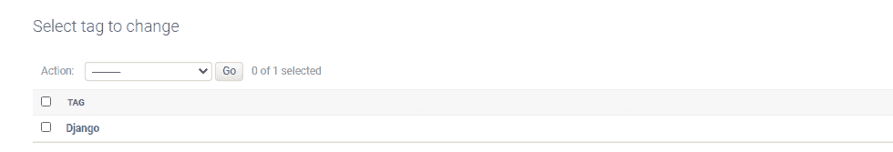
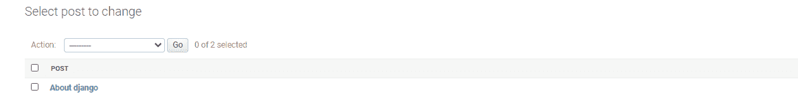
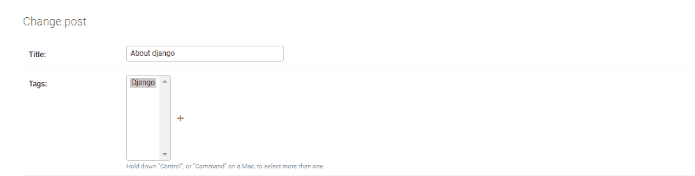

# 相关 _ 名称–姜戈内置现场验证

> 原文:[https://www . geesforgeks . org/related _ name-django-内置字段-验证/](https://www.geeksforgeeks.org/related_name-django-built-in-field-validation/)

相关名称属性指定从用户模型到您的模型的反向关系的名称。如果没有指定相关的名称，Django 会使用带有后缀 _set 的模型名称自动创建一个相关的名称。

**语法:**

```
field_name = models.Field(related_name="name")

```

**说明:**

使用示例说明相关的名称=“名称”。考虑一个名为 suorganizer(启动组织者)的项目，它有一个名为 organizer 的应用程序。

```
*Refer to the following articles to check how to create a project and an app in Django.*

      How to Create a Basic Project using MVT in Django ?
      How to Create an App in Django ?

```

将以下代码输入组织者应用程序的 models.py 文件。

## 计算机编程语言

```
from django.db import models

# Create your models here. 

class Tag(models.Model): 
   name = models.CharField(max_length = 31) 
   def __str__(self):          
   return self.name.title() 

class Post(models.Model):   
   title = models.CharField(max_length = 63)   
   tags = models.ManyToManyField(Tag, related_name ='blog_posts')  
   def __str__(self):          
        return self.title    
```

在 Django 上运行 makemigrations 和 migration 并呈现上述模型之后，让我们尝试使用 Django shell 中的 None 创建一个实例。要启动 Django shell，请输入命令。

```
Python manage.py shell

```

现在让我们尝试使用无创建标记和帖子的实例。

```
# importing required model
from organizer.models import Tag, Post

# creating instance of Tag model
r = Tag.objects.create(name ="django")
r.save()

# creating instance of Post model
s = Post.objects.create(title ="About django")
s.save()

# accessing objects
t = Tag.objects.get(name ="django")
p = Post.objects.get(title ="About django")

# method1--adding tag to post using post object
p.tags.add(t)

# method2--adding tag to post using tag object
# which is possible with related_name
t.blog_posts.add(p)

```

**让我们在管理界面检查模型的实例是否已经创建。**

1.标记对象:



2.发布对象




在姜戈，我们只在一个地方指定对称关系。related_name 参数定义了关系的另一面。具体来说，给定一个帖子实例 p，与这个帖子相关联的标签可以通过 p.tags 访问。由于 related_name 选项，我们现在可以通过 blog post 属性访问与标签 t 相关的博客文章列表，如 t.blog _ posts 中所示。related _name 参数实际上是一个选项。如果我们不设置它，Django 会自动为我们创建关系的另一面。在标签模型的情况下，Django 会创建一个 post_set 属性，在我们的例子中允许通过 t.post_set 进行访问。Django 使用的公式是模型的名称，后跟 string_set。因此，相关的名称参数只是覆盖了 Django 的默认值，而不是提供新的行为。