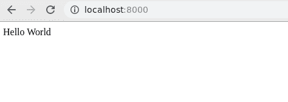

# 渲染一个 HTML 模板作为响应–姜戈视图

> 原文:[https://www . geesforgeks . org/render-a-html-template-as-response-django-view/](https://www.geeksforgeeks.org/render-a-html-template-as-response-django-views/)

视图函数，简称 view，就是一个接受 Web 请求并返回 Web 响应的 Python 函数。本文围绕如何使用视图呈现来自 Django 的 HTML 页面展开。Django 一直以其应用程序结构和轻松管理应用程序的能力而闻名。让我们深入了解如何通过 Django 视图呈现模板文件。

## Django 呈现一个 HTML 模板作为响应解释

如何使用示例在视图中渲染 HTML 模板的图示**。考虑一个名为`geeksforgeeks`的项目，它有一个名为`geeks`的应用程序。**

> 请参考以下文章，查看如何在 Django 中创建项目和应用程序。
> 
> *   [如何利用姜戈的 MVT 创建基础项目？](https://www.geeksforgeeks.org/how-to-create-a-basic-project-using-mvt-in-django/)
> *   [如何在姜戈创建 App？](https://www.geeksforgeeks.org/how-to-create-an-app-in-django/)

有了项目和应用后，打开`views.py`，让我们开始创建一个名为 geeks_view 的视图，用来通过模板文件打印“ **Hello world** ”。django 视图是一个 python 函数，它接受一个名为**请求**的参数，并返回一个**响应**。
在应用的视图中输入以下代码

```py
from django.shortcuts import render

# Create your views here.
def geeks_view(request):

    # render function takes argument  - request
    # and return HTML as response
    return render(request, "home.html")
```

但是，在定义正确 URL 映射之前，这段代码不会起作用。映射意味着您需要告诉 Django 用户在浏览器中输入了什么来呈现您的特定视图。例如[www.geeksforgeeks.org](https://www.geeksforgeeks.org)告诉姜戈执行其主页视图。所以让我们修改 urls.py 来开始我们的视图。
通过在`geeksforgeeks > urls.py`中添加以下代码，将您的应用程序的 URL 包括到主 URL 中

```py
"""geeksforgeeks URL Configuration

The `urlpatterns` list routes URLs to views. For more information please see:
    https://docs.djangoproject.com / en / 2.2 / topics / http / urls / Examples:
Function views
    1\. Add an import:  from my_app import views
    2\. Add a URL to urlpatterns:  path('', views.home, name ='home')
Class-based views
    1\. Add an import:  from other_app.views import Home
    2\. Add a URL to urlpatterns:  path('', Home.as_view(), name ='home')
Including another URLconf
    1\. Import the include() function: from django.urls import include, path
    2\. Add a URL to urlpatterns:  path('blog/', include('blog.urls'))
"""
from django.contrib import admin
from django.urls import path, include

urlpatterns = [
    path('admin/', admin.site.urls),
    path('', include("geeks.urls")),
]
```

现在让我们从`geeks > urls.py`创建一条通往我们的视图的路径

```py
from django.contrib import admin
from django.urls import path

# importing views from views..py
from .views import geeks_view

urlpatterns = [
    path('', geeks_view ),
]
```

完成了。现在去检查我们的模板是否得到渲染。访问此处–[http://localhost:8000/](http://localhost:8000/)


给出一个错误，你没有模板 home.html。现在让我们创建我们的模板，在`geeks`文件夹中创建一个名为模板的文件夹，并在其中创建一个 home.html 文件。现在我们再来看看–[http://localhost:8000/](http://localhost:8000/)。


通过这种方式，您可以使用相同的过程渲染任何模板文件–

```py
1\. Create a view in views.py
2\. Create a template file which is to be rendered and link it to the view.
3\. Create a URL to map to that view.
```

我们使用这个错误是因为在您学习[的过程中，如何使用 django 创建项目？](https://www.geeksforgeeks.org/how-to-create-a-basic-project-using-mvt-in-django/)你可能会遇到很多错误，在那里你不需要超级，只需要深呼吸，简单地谷歌一下错误，你就会有解决一切的办法。