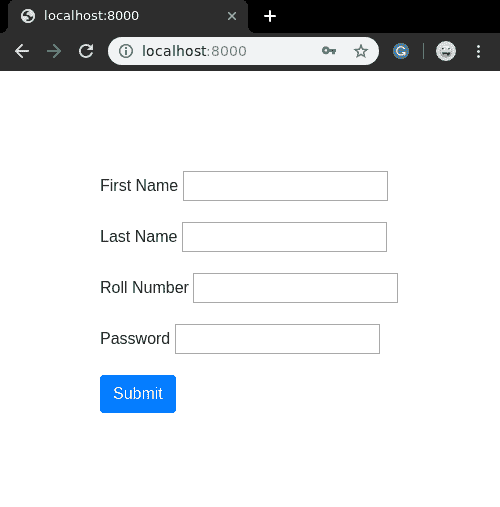

# 手动渲染姜戈表单字段

> 原文:[https://www . geesforgeks . org/render-django-form-fields-manual/](https://www.geeksforgeeks.org/render-django-form-fields-manually/)

Django 表单域有几个内置方法来简化开发人员的工作，但是有时需要手动实现一些东西来定制用户界面。我们已经介绍了如何在姜戈创建和使用表单？。一个表单带有 3 个内置方法，可以用来呈现 Django 表单域。

*   [{{ form.as_table }}](https://www.geeksforgeeks.org/form-as_table-render-django-forms-as-table/) 会将它们渲染为包裹在< tr >标签中的表格单元格
*   [{{ form.as_p }}](https://www.geeksforgeeks.org/form-as_p-render-django-forms-as-paragraph/) 将使它们包裹在< p >标签中
*   [{{ form.as_ul }}](https://www.geeksforgeeks.org/form-as_ul-render-django-forms-as-list/) 将使它们包裹在< li >标签中

它们会自动呈现表单，但是如果你想创建一个有 CSS 效果的漂亮表单，你需要手动呈现表单域。本文围绕如何手动呈现表单域展开。

### 手动呈现表单字段

使用示例手动渲染姜戈表单的图示。考虑一个名为 geeksforgeeks 的项目，它有一个名为 geeks 的应用程序。

> 请参考以下文章，查看如何在 Django 中创建项目和应用程序。
> 
> *   [如何利用姜戈的 MVT 创建基础项目？](https://www.geeksforgeeks.org/how-to-create-a-basic-project-using-mvt-in-django/)
> *   [如何在姜戈创建 App？](https://www.geeksforgeeks.org/how-to-create-an-app-in-django/)

在你的极客应用程序中，创建一个名为 forms.py 的新文件，你可以在其中创建所有的表单。要创建姜戈表单，您需要使用[姜戈表单类](https://docs.djangoproject.com/en/2.2/topics/forms/#the-django-form-class)。让我们演示一下，在你的表格中，
输入以下内容，

## 蟒蛇 3

```py
from django import forms

# creating a form 
class InputForm(forms.Form):

    first_name = forms.CharField(max_length = 200)
    last_name = forms.CharField(max_length = 200)
    roll_number = forms.IntegerField(
                     help_text = "Enter 6 digit roll number"
                     )
    password = forms.CharField(widget = forms.PasswordInput())
```

让我们解释一下到底发生了什么，左边表示字段的名称，右边对应地定义输入字段的各种功能。字段的语法表示为
**语法:**

```py
Field_name = forms.FieldType(attributes)
```

现在要将此表单呈现到视图中，请转到 views.py 并创建一个 home_view，如下所示。

## 蟒蛇 3

```py
from django.shortcuts import render
from .forms import InputForm

# Create your views here.
def home_view(request):
    context ={}
    context['form']= InputForm()
    return render(request, "home.html", context)
```

在视图中，只需要创建上面在 forms.py.
中创建的表单类的一个实例，现在让我们编辑模板>home.html

## 超文本标记语言

```py
<form action = "" method = "post">
    
    {{form }}
    <input type="submit" value=Submit">
</form>
```

全部设置检查表单是否工作让我们访问[http://localhost:8000/](http://localhost:8000/)


。
表单工作正常，但视觉效果令人失望，我们可以手动渲染这些字段来改善一些视觉效果。每个字段都可以使用{{ form.name_of_field }}作为表单的属性，并且在 Django 模板中，将适当地呈现。例如:

```py
{{ form.non_field_errors }}
<div class="fieldWrapper">
    {{ form.subject.errors }}
    <label for="{{ form.subject.id_for_label }}">Email subject:</label>
    {{ form.subject }}
</div>
```

。
让我们修改我们的表单，让它看起来非常令人印象深刻，

## 超文本标记语言

```py
<html>

<head>
    <link 
     rel="stylesheet"
     href="https://stackpath.bootstrapcdn.com/bootstrap/4.4.1/css/bootstrap.min.css">
    <style>
        .i-am-centered {
            margin: auto;
            max-width: 300px;
            padding-top: 20%;
        }
    </style>
</head>

<body>
    <div class="i-am-centered">
        <form method="POST">
            
            <div class="form-group">
                <label>First Name </label>
                {{ form.first_name }}
            </div>
            <div class="form-group">
                <label>Last Name </label>
                {{ form.last_name }}
            </div>
            <div class="form-group">
                <label>Roll Number</label>
                {{ form.roll_number }}
            </div>
            <div class="form-group">
                <label>Password</label>
                {{ form.password }}
            </div>
            <button type="submit" class="btn btn-primary">Submit</button>
        </form>
    </div>
</body>

</html>
```

现在访问 [http://localhost:8000/](http://localhost:8000/) 查看修改后的表单。



这些只是使用 Bootstrap 的一些基本修改。人们可以使用各种 CSS 技巧和方法将其定制到高级水平。

### {{ field }}属性

*   **{{ field.label }}**
    字段的标签，例如电子邮件地址。
*   **{{ field.label_tag }}**
    字段的标签包装在适当的 HTML 标签中。这包括表单的 label _ 后缀。例如，默认的 label _ 后缀是冒号:

```py
<label for="id_email">Email address:</label>
```

*   **{ { field . id _ for _ label } }**
    将用于此字段的 ID(上例中的 id_email)。如果您手动构造标签，您可能希望使用它来代替 label_tag。例如，如果您有一些内联 JavaScript 并希望避免硬编码字段的 id，这也很有用。
*   **{{ field.value }}**
    字段的值。例如 someone@example.com。
*   **{{ field.html_name }}**
    将在输入元素的名称字段中使用的字段名称。如果已经设置了表单前缀，这将把它考虑在内。
*   **{{ field.help_text }}**
    与该字段关联的任何帮助文本。
*   **{{ field.errors }}**
    输出一个< ul class="errorlist" >包含与该字段对应的任何验证错误。您可以使用循环自定义错误的显示。在这种情况下，循环中的每个对象都是包含错误消息的字符串。
*   **{{ field.is_hidden }}**
    如果表单域是隐藏域，则该属性为真，否则为假。它作为模板变量并不是特别有用，但是在条件测试中可能会有用，例如:

    ```py
    
       {# Do something special #}
    
    ```

*   **{{ field.field }}**
    该边界字段包装的表单类中的字段实例。您可以使用它来访问字段属性，例如{ { char _ Field . Field . max _ length } }